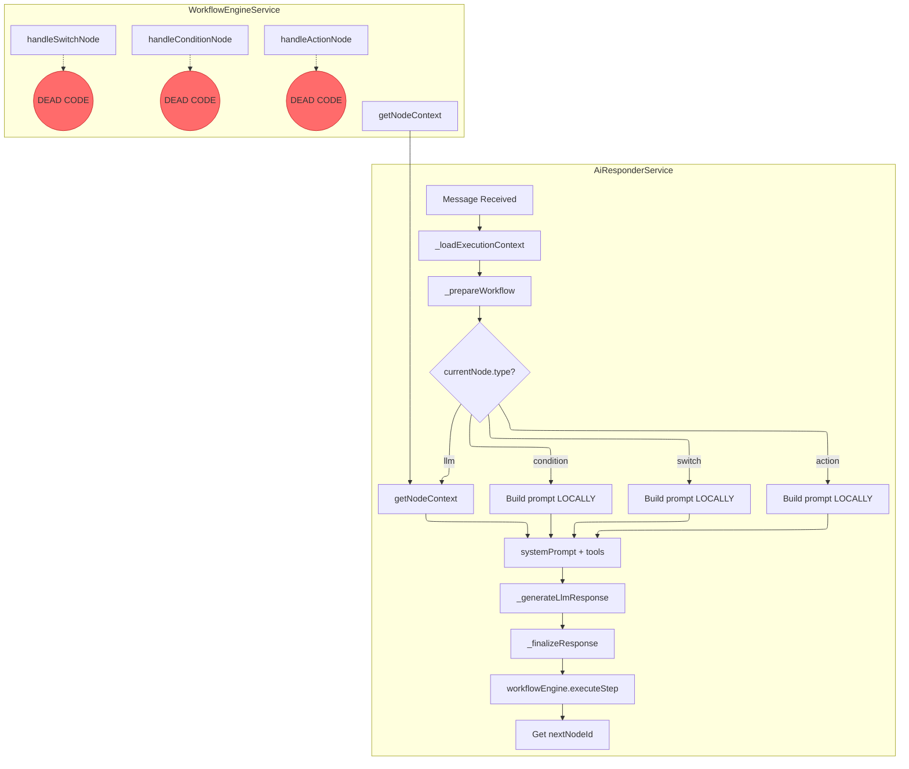
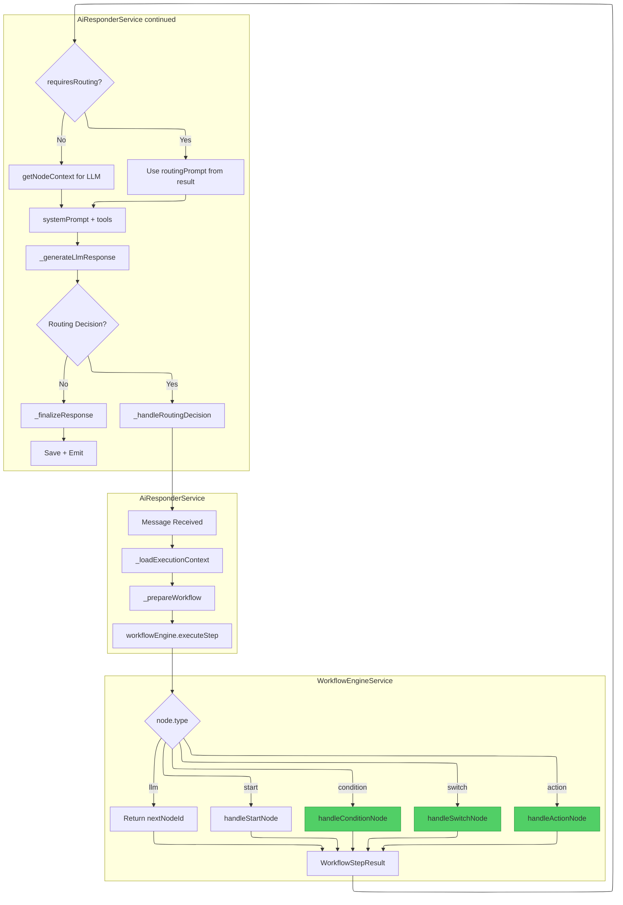

# AI Responder Refactor Proposal

## Current State (Wrong)

### Problem: Duplicated Logic

The node-handling logic is implemented **twice**:

1.  **`WorkflowEngineService`** (The intended source of truth)
    *   `handleConditionNode`: Returns `{ requiresRouting: true, routingPrompt: '...' }`.
    *   `handleSwitchNode`: Returns `{ requiresRouting: true, routingPrompt: '...' }`.
    *   `handleActionNode`: Executes tool with hardcoded `toolArgs` and returns `nextNodeId`.
    *   `getNodeContext`: Returns `{ systemPrompt, tools }` for LLM nodes.

2.  **`AiResponderService._prepareWorkflow`** (The duplicated / overriding implementation)
    *   **Re-implements** Condition node logic (lines 291-301).
    *   **Re-implements** Switch node logic (lines 303-321).
    *   **Re-implements** Action node logic (lines 322-336).
    *   Calls `getNodeContext` only for `llm` nodes (lines 338-349).

### Consequence

*   Methods in `WorkflowEngineService` like `handleConditionNode`, `handleSwitchNode`, `handleActionNode` are **dead code** — they are defined but never called during the actual flow.
*   The `routingPrompt` generated by these methods (which includes language support) is **never used**.
*   Any future updates to `WorkflowEngineService` will have no effect unless `AiResponderService` is also updated, leading to maintenance nightmares.

---

## Proposed Flow (Correct)

### Principle: Single Responsibility

*   **`WorkflowEngineService`**: The **brain**. It knows how to process each node type and what context (prompt, tools, routing requirements) is needed.
*   **`AiResponderService`**: The **orchestrator**. It calls the engine, reads the result, drives the LLM, and handles I/O (DB, Socket).

### New `_prepareWorkflow` Logic

```
1. Get currentNodeId from conversation.metadata.
2. If no currentNodeId, find 'start' node and call executeStep to get the first real node.
3. Call workflowEngine.executeStep(context).
4. Read the WorkflowStepResult:
   a. If result.requiresRouting is true:
      - Use result.routingPrompt as systemPrompt.
      - Assign tools based on node type (route_decision or switch_decision).
      - Mark this as a routingNode for later.
   b. Else (LLM node):
      - Call workflowEngine.getNodeContext() to get systemPrompt and tools.
5. Return { systemPrompt, tools, workflowCtx, routingNode }.
```

### Key Changes

| Current (Wrong) | Proposed (Correct) |
|---|---|
| `_prepareWorkflow` checks `currentNode.type` and runs its own logic. | `_prepareWorkflow` calls `executeStep` and reads `WorkflowStepResult`. |
| Prompts for Condition/Switch are hardcoded in `AiResponderService`. | Prompts come from `WorkflowEngineService` (language-aware). |
| `handleConditionNode`, `handleSwitchNode` are dead code. | These methods are the actual source of routing prompts. |
| Action node is treated as LLM-driven (recent change). | **Decision needed**: Should Action nodes use hardcoded `toolArgs` (engine handles) or require LLM to fill args? |

### Action Node Decision Point

The current `handleActionNode` in `WorkflowEngineService` uses `node.data.toolArgs` (hardcoded).

**Option A (Current Engine Design):** Action nodes are deterministic. Args are pre-defined in the workflow JSON. The engine executes them directly.

**Option B (User's Intent):** Action nodes are LLM-driven. The engine should return `{ requiresRouting: true, routingPrompt: "Use this tool...", tools: [specificTool] }` and let the LLM generate the arguments.

If Option B is chosen, `handleActionNode` needs to be modified to NOT execute the tool, but instead signal that an LLM call is needed.

---

## Current State Diagram



---

## Proposed State Diagram



---

## Next Steps

1.  **Confirm Action Node behavior** (Option A or B).
2.  Refactor `_prepareWorkflow` to delegate to `WorkflowEngineService`.
3.  Remove duplicated logic.
4.  Test all node types (Start, LLM, Condition, Switch, Action).

