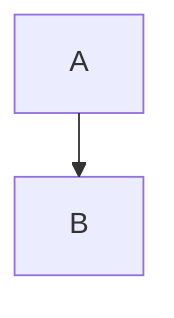

# Mandatory Rules for Slidev Presentation

## 1. Component Usage

All slides **MUST** use the following standardized components found in `presentation/components/`. Do NOT write raw HTML/Markdown layouts manually.

| Content Type        | Component                |
| :------------------ | :----------------------- |
| **Opening / Title** | `<LayoutTitle>`          |
| **Section Header**  | `<LayoutSection>`        |
| **Standard Text**   | `<LayoutTitleContent>`   |
| **Two Columns**     | `<LayoutTwoCol>`         |
| **Comparison**      | `<LayoutComparison>`     |
| **Image & Caption** | `<LayoutPictureCaption>` |
| **Diagrams**        | `<LayoutDiagram>`        |
| **Big Numbers**     | `<LayoutFact>`           |

## 2. Diagram Layout

Do NOT manually wrap diagrams in divs. You **MUST** use the `<LayoutDiagram>` component, which handles scaling and centering automatically.

**Correct:**

````html
<LayoutDiagram title="System Architecture">
```mermaid
graph TD A --> B 
```
</LayoutDiagram>
````

**Incorrect:**

````markdown
# System Architecture

<!-- DO NOT use inline init directives, they break the global ELK config -->


````

## 3. Configuration

Do **NOT** use `%%{init: ...}%%` or per-diagram frontmatter configuration. The global config in `setup/main.ts` handles ELK layout registration. Adding local overrides will break the layout loader.
