<LayoutSection title="Product Features & Workflow">

**Member 4: Product Owner**

Agent Workspace, Productivity Tools, và Team Collaboration

</LayoutSection>

---

<LayoutTitleContent title="Feature Overview">

| Tính năng | Mô tả | Giá trị |
|-----------|-------|---------|
| **Inbox Operations** | Quản lý conversation, filter, status | Core workflow |
| **Assignments** | Phân công công việc giữa agents | Team collaboration |
| **Canned Responses** | Quick replies với shortcut | Tăng tốc độ phản hồi |
| **Actions/Smart Forms** | Custom forms cho agents điền | Thu thập dữ liệu có cấu trúc |
| **Visitor Notes** | Ghi chú riêng về khách hàng | CRM-lite capabilities |

> Tất cả tính năng đều được scope theo **projectId** để đảm bảo multi-tenant isolation

</LayoutTitleContent>

---

<LayoutSection title="Inbox Operations">

Core Workflow: Listing, Filtering, và Status Management

</LayoutSection>

---

<LayoutDiagram title="Inbox Architecture">

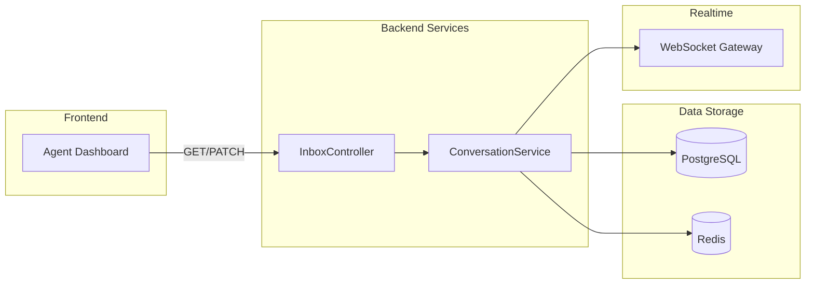

</LayoutDiagram>

---

<LayoutTwoCol title="Inbox Endpoints">

<template #left>

### 📋 Danh sách Endpoints

| Endpoint | Chức năng |
|----------|-----------|
| GET /inbox/conversations | List với filter, pagination |
| PATCH /inbox/conversations/:id | Update status, mark read |
| GET /inbox/conversations/:id/messages | List messages (cursor) |
| POST /inbox/conversations/:id/typing | Agent typing indicator |
| DELETE /inbox/conversations/:id | Xóa (MANAGER only) |

</template>

<template #right>

### 🔐 Authorization

| Role | Quyền |
|------|-------|
| **AGENT** | List, update, typing |
| **MANAGER** | All + Delete |

```typescript
// Status filter options
type ConversationStatus = 
  'open' | 'resolved' | 'pending';
```

</template>

</LayoutTwoCol>

---

<LayoutDiagram title="List Conversations Flow">

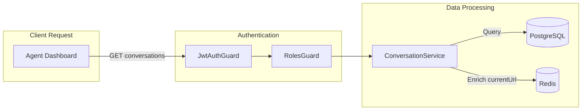

</LayoutDiagram>

---

<LayoutTwoCol title="Conversation Status Management">

<template #left>

### 📊 Status Update Flow

```typescript
// PATCH /inbox/conversations/:id
{
  status?: ConversationStatus,
  read?: boolean  // Mark as read
}
```

| Status | Ý nghĩa |
|--------|---------|
| OPEN | Đang hoạt động |
| PENDING | Chờ xử lý |
| RESOLVED | Đã giải quyết |

</template>

<template #right>

### ✅ Mark as Read

```typescript
// When read: true
conversation.unreadCount = 0;
await repository.save(conversation);
```

> Tất cả update đều có **@Auditable** decorator để ghi audit log

</template>

</LayoutTwoCol>

---

<LayoutDiagram title="Agent Typing Indicator">

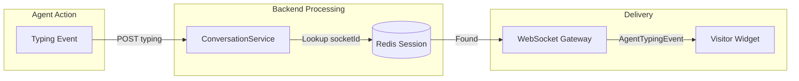

</LayoutDiagram>

---

<LayoutSection title="Conversation Assignments">

Team Workload Distribution

</LayoutSection>

---

<LayoutDiagram title="Assignment Flow">

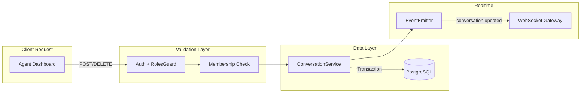

</LayoutDiagram>

---

<LayoutTwoCol title="Assignment Features">

<template #left>

### 👤 Assign Conversation

```typescript
// POST /inbox/conversations/:id/assignments
{
  assigneeId: "user-uuid"
}
```

**Validation Steps:**
1. Actor phải là project member
2. Assignee phải là project member
3. Atomic transaction

</template>

<template #right>

### 🔓 Unassign Conversation

```typescript
// DELETE /inbox/conversations/:id/assignments

// Result:
{
  assigneeId: null,
  assignedAt: null
}
```

> **Real-time Update**: Event **conversation.updated** được broadcast đến tất cả agents trong project

</template>

</LayoutTwoCol>

---

<LayoutDiagram title="Assignment Data Flow">

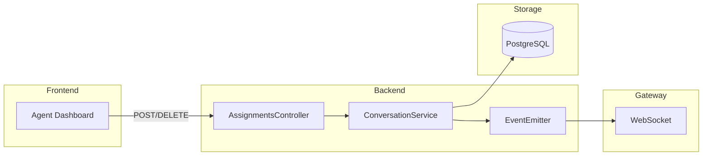

</LayoutDiagram>

---

<LayoutSection title="Canned Responses">

Productivity Boosters - Quick Replies

</LayoutSection>

---

<LayoutTwoCol title="Canned Responses Overview">

<template #left>

### 🚀 Concept

Pre-defined text snippets cho agents

```
/greeting → "Hello! How can I help you today?"
/thanks   → "Thank you for contacting us..."
/closing  → "Is there anything else..."
```

**Use Case:**
- Agent gõ **/greeting** trong chat input
- Autocomplete hiển thị options
- Select → Replace với full content

</template>

<template #right>

### 🔐 Role-Based Access

| Role | Quyền |
|------|-------|
| **MANAGER** | Create, Update, Delete |
| **AGENT** | Read only |

**Constraints:**
- Shortcut: alphanumeric + _ - (max 50)
- Content: Max 5000 chars
- Unique: **(projectId, shortcut)**

</template>

</LayoutTwoCol>

---

<LayoutDiagram title="Create Canned Response Flow">

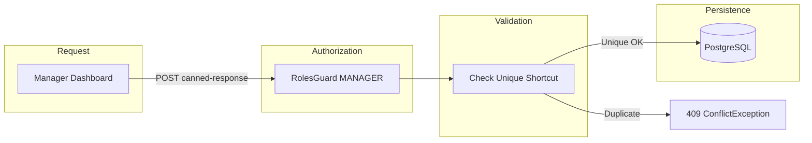

</LayoutDiagram>

---

<LayoutTitleContent title="Canned Response API">

```typescript
// Entity structure
interface CannedResponse {
  id: string;        // UUID
  projectId: number;
  shortcut: string;  // e.g., "greeting"
  content: string;   // Full response text
  createdAt: Date;
  updatedAt: Date;
}

// API Endpoints
GET    /projects/:projectId/canned-responses      // List all
POST   /projects/:projectId/canned-responses      // Create (MANAGER)
PATCH  /projects/:projectId/canned-responses/:id  // Update (MANAGER)
DELETE /projects/:projectId/canned-responses/:id  // Delete (MANAGER)
```

</LayoutTitleContent>

---

<LayoutSection title="Actions & Smart Forms">

Advanced Custom Forms Feature

</LayoutSection>

---

<LayoutTwoCol title="Actions Concept">

<template #left>

### 📝 What is an Action Template?

Manager-defined form templates:
- **"Create Order"**
- **"Request Refund"**
- **"Schedule Callback"**

**Field Types:**
| Type | Input |
|------|-------|
| TEXT | Input text |
| NUMBER | Input number |
| BOOLEAN | Toggle switch |
| DATE | DD/MM/YYYY picker |
| SELECT | Dropdown options |

</template>

<template #right>

### 👥 Role Separation

| Manager | Agent |
|---------|-------|
| Create templates | View templates |
| Update templates | Fill forms |
| Toggle enable/disable | Submit to conversation |
| Delete templates | View submission history |

> **Submissions** được link đến **Conversation** để theo dõi

</template>

</LayoutTwoCol>

---

<LayoutDiagram title="Manager Creates Template">

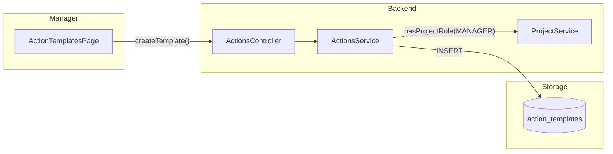

</LayoutDiagram>

---

<LayoutDiagram title="Agent Submits Action">

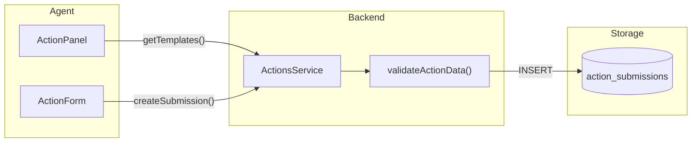

</LayoutDiagram>

---

<LayoutTwoCol title="Action Template Structure">

<template #left>

### 📋 Template Definition

```typescript
interface ActionTemplate {
  id: number;
  projectId: number;
  name: string;
  description?: string;
  definition: {
    fields: ActionFieldDefinition[]
  };
  isEnabled: boolean;
  deletedAt: Date | null;
}

interface ActionFieldDefinition {
  key: string;      // "order_id"
  label: string;    // "Order ID"
  type: ActionFieldType;
  required: boolean;
  options?: string[];  // For SELECT
}
```

</template>

<template #right>

### ✅ Submission Status

```typescript
enum ActionSubmissionStatus {
  SUBMITTED = "submitted",
  PROCESSING = "processing",
  COMPLETED = "completed",
  FAILED = "failed",
  CANCELLED = "cancelled"
}
```

**Validation Rules:**
- Strict mode: reject unknown fields
- Required fields check
- Type validation per field

</template>

</LayoutTwoCol>

---

<LayoutDiagram title="Actions Data Flow">

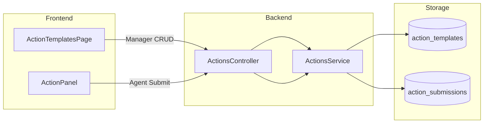

</LayoutDiagram>

---

<LayoutSection title="Visitor Notes">

CRM-Lite Capabilities

</LayoutSection>

---

<LayoutTwoCol title="Visitor Notes Overview">

<template #left>

### 📝 Purpose

Ghi chú riêng về visitors:
- **Visible** cho tất cả agents trong project
- **Tied to Visitor** (không phải conversation)
- **Persist** qua các session

**Use Cases:**
```
"VIP customer, handle with care"
"Đã hỗ trợ issue X ngày 01/01"
"Prefer Vietnamese language"
```

</template>

<template #right>

### ⚡ Real-time Updates

| Event | Trigger |
|-------|---------|
| VISITOR_NOTE_ADDED | Note created |
| VISITOR_NOTE_UPDATED | Note edited |
| VISITOR_NOTE_DELETED | Note removed |

> WebSocket broadcast → All agents see changes immediately

</template>

</LayoutTwoCol>

---

<LayoutDiagram title="Create Note Flow">

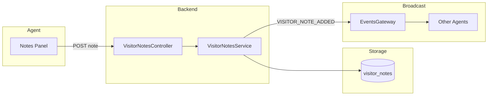

</LayoutDiagram>

---

<LayoutTwoCol title="Visitor Notes API">

<template #left>

### 📋 Endpoints

```typescript
// List notes
GET /projects/:projectId
    /visitors/:visitorId/notes

// Add note
POST /projects/:projectId
     /visitors/:visitorId/notes
{ content: "Note text" }

// Update note
PATCH /projects/:projectId
      /visitors/:visitorId/notes/:id

// Delete note
DELETE /projects/:projectId
       /visitors/:visitorId/notes/:id
```

</template>

<template #right>

### 🗄️ Entity Structure

```typescript
interface VisitorNote {
  id: string;        // UUID
  visitorId: number;
  authorId: string;  // Agent UUID
  author: User;      // Populated
  content: string;   // Max 2000 chars
  createdAt: Date;
  updatedAt: Date;
}
```

> Authorization: Requires **AGENT** role

</template>

</LayoutTwoCol>

---

<LayoutDiagram title="Visitor Notes Data Flow">

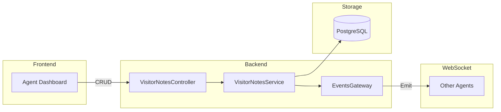

</LayoutDiagram>

---

<LayoutSection title="Summary">

Tổng kết phần Product Features & Workflow

</LayoutSection>

---

<LayoutTitleContent title="Features Recap">

| Tính năng | Điểm chính |
|-----------|------------|
| **Inbox Operations** | List, filter, status update với Redis enrichment |
| **Assignments** | Double validation (actor + assignee membership) |
| **Canned Responses** | Shortcut-based quick replies, MANAGER-only CRUD |
| **Actions/Smart Forms** | Custom templates với strict validation |
| **Visitor Notes** | CRM-lite với real-time WebSocket sync |

> Tất cả đều có **@Auditable** decorator và **Role-Based Access Control**

</LayoutTitleContent>

---

<LayoutTwoCol title="Handoff Summary">

<template #left>

### ✅ Covered Topics
- Feature Overview & Catalog
- Inbox Operations & Workflow
- Conversation Assignments
- Canned Responses (Productivity)
- Actions & Smart Forms
- Visitor Notes (CRM-lite)

</template>

<template #right>

### 🎯 Key Takeaways
**"How do agents use it?"**

- **Efficient Workflow**: Filter, assign, respond
- **Productivity Tools**: Canned responses, Actions
- **Team Collaboration**: Assignments, shared notes
- **Real-time Sync**: WebSocket broadcasts

</template>

</LayoutTwoCol>
