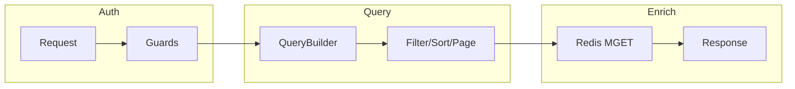
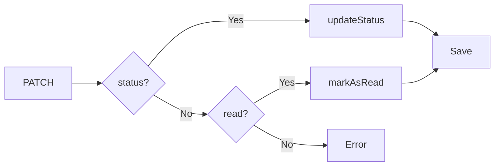
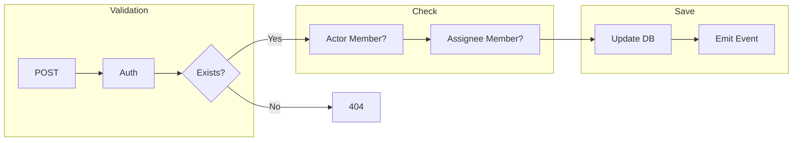
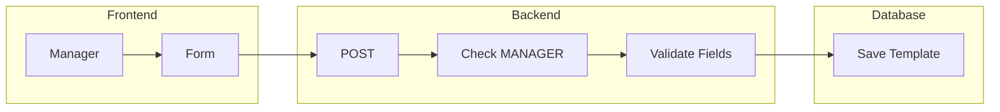
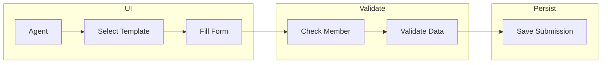
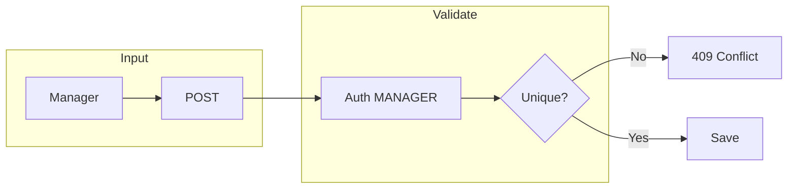
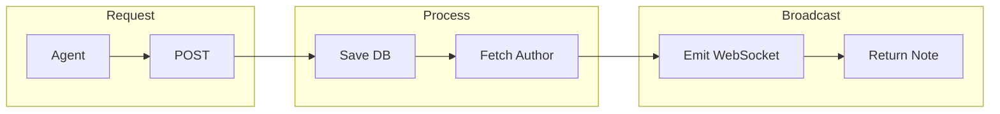
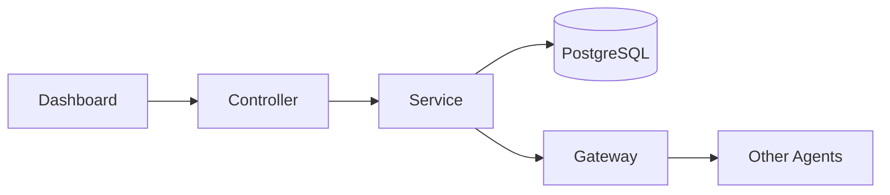

<LayoutSection title="Agent Experience & Productivity">

**Member 4: The Product Owner**

Inbox Operations, Conversation Assignments, Actions Engine, Canned Responses, và Visitor Notes

</LayoutSection>

---

<LayoutTwoCol title="Feature Catalog">

<template #left>

### 🎯 Agent Workspace

- **Inbox**: Quản lý hội thoại
- **Assignments**: Phân công công việc
- **Typing Indicator**: Agent đang gõ

</template>

<template #right>

### ⚡ Productivity Tools

| Feature | Mô tả |
|---------|-------|
| **Actions** | Form động |
| **Canned Responses** | Trả lời nhanh |
| **Visitor Notes** | Ghi chú CRM |

</template>

</LayoutTwoCol>

---

<LayoutDiagram title="Inbox: List Conversations">



</LayoutDiagram>

---

<LayoutTwoCol title="Inbox API & Status">

<template #left>

### 📋 Endpoints
| Method | Endpoint | Purpose |
|--------|----------|---------|
| **GET** | `/conversations` | List |
| **PATCH** | `/conversations/:id` | Update |
| **DELETE** | `/conversations/:id` | Delete |
| **POST** | `/:id/messages` | Reply |

</template>

<template #right>

### 📊 Status Values
- **OPEN** — Đang xử lý
- **RESOLVED** — Đã giải quyết  
- **PENDING** — Chờ phản hồi

### 🔔 Events Emitted
- `conversation.updated`
- `conversation.deleted`

> Base: `/projects/:projectId/inbox`

</template>

</LayoutTwoCol>

---

<LayoutDiagram title="Update Conversation Flow">



</LayoutDiagram>

---

<LayoutDiagram title="Conversation Assignments">



</LayoutDiagram>

---

<LayoutTwoCol title="Assignment API">

<template #left>

### 🔗 Endpoints
| Method | Path | Role |
|--------|------|------|
| **POST** | `/:id/assignments` | AGENT |
| **DELETE** | `/:id/assignments` | AGENT |

```typescript
{ assigneeId: "uuid" }
```

</template>

<template #right>

### 📊 Database & Event
| Field | Type |
|-------|------|
| `assigneeId` | UUID |
| `assignedAt` | Date |

**Event:** `conversation.updated`
**Unassign:** set fields to `null`

</template>

</LayoutTwoCol>

---

<LayoutTwoCol title="Actions Engine">

<template #left>

### 📝 Concept
- Manager tạo template
- Agent điền form
- Submission → Conversation

### 🔐 Permissions
| Role | Access |
|------|--------|
| **MANAGER** | CRUD templates |
| **AGENT** | Submit only |

</template>

<template #right>

### 🎨 Field Types
| Type | Validation |
|------|------------|
| **TEXT** | string |
| **NUMBER** | number |
| **BOOLEAN** | bool |
| **DATE** | parseable |
| **SELECT** | in options |

</template>

</LayoutTwoCol>

---

<LayoutDiagram title="Create Action Template">



</LayoutDiagram>

---

<LayoutDiagram title="Submit Action">



</LayoutDiagram>

---

<LayoutTwoCol title="Canned Responses">

<template #left>

### 🔗 Endpoints
| Method | Path | Role |
|--------|------|------|
| **POST** | `/canned-responses` | MANAGER |
| **GET** | `/canned-responses` | AGENT |
| **PATCH** | `/:id` | MANAGER |
| **DELETE** | `/:id` | MANAGER |

</template>

<template #right>

### ⌨️ Usage
1. Gõ `/` trong chat
2. Chọn shortcut
3. Auto-fill content

**Ví dụ:** `/greeting` → "Xin chào!"

**Error 409:** Shortcut exists

</template>

</LayoutTwoCol>

---

<LayoutDiagram title="Create Canned Response">



</LayoutDiagram>

---

<LayoutTwoCol title="Visitor Notes">

<template #left>

### 📝 Đặc điểm
- Gắn với **Visitor** (không phải Conv)
- Persist across sessions
- All agents can see
- **Real-time** WebSocket

</template>

<template #right>

### 📡 WebSocket Events
| Event | Payload |
|-------|---------|
| `NOTE_ADDED` | `{ visitorId, note }` |
| `NOTE_UPDATED` | `{ visitorId, note }` |
| `NOTE_DELETED` | `{ visitorId, noteId }` |

</template>

</LayoutTwoCol>

---

<LayoutDiagram title="Create Visitor Note">



</LayoutDiagram>

---

<LayoutDiagram title="Notes Data Flow">



</LayoutDiagram>

---

<LayoutTitleContent title="Summary">

| Feature | Key Points |
|---------|-----------|
| **Inbox** | List, filter, status, Redis enrichment |
| **Assignments** | Assign/unassign, membership validation |
| **Actions** | Templates, field validation, submissions |
| **Canned Responses** | Shortcuts, unique constraint |
| **Visitor Notes** | CRM-lite, real-time WebSocket sync |

</LayoutTitleContent>
