<LayoutSection title="Core Developer">

**Member 2: Core Developer**

Authentication, Multi-tenancy, User Management, và Core Utilities

</LayoutSection>

---
transition: slide-up
---

<LayoutTwoCol title="Core Developer Overview">

<template #left>

### 🎯 Trách nhiệm chính
**Identity & Security Foundation**

- **Authentication**: JWT (15min) + Refresh (7 days) + 2FA
- **Multi-tenancy**: Project-based isolation với RBAC
- **User Management**: Self-service account operations
- **Core Utilities**: Transactional email + Screenshot service

</template>

<template #right>

### 🔐 Phạm vi công việc

| Lĩnh vực | Chi tiết kỹ thuật |
|----------|-------------------|
| **Authentication** | JWT + OAuth 2.0 + TOTP 2FA |
| **Multi-tenancy** | Row-level security per project |
| **User Management** | Secure email change với double verification |
| **Mail Service** | i18n support (EN/VI) + async queue |
| **Screenshot** | Puppeteer + SSRF protection |

</template>

</LayoutTwoCol>

---
transition: slide-up
---

<LayoutSection title="User Authentication">

JWT, OAuth Integration, và Two-Factor Authentication

</LayoutSection>

---
transition: slide-up
---

<LayoutDiagram title="Authentication Flow Overview">

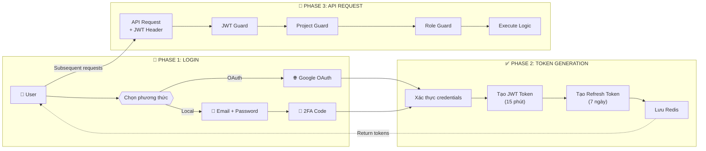

</LayoutDiagram>

---
transition: slide-up
---

<LayoutTwoCol title="Authentication Methods">

<template #left>

### 🔑 Local Authentication
**Email + Password + 2FA**

| Endpoint | Method | Purpose |
|----------|--------|----------|
| `/auth/login` | POST | Authenticate with email/password |
| Response | - | Returns access token, refresh token, and 2FA requirement |

</template>

<template #right>

### 🌐 OAuth Integration
**Google OAuth 2.0**

| Bước | Mô tả |
|------|-------|
| 1 | Redirect to Google |
| 2 | User authorizes |
| 3 | Callback with code |
| 4 | Exchange for tokens |
| 5 | Create/Link user |

> Hỗ trợ **Sign up** và **Link account** cho user hiện tại

</template>

</LayoutTwoCol>

---
transition: slide-up
---

<LayoutDiagram title="JWT Phase 1: Login & Token Generation">

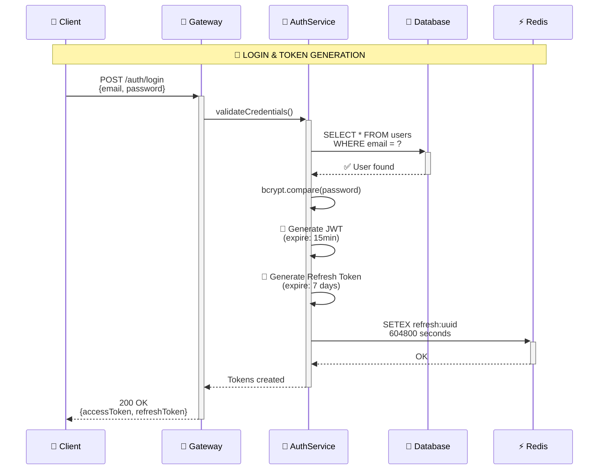

</LayoutDiagram>

---
transition: slide-up
---

<LayoutDiagram title="JWT Phase 2: Authenticated Request">

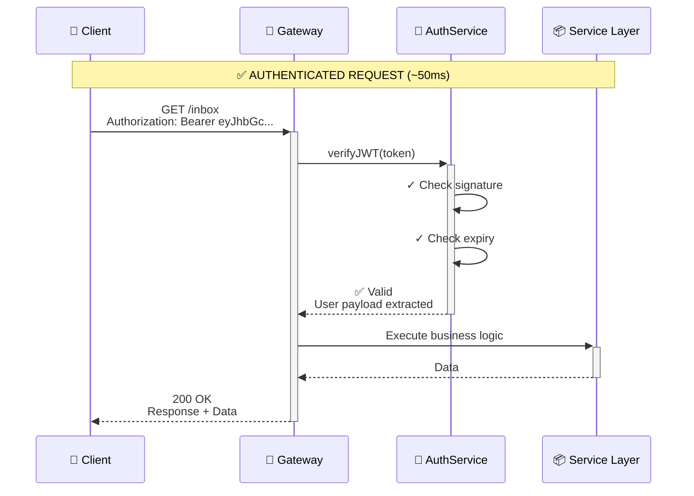

</LayoutDiagram>

---
transition: slide-up
---

<LayoutDiagram title="JWT Phase 3: Token Refresh">

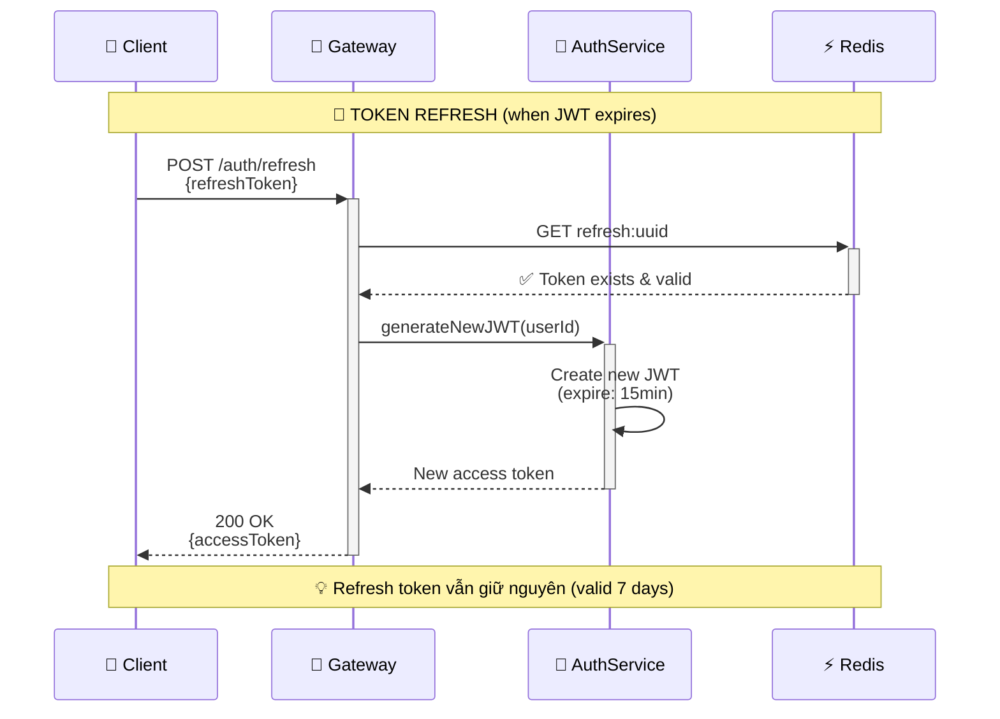

</LayoutDiagram>

---
transition: slide-up
---

<LayoutTitleContent title="JWT Token Structure">

| Token Type | Lifetime | Storage | Purpose |
|------------|----------|---------|---------|
| **Access Token** | 15 phút | Memory/LocalStorage | API authentication |
| **Refresh Token** | 7 ngày | Redis + HttpOnly Cookie | Token renewal |

**Access Token Payload**: User ID, email, role, issued at, expiry

**Refresh Token Payload**: User ID, token ID, issued at, expiry

> **Security**: Refresh token được lưu trong Redis để có thể **revoke** khi cần

</LayoutTitleContent>

---
transition: slide-up
---

<LayoutTwoCol title="Two-Factor Authentication (2FA)">

<template #left>

### 📱 TOTP-based 2FA
**Time-based One-Time Password**

| Endpoint | Purpose |
|----------|----------|
| `POST /auth/2fa/enable` | Generate secret and QR code |
| `POST /auth/2fa/verify` | Verify TOTP token |

</template>

<template #right>

### � 2FA Endpoints

| Endpoint | Purpose |
|----------|---------|
| `POST /auth/2fa/enable` | Generate secret and QR code |
| `POST /auth/2fa/verify` | Verify TOTP token |

> Sử dụng thư viện **speakeasy** cho TOTP generation/validation

</template>

</LayoutTwoCol>

---
transition: slide-up
---

<LayoutDiagram title="2FA Login Flow - Complete Sequence">

```mermaid
%%{init: {'theme':'base', 'themeVariables': { 'fontSize':'18px'}}}%%
flowchart LR
    Start([<b>👤 USER LOGIN</b>]) --> Input["<b>📧 INPUT</b><br/>Email + Password"]
    Input --> Validate{"<b>🔍 VALIDATE</b><br/>Credentials?"}
    
    %% Invalid credentials path (top)
    Validate -->|"❌ INVALID"| ErrorAuth["<b>❌ ERROR</b><br/>401 Unauthorized"]
    ErrorAuth --> EndError([<b>🚫 FAILED</b>])
    
    %% Valid credentials path (bottom)
    Validate -->|"✅ VALID"| Check2FA{"<b>🔐 CHECK</b><br/>2FA Enabled?"}
    
    %% 2FA disabled path (top of valid branch)
    Check2FA -->|"❌ NO"| GenToken1["<b>🎫 GENERATE</b><br/>JWT + Refresh Token"]
    GenToken1 --> SaveRedis1["<b>⚡ REDIS</b><br/>Save Token<br/>TTL: 7 days"]
    SaveRedis1 --> Success1["<b>✅ SUCCESS</b><br/>Return Tokens"]
    Success1 --> End([<b>🎉 SUCCESS</b>])
    
    %% 2FA enabled path (bottom of valid branch)
    Check2FA -->|"✅ YES"| Require2FA["<b>⚠️ REQUIRE</b><br/>2FA Code"]
    Require2FA --> UserApp["<b>📱 USER ACTION</b><br/>Open Authenticator"]
    UserApp --> InputCode["<b>🔢 INPUT</b><br/>TOTP Code"]
    InputCode --> VerifyTOTP{"<b>✓ VERIFY</b><br/>TOTP Valid?"}
    
    %% Invalid TOTP path (top)
    VerifyTOTP -->|"❌ INVALID"| Error2FA["<b>❌ ERROR</b><br/>401 Invalid Code"]
    Error2FA --> EndError
    
    %% Valid TOTP path (bottom)
    VerifyTOTP -->|"✅ VALID"| GenToken2["<b>🎫 GENERATE</b><br/>JWT + Refresh Token"]
    GenToken2 --> SaveRedis2["<b>⚡ REDIS</b><br/>Save Token<br/>TTL: 7 days"]
    SaveRedis2 --> Success2["<b>✅ SUCCESS</b><br/>Return Tokens"]
    Success2 --> End
    
    %% Styling
    style Start fill:#e3f2fd,stroke:#1976d2,stroke-width:4px,color:#000
    style End fill:#c8e6c9,stroke:#2e7d32,stroke-width:4px,color:#000
    style EndError fill:#ffebee,stroke:#c62828,stroke-width:4px,color:#000
    
    style Check2FA fill:#fff3e0,stroke:#f57c00,stroke-width:3px,color:#000
    style VerifyTOTP fill:#fff3e0,stroke:#f57c00,stroke-width:3px,color:#000
    style Validate fill:#fff3e0,stroke:#f57c00,stroke-width:3px,color:#000
    
    style GenToken1 fill:#f3e5f5,stroke:#7b1fa2,stroke-width:3px,color:#000
    style GenToken2 fill:#f3e5f5,stroke:#7b1fa2,stroke-width:3px,color:#000
    
    style SaveRedis1 fill:#e1f5fe,stroke:#0277bd,stroke-width:3px,color:#000
    style SaveRedis2 fill:#e1f5fe,stroke:#0277bd,stroke-width:3px,color:#000
    
    style ErrorAuth fill:#ffcdd2,stroke:#d32f2f,stroke-width:3px,color:#000
    style Error2FA fill:#ffcdd2,stroke:#d32f2f,stroke-width:3px,color:#000
    
    style Success1 fill:#c8e6c9,stroke:#388e3c,stroke-width:3px,color:#000
    style Success2 fill:#c8e6c9,stroke:#388e3c,stroke-width:3px,color:#000
    
    style Input fill:#f5f5f5,stroke:#616161,stroke-width:2px,color:#000
    style Require2FA fill:#fff9c4,stroke:#f9a825,stroke-width:3px,color:#000
    style UserApp fill:#e0f2f1,stroke:#00897b,stroke-width:2px,color:#000
    style InputCode fill:#f5f5f5,stroke:#616161,stroke-width:2px,color:#000
```

</LayoutDiagram>

---
transition: slide-up
---

<LayoutTitleContent title="Authentication Guards">

**JwtAuthGuard**: Bảo vệ tất cả routes bằng cách kiểm tra JWT token trong header

**Usage**: Áp dụng guard cho controller để yêu cầu authentication

**Features**:
- Kiểm tra JWT token trong Authorization header
- Extract user từ JWT payload
- Inject user vào request context

> **@CurrentUser()** decorator tự động extract user từ JWT payload

</LayoutTitleContent>

---
transition: slide-up
---

<LayoutSection title="Security Architecture">

Tổng quan kiến trúc bảo mật đa lớp

</LayoutSection>

---
transition: slide-up
---

<LayoutDiagram title="Security Layers - Defense in Depth">

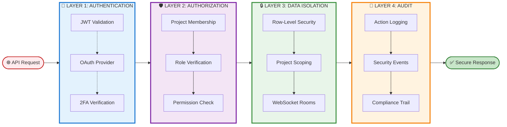

</LayoutDiagram>

---
transition: slide-up
---

<LayoutTwoCol title="Security Principles">

<template #left>

### 🎯 Core Principles

**Defense in Depth**
- Nhiều lớp bảo vệ
- Fail-closed security
- Zero-trust architecture

**Least Privilege**
- Quyền tối thiểu cần thiết
- Role-based access control
- Time-limited tokens

</template>

<template #right>

### 🔑 Key Mechanisms

| Mechanism | Implementation |
|-----------|----------------|
| **Authentication** | JWT + OAuth + 2FA |
| **Session** | Refresh token rotation |
| **Authorization** | RBAC với project scope |
| **Isolation** | Row-level + WebSocket rooms |
| **Audit** | Comprehensive logging |

</template>

</LayoutTwoCol>

---
transition: slide-up
---

<LayoutSection title="Multi-Tenancy: Projects">

Project-based Data Isolation và Role-Based Access Control

</LayoutSection>

---
transition: slide-up
---

<LayoutDiagram title="Multi-Tenancy Architecture">

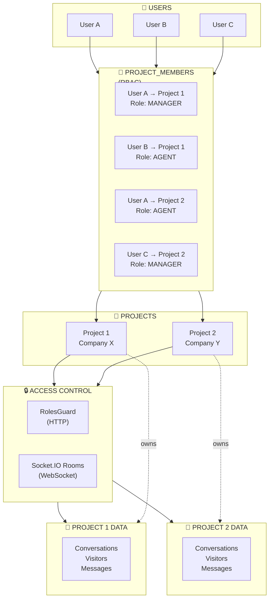

</LayoutDiagram>

---
transition: slide-up
---

<LayoutTwoCol title="Project Entity Structure">

<template #left>

### 📦 Project Model

**Key Fields**:
- `id`: UUID primary key
- `name`: Project name
- `slug`: Unique identifier
- `members`: Project members relationship
- `conversations`: Project conversations relationship

</template>

<template #right>

### 👥 ProjectMember Model

**Key Fields**:
- `user`: Reference to User entity
- `project`: Reference to Project entity
- `role`: MANAGER or AGENT
- `isActive`: Membership status

</template>

</LayoutTwoCol>

---
transition: slide-up
---

<LayoutTitleContent title="Project Isolation Enforcement">

**ProjectGuard**: Đảm bảo user thuộc project trước khi cho phép truy cập

**Process**:
1. Extract user và projectId từ request
2. Kiểm tra membership trong database
3. Verify membership status (isActive)
4. Inject project và role vào request context
5. Throw ForbiddenException nếu không hợp lệ

> Mọi request liên quan đến dữ liệu project **phải qua ProjectGuard**

</LayoutTitleContent>

---
transition: slide-up
---

<LayoutTwoCol title="Role-Based Access Control (RBAC)">

<template #left>

### 🎭 Project Roles

| Role | Quyền hạn |
|------|-----------|
| **MANAGER** | Toàn quyền quản lý project |
| **AGENT** | Chat với visitor, quản lý inbox |

### 🔐 Role Guard

**Usage**: Decorator-based role checking

**Example**: `@Roles(ProjectRole.MANAGER)` - Chỉ MANAGER mới được truy cập endpoint

</template>

<template #right>

### ✅ Permission Matrix

| Action | MANAGER | AGENT |
|--------|---------|-------|
| View conversations | ✅ | ✅ |
| Reply to visitor | ✅ | ✅ |
| Assign conversation | ✅ | ✅ |
| Manage team members | ✅ | ❌ |
| Configure webhooks | ✅ | ❌ |
| View audit logs | ✅ | ❌ |
| Delete project | ✅ | ❌ |

</template>

</LayoutTwoCol>

---
transition: slide-up
---

<LayoutDiagram title="Request Flow with Multi-Tenancy">

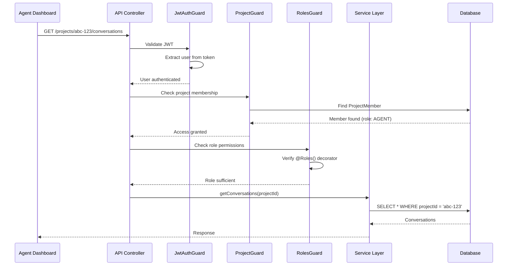

</LayoutDiagram>

---
transition: slide-up
---

<LayoutSection title="User Profile & Settings">

Self-Service Account Management

</LayoutSection>

---
transition: slide-up
---

<LayoutTwoCol title="User Profile Management">

<template #left>

### 👤 User Entity

**Key Fields**:
- `id`: UUID primary key
- `email`: Unique email address
- `password`: Hashed password (nullable for OAuth-only users)
- `displayName`: User's display name
- `avatarUrl`: Profile picture URL
- `is2FAEnabled`: Two-factor authentication status
- `twoFactorSecret`: TOTP secret for 2FA

</template>

<template #right>

### ⚙️ Profile Operations

| Endpoint | Mô tả |
|----------|-------|
| `GET /users/me` | Lấy thông tin profile |
| `PATCH /users/me` | Cập nhật displayName, avatar |
| `POST /users/me/change-email` | Đổi email (cần verify) |
| `POST /users/me/change-password` | Đổi password |
| `POST /users/me/upload-avatar` | Upload avatar |

> Avatar được lưu trên **cloud storage** (hoặc local trong dev)

</template>

</LayoutTwoCol>

---
transition: slide-up
---

<LayoutDiagram title="Email Change Flow (Security)">

```mermaid
%%{init: {'theme':'base', 'themeVariables': { 'fontSize':'18px'}}}%%
flowchart LR
    Start([<b>👤 USER REQUEST</b>]) --> Phase1
    
    subgraph Phase1["<b>📧 PHASE 1: INITIATE</b>"]
        direction TB
        A1["<b>🔌 API CALL</b><br/>POST /users/me/change-email"]
        A2{"<b>🔍 CHECK</b><br/>Email Exists?"}
        A3["<b>🔐 GENERATE</b><br/>Secure Token<br/>32 bytes random"]
        A4["<b>⚡ REDIS</b><br/>Store Token<br/>TTL: 1 hour"]
        A5["<b>📨 QUEUE</b><br/>Send Verification<br/>via BullMQ"]
        
        A1 --> A2
        A2 -->|"❌ NO"| A3
        A2 -->|"✅ YES"| Err1["<b>❌ ERROR</b><br/>409 Conflict"]
        A3 --> A4
        A4 --> A5
    end
    
    A5 --> Wait["<b>⏳ WAITING</b><br/>User Checks Email"]
    Wait --> Phase2
    
    subgraph Phase2["<b>✅ PHASE 2: VERIFY</b>"]
        direction TB
        B1["<b>🔌 API CALL</b><br/>GET /verify-email?token=xxx"]
        B2{"<b>✓ VERIFY</b><br/>Token Valid?"}
        B3["<b>💾 UPDATE</b><br/>Change Email in DB"]
        B4["<b>🗑️ CLEANUP</b><br/>Delete Token"]
        
        B1 --> B2
        B2 -->|"✅ VALID"| B3
        B2 -->|"❌ INVALID"| Err2["<b>❌ ERROR</b><br/>400 Invalid Token"]
        B3 --> B4
    end
    
    B4 --> Success([<b>🎉 SUCCESS</b><br/>Email Changed])
    
    style Phase1 fill:#fff3e0,stroke:#f57c00,stroke-width:4px,color:#000
    style Phase2 fill:#e8f5e9,stroke:#388e3c,stroke-width:4px,color:#000
    style Start fill:#e3f2fd,stroke:#1976d2,stroke-width:4px,color:#000
    style Success fill:#c8e6c9,stroke:#2e7d32,stroke-width:4px,color:#000
    
    style A2 fill:#fff3e0,stroke:#f57c00,stroke-width:3px,color:#000
    style B2 fill:#fff3e0,stroke:#f57c00,stroke-width:3px,color:#000
    
    style A3 fill:#f3e5f5,stroke:#7b1fa2,stroke-width:3px,color:#000
    style A4 fill:#e1f5fe,stroke:#0277bd,stroke-width:3px,color:#000
    style A5 fill:#fff9c4,stroke:#f9a825,stroke-width:3px,color:#000
    style B3 fill:#e8f5e9,stroke:#388e3c,stroke-width:3px,color:#000
    style B4 fill:#fce4ec,stroke:#c2185b,stroke-width:3px,color:#000
    
    style Err1 fill:#ffcdd2,stroke:#d32f2f,stroke-width:3px,color:#000
    style Err2 fill:#ffcdd2,stroke:#d32f2f,stroke-width:3px,color:#000
    style Wait fill:#e0f2f1,stroke:#00897b,stroke-width:3px,color:#000
    
    style A1 fill:#e8eaf6,stroke:#3f51b5,stroke-width:2px,color:#000
    style B1 fill:#e8eaf6,stroke:#3f51b5,stroke-width:2px,color:#000
```

</LayoutDiagram>

---
transition: slide-up
---

<LayoutTwoCol title="Email Change Security Details">

<template #left>

### 🔑 Token Security

**Generation**
- 32 bytes random (crypto.randomBytes)
- Stored in Redis with key pattern
- `email-change:{token}`

**Expiration**
- TTL: 3600 seconds (1 hour)
- Auto-deleted after use
- One-time use only

</template>

<template #right>

### 📧 Email Verification

**Security Features**
- One-time use token
- Time-limited validity (1 hour)
- Secure random generation
- Redis-based storage

**Process**
- Token sent via email
- User clicks verification link
- Token validated and consumed
- Email updated in database

</template>

</LayoutTwoCol>

---
transition: slide-up
---

<LayoutDiagram title="Email Change Flow - Detailed Steps">

```mermaid
%%{init: {'theme':'base', 'themeVariables': { 'fontSize':'18px'}}}%%
flowchart LR
    subgraph Phase1["<b>📧 INITIATE PHASE</b>"]
        direction LR
        S1["<b>1.</b> Check Email<br/>Availability"] --> S2["<b>2.</b> Generate<br/>Secure Token"]
        S2 --> S3["<b>3.</b> Store in Redis<br/>with TTL"]
        S3 --> S4["<b>4.</b> Queue Email<br/>via BullMQ"]
    end
    
    Phase1 -.->|"User clicks link"| Phase2
    
    subgraph Phase2["<b>✅ VERIFY PHASE</b>"]
        direction LR
        V1["<b>1.</b> Validate Token<br/>from Redis"] --> V2["<b>2.</b> Update Email<br/>in Database"]
        V2 --> V3["<b>3.</b> Delete Token<br/>(prevent reuse)"]
        V3 --> V4["<b>4.</b> Return Success<br/>Response"]
    end
    
    style Phase1 fill:#fff3e0,stroke:#f57c00,stroke-width:4px,color:#000
    style Phase2 fill:#e8f5e9,stroke:#388e3c,stroke-width:4px,color:#000
    
    style S1 fill:#e3f2fd,stroke:#1976d2,stroke-width:3px,color:#000
    style S2 fill:#f3e5f5,stroke:#7b1fa2,stroke-width:3px,color:#000
    style S3 fill:#e1f5fe,stroke:#0277bd,stroke-width:3px,color:#000
    style S4 fill:#fff9c4,stroke:#f9a825,stroke-width:3px,color:#000
    
    style V1 fill:#e1f5fe,stroke:#0277bd,stroke-width:3px,color:#000
    style V2 fill:#e8f5e9,stroke:#388e3c,stroke-width:3px,color:#000
    style V3 fill:#ffcdd2,stroke:#d32f2f,stroke-width:3px,color:#000
    style V4 fill:#c8e6c9,stroke:#2e7d32,stroke-width:3px,color:#000
```

</LayoutDiagram>

---
transition: slide-up
---

<LayoutSection title="Mail Service">

Transactional Email Infrastructure

</LayoutSection>

---
transition: slide-up
---

<LayoutDiagram title="Mail Service Architecture">

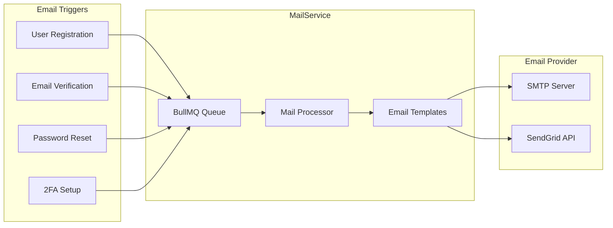

</LayoutDiagram>

---
transition: slide-up
---

<LayoutTwoCol title="Mail Service Features">

<template #left>

### 📧 Email Types

| Template | Trigger |
|----------|---------|
| **Welcome Email** | User registration |
| **Email Verification** | Email change |
| **Password Reset** | Forgot password |
| **2FA Setup** | Enable 2FA |
| **Team Invitation** | Add to project |

### 🎨 Template Engine
- **Handlebars** cho dynamic content
- **MJML** cho responsive layout

</template>

<template #right>

### 🌍 Internationalization (i18n)

**Features**:
- Multi-language support (EN/VI)
- Template-based với dynamic context
- User preference-based locale selection

> Hỗ trợ **multi-language** dựa trên user preference

</template>

</LayoutTwoCol>

---
transition: slide-up
---

<LayoutTitleContent title="Mail Service Implementation">

**Key Methods**:
- `sendEmailVerification()`: Gửi email xác thực với verification URL
- `sendPasswordReset()`: Gửi email reset password

**Architecture**:
- Sử dụng BullMQ queue cho async processing
- Template-based email generation
- Dynamic context injection

> Email được gửi **bất đồng bộ** qua BullMQ để không block request

</LayoutTitleContent>

---
transition: slide-up
---

<LayoutSection title="Screenshot Service">

Puppeteer Integration & Security

</LayoutSection>

---
transition: slide-up
---

<LayoutDiagram title="Screenshot Service Flow">

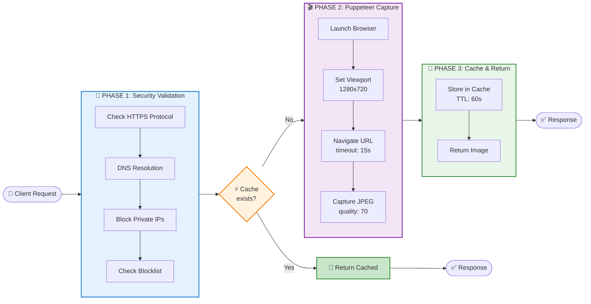

</LayoutDiagram>

---
transition: slide-up
---

<LayoutTwoCol title="Screenshot Service Security">

<template #left>

### 🛡️ SSRF Protection

**Validation Steps**:
1. HTTPS only - Reject non-HTTPS URLs
2. Parse URL - Extract hostname
3. Resolve DNS - Get IP addresses
4. Block private IPs - Prevent internal network access

**Blocked IP Ranges**:
- `127.0.0.0/8` - Localhost
- `10.0.0.0/8` - Private network
- `172.16.0.0/12` - Private network
- `192.168.0.0/16` - Private network
- `169.254.0.0/16` - Link-local

</template>

<template #right>

### 🤖 Puppeteer Implementation

**Process**:
1. Validate URL (SSRF protection)
2. Launch headless browser
3. Set viewport (1280x720)
4. Navigate with timeout (30s)
5. Capture screenshot (PNG)
6. Save to storage
7. Return public URL

**Security**:
- Sandbox mode (containerized)
- Timeout protection (30s)
- Resource cleanup (browser.close())

</template>

</LayoutTwoCol>

---
transition: slide-up
---

<LayoutTwoCol title="Screenshot Use Cases">

<template #left>

### 📸 Use Cases

| Tính năng | Mô tả |
|-----------|-------|
| **Visitor Context** | Capture trang visitor đang xem |
| **Bug Reports** | Screenshot lỗi từ dashboard |
| **Audit Trail** | Visual proof cho audit logs |
| **Webhooks** | Attach screenshot vào webhook payload |

</template>

<template #right>

### ⚙️ Configuration

**Environment Variables**:
- `SCREENSHOT_STORAGE_TYPE`: local hoặc s3
- `SCREENSHOT_MAX_SIZE`: 5MB limit
- `SCREENSHOT_TIMEOUT`: 30 seconds
- `SCREENSHOT_VIEWPORT_WIDTH`: 1280px
- `SCREENSHOT_VIEWPORT_HEIGHT`: 720px

> Production nên dùng **S3** hoặc **Cloud Storage**

</template>

</LayoutTwoCol>

---
transition: slide-up
---

<LayoutSection title="Summary">

Tổng kết phần Core Developer

</LayoutSection>

---
transition: slide-up
---

<LayoutTitleContent title="Core Developer Recap">

### 🔐 Security & Identity Foundation

| Chủ đề | Điểm chính | Metrics |
|--------|------------|---------|
| **Authentication** | JWT + OAuth + 2FA với token refresh | Access: 15min, Refresh: 7 days |
| **Multi-tenancy** | Project-based isolation với RBAC | 2-tier roles (Global + Project) |
| **User Management** | Secure email change với double verification | Token expiry: 24h, One-time use |
| **Mail Service** | Async email với i18n support qua BullMQ | EN/VI templates, Queue-based |
| **Screenshot Service** | Puppeteer với comprehensive SSRF protection | Max 5 concurrent, 60s cache |

### 🛡️ Security Highlights

- **Defense in Depth**: 4 lớp bảo mật (Auth → Authorization → Isolation → Audit)
- **Zero Trust**: Mọi request đều được validate ở multiple layers
- **Fail-Closed**: Default deny cho tất cả security checks
- **Token Rotation**: Refresh tokens được rotate để ngăn replay attacks
- **SSRF Protection**: DNS resolution + IP validation + hostname blocklist

</LayoutTitleContent>

<!-- End of presentation -->
