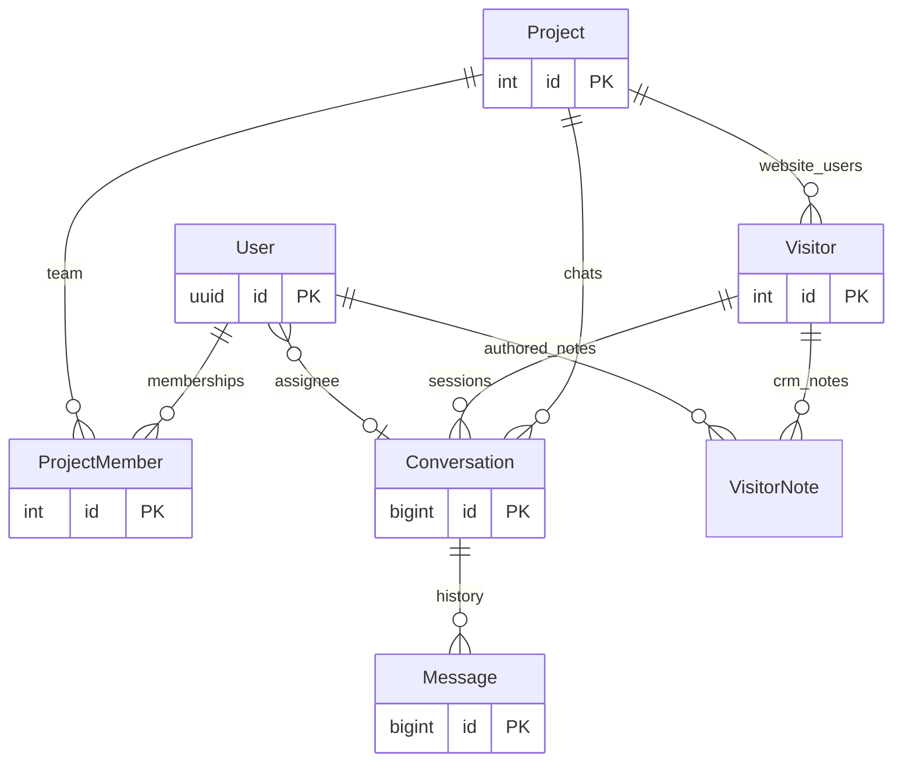
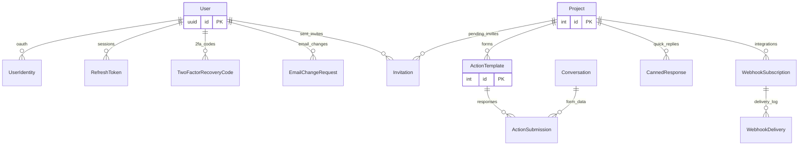
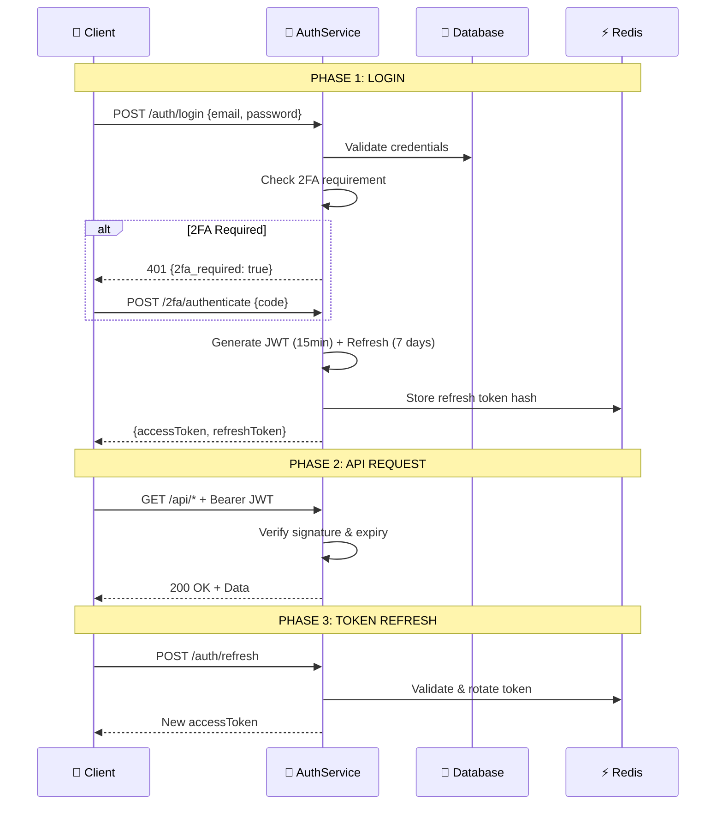
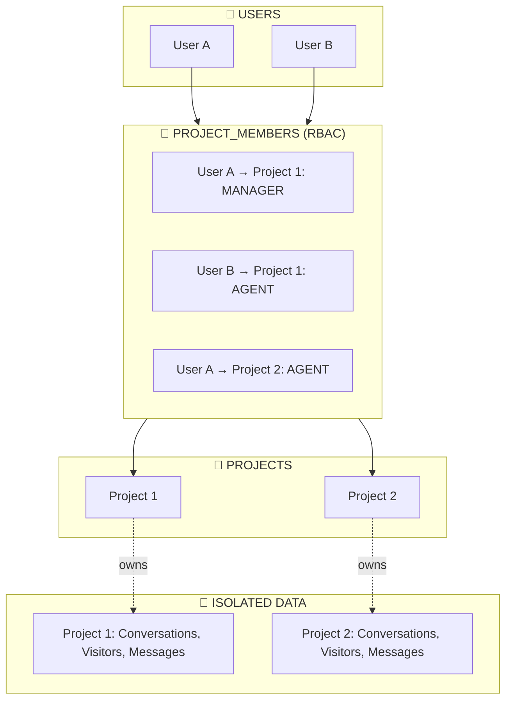
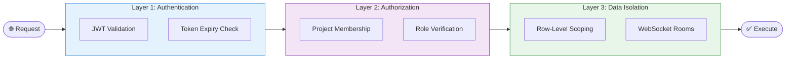

<LayoutSection title="Core Developer">

**Member 2: Core Developer**

Authentication, Multi-tenancy, User Management, và Core Utilities

</LayoutSection>

---

<LayoutTwoCol title="Core Developer Overview">

<template #left>

### 🎯 Trách nhiệm chính
**Identity & Security Foundation**

- **Authentication**: JWT (15min) + Refresh (7 days) + 2FA
- **Multi-tenancy**: Project-based isolation với RBAC
- **User Management**: Self-service account operations
- **Core Utilities**: Transactional email + Screenshot service

</template>

<template #right>

### 🔐 Phạm vi công việc

| Lĩnh vực | Chi tiết kỹ thuật |
|----------|-------------------|
| **Authentication** | JWT + OAuth 2.0 + TOTP 2FA |
| **Multi-tenancy** | Row-level security per project |
| **User Management** | Secure email change với double verification |
| **Mail Service** | i18n support (EN/VI) + async queue |
| **Screenshot** | Puppeteer + SSRF protection |

</template>

</LayoutTwoCol>

---

<LayoutSection title="Database Schema (ERD)">

Entity Relationship Diagram - Toàn bộ hệ thống

</LayoutSection>

---

<LayoutDiagram title="Database Schema: Core & Tenancy">



</LayoutDiagram>

---

<LayoutDiagram title="Database Schema: Identity & Extensions">



</LayoutDiagram>


---

<LayoutTwoCol title="Entity Details">

<template #left>

### 🔐 Identity Domain (5 tables)

| Entity | Purpose |
|--------|---------|
| **User** | Agent/Manager accounts |
| **UserIdentity** | OAuth providers (Google) |
| **RefreshToken** | Session management |
| **TwoFactorRecoveryCode** | 2FA backup codes |
| **EmailChangeRequest** | Secure email change flow |

### 🏢 Multi-tenancy Domain (3 tables)

| Entity | Purpose |
|--------|---------|
| **Project** | Workspace isolation unit |
| **ProjectMember** | RBAC pivot table |
| **Invitation** | Pending team invites |

</template>

<template #right>

### 💬 Communication Domain (4 tables)

| Entity | Purpose |
|--------|---------|
| **Visitor** | Website customers |
| **Conversation** | Chat sessions |
| **Message** | Chat history |
| **VisitorNote** | CRM notes |

### ⚙️ Automation Domain (5 tables)

| Entity | Purpose |
|--------|---------|
| **ActionTemplate** | Custom forms |
| **ActionSubmission** | Form responses |
| **CannedResponse** | Quick replies |
| **WebhookSubscription** | External integrations |
| **WebhookDelivery** | Webhook logs |

</template>

</LayoutTwoCol>

---

<LayoutSection title="Authentication Flow">

JWT, OAuth Integration, và Two-Factor Authentication

</LayoutSection>

---

<LayoutDiagram title="Authentication Lifecycle">



</LayoutDiagram>

---

<LayoutTwoCol title="Authentication Components">

<template #left>

### 🔑 Token Strategy

| Token | Lifetime | Storage |
|-------|----------|---------|
| **Access Token** | 15 min | Memory |
| **Refresh Token** | 7 days | Redis + HttpOnly Cookie |
| **2FA Partial** | 5 min | HttpOnly Cookie |

### 🛡️ Guards Pipeline

```
Request → JwtAuthGuard → ProjectGuard → RolesGuard → Controller
```

</template>

<template #right>

### 🌐 OAuth Flow (Google)

1. Redirect to Google consent
2. Callback with authorization code
3. Exchange for Google tokens
4. Create/Link `UserIdentity`
5. Generate app tokens

### 📱 2FA (TOTP)

- **Library**: `otplib`
- **Setup**: QR code + secret
- **Recovery**: 10 backup codes (hashed)

</template>

</LayoutTwoCol>

---

<LayoutSection title="Multi-Tenancy Architecture">

Project-based Data Isolation và Role-Based Access Control

</LayoutSection>

---

<LayoutDiagram title="Multi-Tenancy Model">



</LayoutDiagram>

---

<LayoutTwoCol title="Access Control">

<template #left>

### 🎭 Role Hierarchy

| Role | Permissions |
|------|-------------|
| **MANAGER** | Full project access + settings |
| **AGENT** | Chat operations only |

### 🔒 Isolation Layers

1. **Database**: `WHERE project_id = ?`
2. **Guards**: `ProjectGuard` validates membership
3. **WebSocket**: Rooms `project:{id}`

</template>

<template #right>

### ✅ Permission Matrix

| Action | MANAGER | AGENT |
|--------|:-------:|:-----:|
| View conversations | ✅ | ✅ |
| Reply to visitor | ✅ | ✅ |
| Manage team | ✅ | ❌ |
| Configure webhooks | ✅ | ❌ |
| View audit logs | ✅ | ❌ |

</template>

</LayoutTwoCol>

---

<LayoutSection title="Security Architecture">

Defense in Depth

</LayoutSection>

---

<LayoutDiagram title="Security Layers">



</LayoutDiagram>

---

<LayoutTwoCol title="Core Utilities">

<template #left>

### 📧 Mail Service

**Stack**: Nodemailer + BullMQ

| Email Type | Trigger |
|------------|---------|
| Welcome | Registration |
| Verification | Email change |
| Password Reset | Forgot password |
| Invitation | Team invite |

**I18n**: Templates in EN/VI based on `user.language`

</template>

<template #right>

### 📸 Screenshot Service

**Stack**: Puppeteer (headless Chrome)

**🛡️ SSRF Protection**:
1. HTTPS only
2. DNS resolution before request
3. Block private IPs (`10.x`, `192.168.x`, `127.x`)
4. Block metadata endpoints (AWS/GCP)

**Config**: 1280x720, JPEG 70%, 60s cache

</template>

</LayoutTwoCol>

---
transition: slide-up
---

<LayoutTitleContent title="Summary">

### 🔐 Core Developer Achievements

| Domain | Implementation | Key Metric |
|--------|---------------|------------|
| **Authentication** | JWT + OAuth + 2FA | Access: 15min, Refresh: 7 days |
| **Multi-tenancy** | ProjectMember RBAC | 2 roles (Manager/Agent) |
| **Database** | 17 entities, 4 domains | Full referential integrity |
| **Security** | Defense in Depth | 3-layer guard pipeline |
| **Utilities** | Mail (i18n) + Screenshot (SSRF-safe) | Async processing |

</LayoutTitleContent>