```mermaid
flowchart LR
    subgraph Phase1["🔐 PHASE 1: LOGIN"]
        direction TB
        User["👤 User"]
        LoginChoice{{"Chọn phương thức"}}
        LocalAuth["📧 Email + Password"]
        OAuthAuth["🌐 Google OAuth"]
        TwoFA["🔢 2FA Code"]
    end

    subgraph Phase2["✅ PHASE 2: TOKEN GENERATION"]
        direction TB
        ValidateCreds["Xác thực credentials"]
        GenJWT["Tạo JWT Token<br/>(15 phút)"]
        GenRefresh["Tạo Refresh Token<br/>(7 ngày)"]
        StoreRedis["Lưu Redis"]
    end

    subgraph Phase3["🚀 PHASE 3: API REQUEST"]
        direction TB
        APICall["API Request<br/>+ JWT Header"]
        JwtGuard["JWT Guard"]
        ProjectGuard["Project Guard"]
        RoleGuard["Role Guard"]
        Execute["Execute Logic"]
    end

    User --> LoginChoice
    LoginChoice -->|"Local"| LocalAuth
    LoginChoice -->|"OAuth"| OAuthAuth
    LocalAuth --> TwoFA
    OAuthAuth --> ValidateCreds
    TwoFA --> ValidateCreds
    
    ValidateCreds --> GenJWT
    GenJWT --> GenRefresh
    GenRefresh --> StoreRedis
    StoreRedis -.->|"Return tokens"| User

    User -->|"Subsequent requests"| APICall
    APICall --> JwtGuard
    JwtGuard --> ProjectGuard
    ProjectGuard --> RoleGuard
    RoleGuard --> Execute
```

```mermaid
sequenceDiagram
    participant C as 👤 Client
    participant G as 🚪 Gateway
    participant A as 🔐 AuthService
    participant D as 💾 Database
    participant R as ⚡ Redis

    Note over C,R: 🔐 LOGIN & TOKEN GENERATION

    C->>+G: POST /auth/login<br/>{email, password}
    G->>+A: validateCredentials()
    A->>+D: SELECT * FROM users<br/>WHERE email = ?
    D-->>-A: ✅ User found
    A->>A: bcrypt.compare(password)
    A->>A: 🎫 Generate JWT<br/>(expire: 15min)
    A->>A: 🔄 Generate Refresh Token<br/>(expire: 7 days)
    A->>+R: SETEX refresh:uuid<br/>604800 seconds
    R-->>-A: OK
    A-->>-G: Tokens created
    G-->>-C: 200 OK<br/>{accessToken, refreshToken}
```

```mermaid
sequenceDiagram
    participant C as 👤 Client
    participant G as 🚪 Gateway
    participant A as 🔐 AuthService
    participant R as ⚡ Redis

    Note over C,R: 🔄 TOKEN REFRESH (when JWT expires)

    C->>+G: POST /auth/refresh<br/>{refreshToken}
    G->>+R: GET refresh:uuid
    R-->>-G: ✅ Token exists & valid
    G->>+A: generateNewJWT(userId)
    A->>A: Create new JWT<br/>(expire: 15min)
    A-->>-G: New access token
    G-->>-C: 200 OK<br/>{accessToken}

    Note over C,R: 💡 Refresh token vẫn giữ nguyên (valid 7 days)
```

```mermaid
flowchart LR
    Start([🌐 API Request]) --> Layer1
    
    subgraph Layer1["🔐 LAYER 1: AUTHENTICATION"]
        direction TB
        A1[JWT Validation]
        A2[OAuth Provider]
        A3[2FA Verification]
        A1 -.-> A2 -.-> A3
    end
    
    Layer1 --> Layer2
    
    subgraph Layer2["🛡️ LAYER 2: AUTHORIZATION"]
        direction TB
        B1[Project Membership]
        B2[Role Verification]
        B3[Permission Check]
        B1 --> B2 --> B3
    end
    
    Layer2 --> Layer3
    
    subgraph Layer3["🔒 LAYER 3: DATA ISOLATION"]
        direction TB
        C1[Row-Level Security]
        C2[Project Scoping]
        C3[WebSocket Rooms]
        C1 --> C2 --> C3
    end
    
    Layer3 --> Layer4
    
    subgraph Layer4["📝 LAYER 4: AUDIT"]
        direction TB
        D1[Action Logging]
        D2[Security Events]
        D3[Compliance Trail]
        D1 --> D2 --> D3
    end
    
    Layer4 --> End([✅ Secure Response])
    
    style Layer1 fill:#e3f2fd,stroke:#1976d2,stroke-width:3px
    style Layer2 fill:#f3e5f5,stroke:#7b1fa2,stroke-width:3px
    style Layer3 fill:#e8f5e9,stroke:#388e3c,stroke-width:3px
    style Layer4 fill:#fff3e0,stroke:#f57c00,stroke-width:3px
    style Start fill:#ffebee,stroke:#c62828,stroke-width:2px
    style End fill:#c8e6c9,stroke:#2e7d32,stroke-width:2px
```

```mermaid
flowchart TB
    subgraph Users["👥 USERS"]
        U1["User A"]
        U2["User B"]
        U3["User C"]
    end

    subgraph Membership["🔗 PROJECT_MEMBERS<br/>(RBAC)"]
        M1["User A → Project 1<br/>Role: MANAGER"]
        M2["User B → Project 1<br/>Role: AGENT"]
        M3["User A → Project 2<br/>Role: AGENT"]
        M4["User C → Project 2<br/>Role: MANAGER"]
    end

    subgraph Projects["🏢 PROJECTS"]
        P1["Project 1<br/>Company X"]
        P2["Project 2<br/>Company Y"]
    end

    subgraph Guards["🔒 ACCESS CONTROL"]
        RG["RolesGuard<br/>(HTTP)"]
        WS["Socket.IO Rooms<br/>(WebSocket)"]
    end

    subgraph Data1["💾 PROJECT 1 DATA"]
        D1["Conversations<br/>Visitors<br/>Messages"]
    end

    subgraph Data2["💾 PROJECT 2 DATA"]
        D2["Conversations<br/>Visitors<br/>Messages"]
    end

    U1 & U2 --> Membership
    U3 --> Membership
    Membership --> P1 & P2
    P1 & P2 --> Guards
    Guards --> Data1 & Data2
    
    P1 -.->|"owns"| Data1
    P2 -.->|"owns"| Data2
```

```mermaid
flowchart LR
    Start([👤 User Request]) --> Phase1
    
    subgraph Phase1["� PHASE 1: Initiate"]
        direction TB
        A1[POST /users/me/change-email]
        A2{Email<br/>exists?}
        A3[Generate Token<br/>32 bytes random]
        A4[Store in Redis<br/>TTL: 1h]
        A5[Send Email<br/>Verification]
        
        A1 --> A2
        A2 -->|No| A3
        A2 -->|Yes| Err1[❌ 409 Conflict]
        A3 --> A4
        A4 --> A5
    end
    
    A5 --> Wait[📧 User checks email]
    Wait --> Phase2
    
    subgraph Phase2["✅ PHASE 2: Verify"]
        direction TB
        B1[GET /verify-email?token=xxx]
        B2{Token<br/>valid?}
        B3[UPDATE email]
        B4[DELETE token]
        
        B1 --> B2
        B2 -->|Yes| B3
        B2 -->|No| Err2[❌ 400 Invalid Token]
        B3 --> B4
    end
    
    B4 --> Success([✅ Email Changed])
    
    style Phase1 fill:#fff3e0,stroke:#f57c00,stroke-width:2px
    style Phase2 fill:#e8f5e9,stroke:#388e3c,stroke-width:2px
    style A2 fill:#e3f2fd,stroke:#1976d2,stroke-width:2px
    style B2 fill:#e3f2fd,stroke:#1976d2,stroke-width:2px
    style Err1 fill:#ffebee,stroke:#c62828,stroke-width:2px
    style Err2 fill:#ffebee,stroke:#c62828,stroke-width:2px
    style Success fill:#c8e6c9,stroke:#2e7d32,stroke-width:2px
```

<LayoutSection title="Core Developer">

**Member 2: Core Developer**

Authentication, Multi-tenancy, User Management, và Core Utilities

</LayoutSection>

---

<LayoutTwoCol title="Core Developer Overview">

<template #left>

### 🎯 Trách nhiệm chính
**Identity & Security Foundation**

- **Authentication**: JWT (15min) + Refresh (7 days) + 2FA
- **Multi-tenancy**: Project-based isolation với RBAC
- **User Management**: Self-service account operations
- **Core Utilities**: Transactional email + Screenshot service

</template>

<template #right>

### 🔐 Phạm vi công việc

| Lĩnh vực | Chi tiết kỹ thuật |
|----------|-------------------|
| **Authentication** | JWT + OAuth 2.0 + TOTP 2FA |
| **Multi-tenancy** | Row-level security per project |
| **User Management** | Secure email change với double verification |
| **Mail Service** | i18n support (EN/VI) + async queue |
| **Screenshot** | Puppeteer + SSRF protection |

</template>

</LayoutTwoCol>

---

<LayoutSection title="User Authentication">

JWT, OAuth Integration, và Two-Factor Authentication

</LayoutSection>

---

<LayoutDiagram title="Authentication Flow Overview">



</LayoutDiagram>

---

<LayoutTwoCol title="Authentication Methods">

<template #left>

### 🔑 Local Authentication
**Email + Password + 2FA**

```typescript
// Login flow
POST /auth/login
{
  "email": "agent@company.com",
  "password": "***"
}

// Response
{
  "accessToken": "eyJhbGc...",
  "refreshToken": "...",
  "requires2FA": true
}
```

</template>

<template #right>

### 🌐 OAuth Integration
**Google OAuth 2.0**

| Bước | Mô tả |
|------|-------|
| 1 | Redirect to Google |
| 2 | User authorizes |
| 3 | Callback with code |
| 4 | Exchange for tokens |
| 5 | Create/Link user |

> Hỗ trợ **Sign up** và **Link account** cho user hiện tại

</template>

</LayoutTwoCol>

---

<LayoutDiagram title="JWT Phase 1: Login & Token Generation">



</LayoutDiagram>

---

<LayoutDiagram title="JWT Phase 2: Authenticated Request">


</LayoutDiagram>

---

<LayoutDiagram title="JWT Phase 3: Token Refresh">



</LayoutDiagram>

---

<LayoutTitleContent title="JWT Token Structure">

```typescript
// Access Token Payload
{
  "sub": "user-uuid",           // User ID
  "email": "agent@company.com",
  "role": "AGENT",
  "iat": 1706543210,            // Issued at
  "exp": 1706544110             // Expires in 15 minutes
}

// Refresh Token
{
  "sub": "user-uuid",
  "tokenId": "refresh-uuid",
  "iat": 1706543210,
  "exp": 1707148010             // Expires in 7 days
}
```

| Token Type | Lifetime | Storage | Purpose |
|------------|----------|---------|---------|
| **Access Token** | 15 phút | Memory/LocalStorage | API authentication |
| **Refresh Token** | 7 ngày | Redis + HttpOnly Cookie | Token renewal |

> **Security**: Refresh token được lưu trong Redis để có thể **revoke** khi cần

</LayoutTitleContent>

---

<LayoutTwoCol title="Two-Factor Authentication (2FA)">

<template #left>

### 📱 TOTP-based 2FA
**Time-based One-Time Password**

```typescript
// Enable 2FA
POST /auth/2fa/enable
Response: {
  "secret": "JBSWY3DPEHPK3PXP",
  "qrCode": "data:image/png;base64,..."
}

// Verify setup
POST /auth/2fa/verify
{
  "token": "123456"
}
```

</template>

<template #right>

### 🔒 2FA Login Flow

| Bước | Mô tả |
|------|-------|
| 1 | User nhập email/password |
| 2 | Server kiểm tra `user.is2FAEnabled` |
| 3 | Nếu true → Yêu cầu TOTP code |
| 4 | Verify code với `speakeasy` |
| 5 | Cấp JWT token |

> Sử dụng thư viện **speakeasy** cho TOTP generation/validation

</template>

</LayoutTwoCol>

---

<LayoutTitleContent title="Authentication Guards">

```typescript
// JwtAuthGuard - Bảo vệ tất cả routes
@Injectable()
export class JwtAuthGuard extends AuthGuard('jwt') {
  canActivate(context: ExecutionContext) {
    // Kiểm tra JWT token trong header
    // Authorization: Bearer <token>
    return super.canActivate(context);
  }
}

// Usage trong controller
@Controller('inbox')
@UseGuards(JwtAuthGuard)
export class InboxController {
  @Get()
  async getInbox(@CurrentUser() user: User) {
    // user đã được inject từ JWT payload
  }
}
```

> **@CurrentUser()** decorator tự động extract user từ JWT payload

</LayoutTitleContent>

---

<LayoutSection title="Security Architecture">

Tổng quan kiến trúc bảo mật đa lớp

</LayoutSection>

---

<LayoutDiagram title="Security Layers - Defense in Depth">



</LayoutDiagram>

---

<LayoutTwoCol title="Security Principles">

<template #left>

### 🎯 Core Principles

**Defense in Depth**
- Nhiều lớp bảo vệ
- Fail-closed security
- Zero-trust architecture

**Least Privilege**
- Quyền tối thiểu cần thiết
- Role-based access control
- Time-limited tokens

</template>

<template #right>

### 🔑 Key Mechanisms

| Mechanism | Implementation |
|-----------|----------------|
| **Authentication** | JWT + OAuth + 2FA |
| **Session** | Refresh token rotation |
| **Authorization** | RBAC với project scope |
| **Isolation** | Row-level + WebSocket rooms |
| **Audit** | Comprehensive logging |

</template>

</LayoutTwoCol>

---

<LayoutSection title="Multi-Tenancy: Projects">

Project-based Data Isolation và Role-Based Access Control

</LayoutSection>

---

<LayoutDiagram title="Multi-Tenancy Architecture">



</LayoutDiagram>

---

<LayoutTwoCol title="Project Entity Structure">

<template #left>

### 📦 Project Model

```typescript
@Entity()
export class Project {
  @PrimaryGeneratedColumn('uuid')
  id: string;

  @Column()
  name: string;

  @Column({ unique: true })
  slug: string;

  @OneToMany(() => ProjectMember)
  members: ProjectMember[];

  @OneToMany(() => Conversation)
  conversations: Conversation[];
}
```

</template>

<template #right>

### 👥 ProjectMember Model

```typescript
@Entity()
export class ProjectMember {
  @ManyToOne(() => User)
  user: User;

  @ManyToOne(() => Project)
  project: Project;

  @Column({
    type: 'enum',
    enum: ProjectRole
  })
  role: ProjectRole; // MANAGER | AGENT

  @Column({ default: true })
  isActive: boolean;
}
```

</template>

</LayoutTwoCol>

---

<LayoutTitleContent title="Project Isolation Enforcement">

```typescript
// ProjectGuard - Đảm bảo user thuộc project
@Injectable()
export class ProjectGuard implements CanActivate {
  async canActivate(context: ExecutionContext): Promise<boolean> {
    const request = context.switchToHttp().getRequest();
    const user = request.user;
    const projectId = request.params.projectId || request.body.projectId;

    // Kiểm tra membership
    const member = await this.projectService.findMembership(
      projectId,
      user.id
    );

    if (!member || !member.isActive) {
      throw new ForbiddenException('Not a member of this project');
    }

    // Inject project vào request
    request.project = member.project;
    request.projectRole = member.role;
    return true;
  }
}
```

> Mọi request liên quan đến dữ liệu project **phải qua ProjectGuard**

</LayoutTitleContent>

---

<LayoutTwoCol title="Role-Based Access Control (RBAC)">

<template #left>

### 🎭 Project Roles

| Role | Quyền hạn |
|------|-----------|
| **MANAGER** | Toàn quyền quản lý project |
| **AGENT** | Chat với visitor, quản lý inbox |

### 🔐 Role Guard

```typescript
@Roles(ProjectRole.MANAGER)
@UseGuards(JwtAuthGuard, ProjectGuard, RolesGuard)
@Delete('members/:memberId')
async removeMember() {
  // Chỉ MANAGER mới được xóa member
}
```

</template>

<template #right>

### ✅ Permission Matrix

| Action | MANAGER | AGENT |
|--------|---------|-------|
| View conversations | ✅ | ✅ |
| Reply to visitor | ✅ | ✅ |
| Assign conversation | ✅ | ✅ |
| Manage team members | ✅ | ❌ |
| Configure webhooks | ✅ | ❌ |
| View audit logs | ✅ | ❌ |
| Delete project | ✅ | ❌ |

</template>

</LayoutTwoCol>

---

<LayoutDiagram title="Request Flow with Multi-Tenancy">


</LayoutDiagram>

---

<LayoutSection title="User Profile & Settings">

Self-Service Account Management

</LayoutSection>

---

<LayoutTwoCol title="User Profile Management">

<template #left>

### 👤 User Entity

```typescript
@Entity()
export class User {
  @PrimaryGeneratedColumn('uuid')
  id: string;

  @Column({ unique: true })
  email: string;

  @Column({ nullable: true })
  password: string; // Null for OAuth-only

  @Column()
  displayName: string;

  @Column({ nullable: true })
  avatarUrl: string;

  @Column({ default: false })
  is2FAEnabled: boolean;

  @Column({ nullable: true })
  twoFactorSecret: string;
}
```

</template>

<template #right>

### ⚙️ Profile Operations

| Endpoint | Mô tả |
|----------|-------|
| `GET /users/me` | Lấy thông tin profile |
| `PATCH /users/me` | Cập nhật displayName, avatar |
| `POST /users/me/change-email` | Đổi email (cần verify) |
| `POST /users/me/change-password` | Đổi password |
| `POST /users/me/upload-avatar` | Upload avatar |

> Avatar được lưu trên **cloud storage** (hoặc local trong dev)

</template>

</LayoutTwoCol>

---

<LayoutDiagram title="Email Change Flow (Security)">



</LayoutDiagram>

---

<LayoutTwoCol title="Email Change Security Details">

<template #left>

### 🔑 Token Security

**Generation**
- 32 bytes random (crypto.randomBytes)
- Stored in Redis with key pattern
- `email-change:{token}`

**Expiration**
- TTL: 3600 seconds (1 hour)
- Auto-deleted after use
- One-time use only

</template>

<template #right>

### 📧 Email Flow

**Initiate Phase**
1. Check email availability
2. Generate secure token
3. Store in Redis with TTL
4. Queue email via BullMQ

**Verify Phase**
1. Validate token from Redis
2. Update user email in DB
3. Delete token (prevent reuse)
4. Return success response

</template>

</LayoutTwoCol>

---

<LayoutTitleContent title="Secure Email Change Implementation">

```typescript
// Step 1: Request email change
async requestEmailChange(userId: string, newEmail: string) {
  // Kiểm tra email đã tồn tại
  const exists = await this.userRepository.findOne({ where: { email: newEmail } });
  if (exists) throw new ConflictException('Email already in use');

  // Generate token
  const token = randomBytes(32).toString('hex');
  
  // Lưu vào Redis (expire 1 hour)
  await this.redis.setex(
    `email-change:${token}`,
    3600,
    JSON.stringify({ userId, newEmail })
  );

  // Gửi email
  await this.mailService.sendEmailVerification(newEmail, token);
}

// Step 2: Verify token
async verifyEmailChange(token: string) {
  const data = await this.redis.get(`email-change:${token}`);
  if (!data) throw new BadRequestException('Invalid or expired token');

  const { userId, newEmail } = JSON.parse(data);
  await this.userRepository.update(userId, { email: newEmail });
  await this.redis.del(`email-change:${token}`);
}
```

> **Security**: Token chỉ dùng 1 lần và tự động expire sau 1 giờ

</LayoutTitleContent>

---

<LayoutSection title="Mail Service">

Transactional Email Infrastructure

</LayoutSection>

---

<LayoutDiagram title="Mail Service Architecture">


</LayoutDiagram>

---

<LayoutTwoCol title="Mail Service Features">

<template #left>

### 📧 Email Types

| Template | Trigger |
|----------|---------|
| **Welcome Email** | User registration |
| **Email Verification** | Email change |
| **Password Reset** | Forgot password |
| **2FA Setup** | Enable 2FA |
| **Team Invitation** | Add to project |

### 🎨 Template Engine
- **Handlebars** cho dynamic content
- **MJML** cho responsive layout

</template>

<template #right>

### 🌍 Internationalization (i18n)

```typescript
// Template với i18n
await this.mailService.send({
  to: user.email,
  template: 'welcome',
  locale: user.preferredLanguage, // 'en' | 'vi'
  context: {
    displayName: user.displayName,
    loginUrl: 'https://app.example.com'
  }
});
```

> Hỗ trợ **multi-language** dựa trên user preference

</template>

</LayoutTwoCol>

---

<LayoutTitleContent title="Mail Service Implementation">

```typescript
@Injectable()
export class MailService {
  constructor(
    @InjectQueue('mail') private mailQueue: Queue,
    private configService: ConfigService,
  ) {}

  async sendEmailVerification(email: string, token: string) {
    const verifyUrl = `${this.configService.get('APP_URL')}/verify-email?token=${token}`;
    
    await this.mailQueue.add('send-email', {
      to: email,
      template: 'email-verification',
      context: {
        verifyUrl,
        expiresIn: '1 hour'
      }
    });
  }

  async sendPasswordReset(email: string, token: string) {
    const resetUrl = `${this.configService.get('APP_URL')}/reset-password?token=${token}`;
    
    await this.mailQueue.add('send-email', {
      to: email,
      template: 'password-reset',
      context: { resetUrl }
    });
  }
}
```

> Email được gửi **bất đồng bộ** qua BullMQ để không block request

</LayoutTitleContent>

---

<LayoutSection title="Screenshot Service">

Puppeteer Integration & Security

</LayoutSection>

---

<LayoutDiagram title="Screenshot Service Flow">


</LayoutDiagram>

---

<LayoutTwoCol title="Screenshot Service Security">

<template #left>

### 🛡️ SSRF Protection

```typescript
async validateUrl(url: string) {
  // 1. HTTPS only
  if (!url.startsWith('https://')) {
    throw new BadRequestException(
      'Only HTTPS URLs allowed'
    );
  }

  // 2. Parse URL
  const parsed = new URL(url);
  
  // 3. Resolve DNS
  const ips = await dns.resolve4(
    parsed.hostname
  );

  // 4. Block private IPs
  for (const ip of ips) {
    if (this.isPrivateIP(ip)) {
      throw new ForbiddenException(
        'Private IPs not allowed'
      );
    }
  }
}
```

</template>

<template #right>

### 🚫 Blocked IP Ranges

| Range | Description |
|-------|-------------|
| `127.0.0.0/8` | Localhost |
| `10.0.0.0/8` | Private network |
| `172.16.0.0/12` | Private network |
| `192.168.0.0/16` | Private network |
| `169.254.0.0/16` | Link-local |

> Ngăn chặn **SSRF attacks** vào internal services

</template>

</LayoutTwoCol>

---

<LayoutTitleContent title="Puppeteer Implementation">

```typescript
@Injectable()
export class ScreenshotService {
  async captureScreenshot(url: string): Promise<string> {
    // Validate URL (SSRF protection)
    await this.validateUrl(url);

    // Launch headless browser
    const browser = await puppeteer.launch({
      headless: true,
      args: [
        '--no-sandbox',
        '--disable-setuid-sandbox',
        '--disable-dev-shm-usage'
      ]
    });

    try {
      const page = await browser.newPage();
      
      // Set viewport
      await page.setViewport({ width: 1280, height: 720 });
      
      // Navigate with timeout
      await page.goto(url, { 
        waitUntil: 'networkidle2',
        timeout: 30000 
      });
      
      // Capture screenshot
      const screenshot = await page.screenshot({ 
        type: 'png',
        fullPage: false 
      });
      
      // Save to storage
      const filename = `screenshot-${Date.now()}.png`;
      await this.storageService.save(filename, screenshot);
      
      return this.storageService.getUrl(filename);
    } finally {
      await browser.close();
    }
  }
}
```

</LayoutTitleContent>

---

<LayoutTwoCol title="Screenshot Use Cases">

<template #left>

### 📸 Use Cases

| Tính năng | Mô tả |
|-----------|-------|
| **Visitor Context** | Capture trang visitor đang xem |
| **Bug Reports** | Screenshot lỗi từ dashboard |
| **Audit Trail** | Visual proof cho audit logs |
| **Webhooks** | Attach screenshot vào webhook payload |

</template>

<template #right>

### ⚙️ Configuration

```typescript
// Environment variables
SCREENSHOT_STORAGE_TYPE=local // or 's3'
SCREENSHOT_MAX_SIZE=5242880    // 5MB
SCREENSHOT_TIMEOUT=30000       // 30s
SCREENSHOT_VIEWPORT_WIDTH=1280
SCREENSHOT_VIEWPORT_HEIGHT=720
```

> Production nên dùng **S3** hoặc **Cloud Storage**

</template>

</LayoutTwoCol>

---

<LayoutSection title="Summary">

Tổng kết phần Core Developer

</LayoutSection>

---

<LayoutTitleContent title="Core Developer Recap">

### 🔐 Security & Identity Foundation

| Chủ đề | Điểm chính | Metrics |
|--------|------------|---------|
| **Authentication** | JWT + OAuth + 2FA với token refresh | Access: 15min, Refresh: 7 days |
| **Multi-tenancy** | Project-based isolation với RBAC | 2-tier roles (Global + Project) |
| **User Management** | Secure email change với double verification | Token expiry: 24h, One-time use |
| **Mail Service** | Async email với i18n support qua BullMQ | EN/VI templates, Queue-based |
| **Screenshot Service** | Puppeteer với comprehensive SSRF protection | Max 5 concurrent, 60s cache |

### 🛡️ Security Highlights

- **Defense in Depth**: 4 lớp bảo mật (Auth → Authorization → Isolation → Audit)
- **Zero Trust**: Mọi request đều được validate ở multiple layers
- **Fail-Closed**: Default deny cho tất cả security checks
- **Token Rotation**: Refresh tokens được rotate để ngăn replay attacks
- **SSRF Protection**: DNS resolution + IP validation + hostname blocklist

</LayoutTitleContent>

---

<LayoutTwoCol title="Handoff to Next Presenter">

<template #left>

### ✅ Covered Topics
- User Authentication (JWT, OAuth, 2FA)
- Multi-tenancy & Project Isolation
- Role-Based Access Control
- User Profile & Settings
- Mail Service Infrastructure
- Screenshot Service Security

</template>

<template #right>

### ➡️ Next: Member 3
**Streaming Engineer - Real-time Engine**

- WebSocket Connection Lifecycle
- Visitor Session Management
- Message Flow (Inbound/Outbound)
- Agent Broadcast Synchronization

</template>

</LayoutTwoCol>
