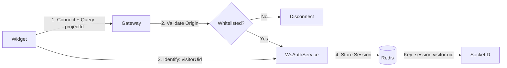
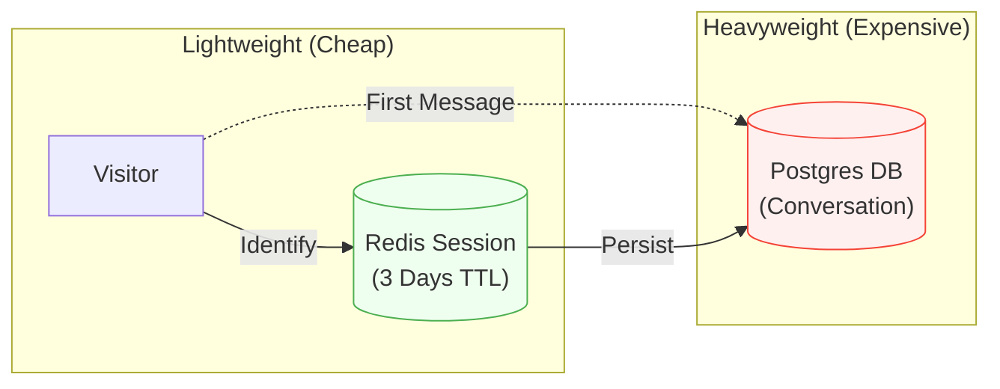
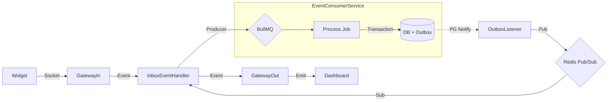
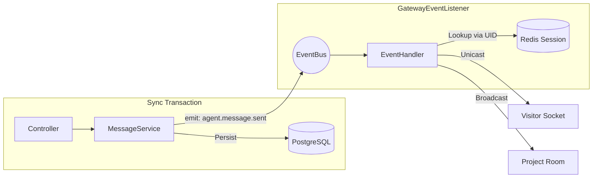
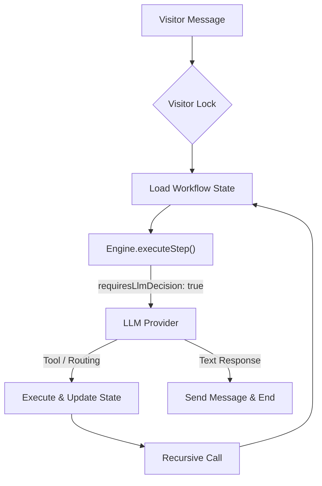
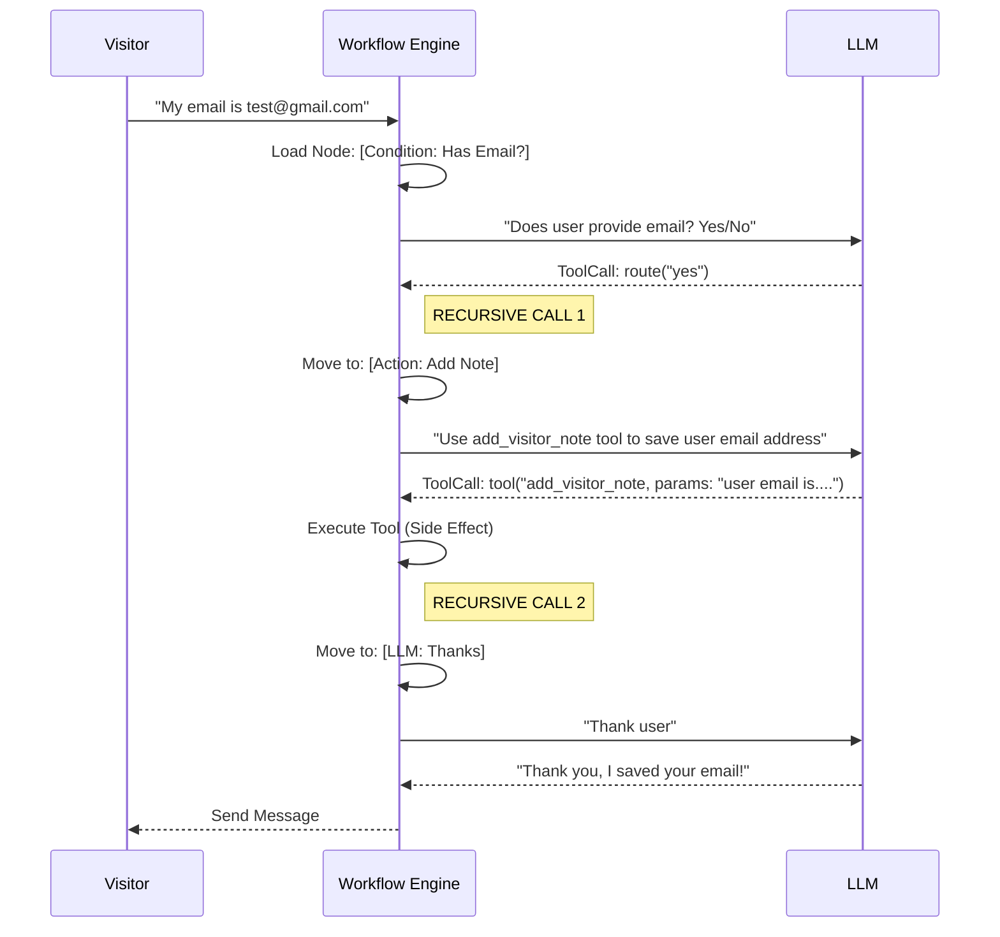

<LayoutTitleContent title="The Streaming Engine">

### ⚡ The Challenge: Speed vs. Reliability

Building a bi-directional pipeline that delivers messages **instantly** (<50ms) while guaranteeing **Zero Data Loss** during traffic bursts.

**Core Architecture:**
- **Inbound**: Async Queues (BullMQ) & Outbox Pattern for durability.
- **Outbound**: Synchronous Redis Session routing for speed.
- **Bridge**: Decoupling Domain Events from WebSocket transport.

</LayoutTitleContent>

---

<LayoutDiagram title="The Handshake: Connection & Auth">

<!--
- **Domain Whitelisting**: `WsAuthService` validates the HTTP `Origin` header.
- **Visitor Identity**: Client-side generated UUID (`visitorUid`).
- **Session**: Stored in Redis (`session:visitor:${uid}`) with a 3-day TTL.
-->

</LayoutDiagram>

---

<LayoutDiagram title="Lazy Creation Strategy">

</LayoutDiagram>

---

<LayoutSection title="Message Pipelines">

Designing for Asymmetric Traffic:   10,000 Visitors vs 50 Agents

</LayoutSection>
---

<LayoutDiagram title="Inbound Pipeline: High traffic (Async)">

<!--
- **Async Flow**: `InboxEventHandler` -> `BullMQ` -> `EventConsumerService`.
- **Reliability**: Dual Write (DB + Outbox) guarantees zero data loss.
-->

  <strong>Challenge:</strong> 10k Concurrent Visitors 
  <strong>Solution:</strong> Queue Buffering (BullMQ)

</LayoutDiagram>

---

<LayoutDiagram title="Outbound Pipeline: Instant Feedback (Sync)">

<!--
- **Sync Flow**: REST API -> `MessageService`.
- **Routing**: `RealtimeSessionService` looks up Redis for specific socket.
-->

  <strong>Challenge:</strong> Agent UX Latency 
  <strong>Solution:</strong> Direct Sync Write

</LayoutDiagram>

---

<LayoutSection title="The AI Orchestrator">

AI Workflow Engine & Decision Trees

</LayoutSection>

---

<LayoutTitleContent title="The AI Orchestrator">

### Beyond Q&A: Stateful Workflows

We built an engine that allows Agents to design **Decision Trees** that the AI executes statefully.

**Key Capabilities:**
- **LLM-Driven**: All routing nodes (Condition, Switch, Action) are handled by the LLM.
- **Recursive Chaining**: Handling multiple logic steps in a single turn.
- **Scope Isolation**: Condition nodes only see the **last message** to avoid sticky history.

</LayoutTitleContent>

---

<LayoutDiagram title="The Execution Loop">

<!--
1. **Lock**: VisitorLockService ensures sequential processing.
2. **State**: Loaded from `conversation.metadata`.
3. **Think**: LLM receives context. If "Text", it replies. if "Tool/Decision", it executes & recurses.
4. **Recurse**: The loop starts over for the NEXT node immediately.
-->

</LayoutDiagram>

---

<LayoutDiagram title="Recursive Intelligence">

<!--
**The Power of Recursion**:
If the AI decides to "Route" (e.g., "Yes, refund"), the engine:
1. Updates the State to the new Node.
2. **IMMEDIATELY** re-executes `_processMessage()` (Recursion).
3. The next node (e.g., "Ask for Order ID") runs instantly.

**Condition Node Scope:** Only the LAST user message is sent.
-->

</LayoutDiagram>

---
transition: slide-up
---

<LayoutTwoCol title="Seamless Integration">
<template #left>

### The Hook
We reuse the existing event pipeline.

1. **Inbound**: Listens to `ai.process.message` (Triggered **after** message persistence).
2. **Outbound**: Emits `agent.message.sent` (Just like a Human Agent).

No race conditions. The AI always sees the full context.
</template>

<template #right>

### System Actor
AI needs to perform actions (Add visistor note, Send Form,...) without being a "Member".

**The Trick**: `SYSTEM_USER_ID`

- A dedicated UUID in the database.
- Bypasses project membership checks in `ActionsService`.
- Ensures Audit Logs show "AI System" as the actor.
</template>
</LayoutTwoCol>
