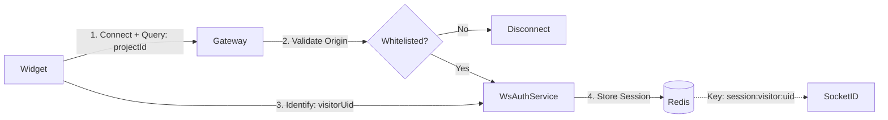
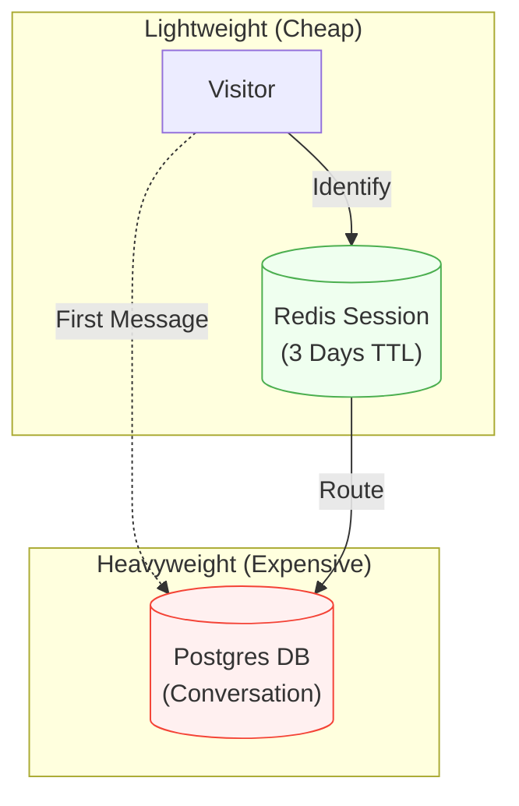
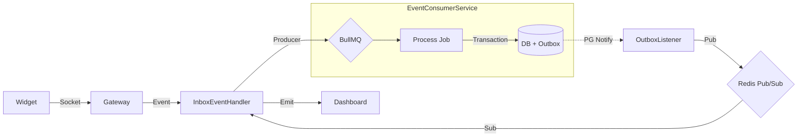
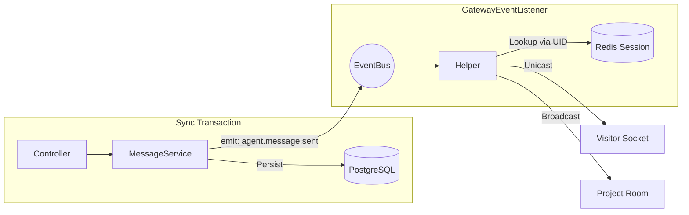
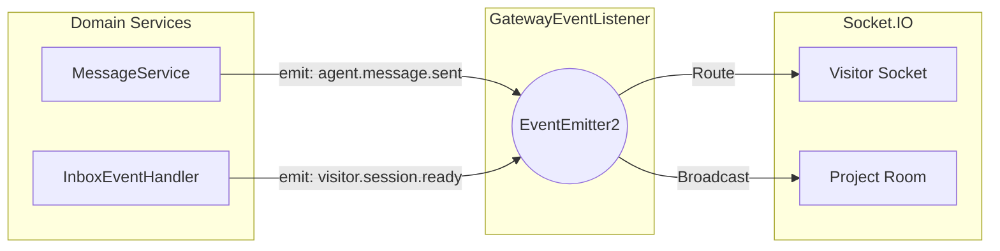
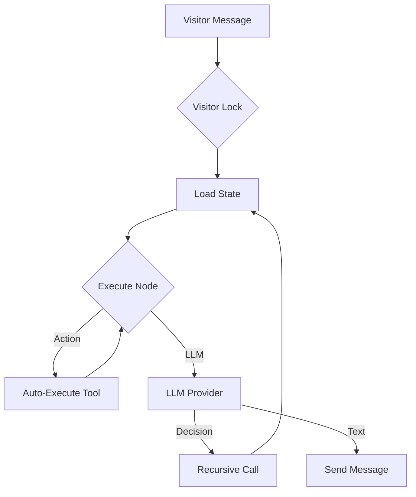
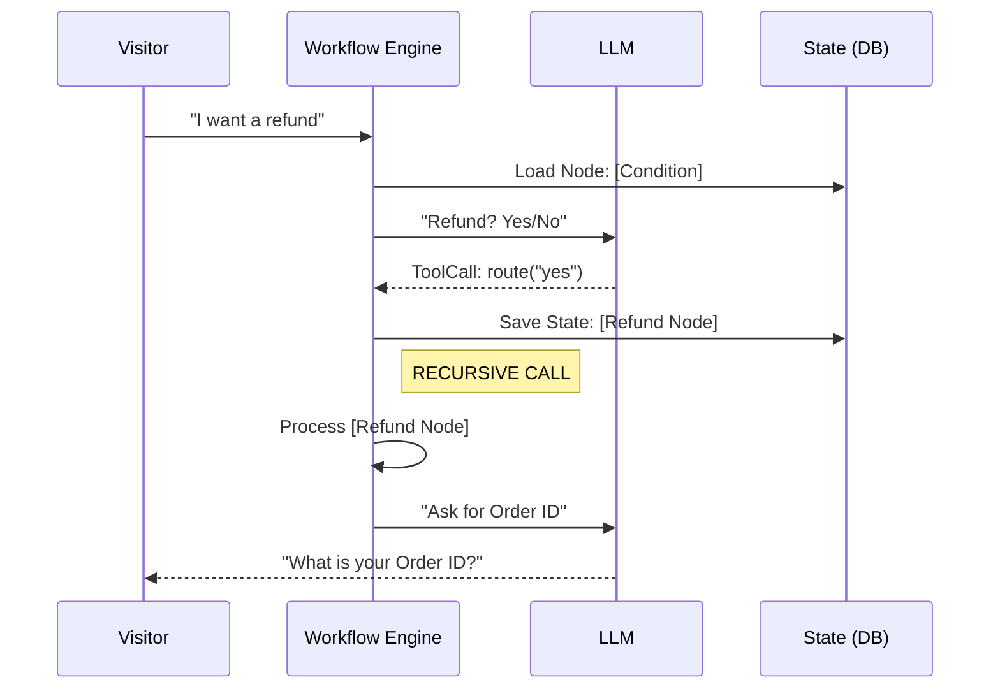

<LayoutTitleContent title="The Streaming Engine">

### ⚡ The Challenge: Speed vs. Reliability

Building a bi-directional pipeline that delivers messages **instantly** (<50ms) while guaranteeing **Zero Data Loss** during traffic bursts.

**Core Architecture:**
- **Inbound**: Async Queues (BullMQ) & Outbox Pattern for durability.
- **Outbound**: Synchronous Redis Session routing for speed.
- **Bridge**: Decoupling Domain Events from WebSocket transport.

</LayoutTitleContent>

---
transition: slide-up
---

<LayoutDiagram title="The Handshake: Connection & Auth">

<!--
- **Domain Whitelisting**: `WsAuthService` validates the HTTP `Origin` header.
- **Visitor Identity**: Client-side generated UUID (`visitorUid`).
- **Session**: Stored in Redis (`session:visitor:${uid}`) with a 3-day TTL.
-->

</LayoutDiagram>

---
transition: slide-up
---

<LayoutDiagram title="Lazy Creation Strategy">

</LayoutDiagram>

---
transition: slide-up
---

<LayoutDiagram title="Inbound Pipeline (Visitor → System)">

<!--
- **Async Flow**: `InboxEventHandler` -> `BullMQ` -> `EventConsumerService`.
- **Reliability**: Dual Write (DB + Outbox) guarantees zero data loss.
-->

</LayoutDiagram>

---
transition: slide-up
---

<LayoutDiagram title="Outbound Pipeline (Agent → Visitor)">

<!--
- **Sync Flow**: REST API -> `MessageService`.
- **Routing**: `RealtimeSessionService` looks up Redis for specific socket.
-->

</LayoutDiagram>

---
transition: slide-up
---

<LayoutDiagram title="The Bridge: Gateway Event Listener">

<!--
- **Decoupling**: Service layer (`MessageService`) is unaware of WebSockets.
- **Bridge**: `GatewayEventListener` connects internal `EventEmitter2` to external `Socket.IO`.
-->

</LayoutDiagram>

---
transition: slide-up
---

<LayoutTitleContent title="Agent Synchronization" label="Socket.IO Rooms">

<!--
- All agents viewing a project join a `project:${projectId}` socket room.
-->

**Room**: `project:${projectId}`

Every agent joins. Every action broadcasts.
State stays consistent across all screens.

</LayoutTitleContent>

---
transition: slide-up
---

<LayoutTitleContent title="The AI Orchestrator">

### Beyond Q&A: Stateful Workflows

We built an engine that allows Agents to design **Decision Trees** that the AI executes statefully.

**Key Capabilities:**
- **Graph Execution**: Visual flows (Start → Condition → Action → LLM).
- **Recursive Chaining**: Handling multiple logic steps in a single turn.
- **State Persistence**: "Remembering" position in the graph across messages.

</LayoutTitleContent>

---
transition: slide-up
---

<LayoutDiagram title="The Execution Loop">

<!--
1. **Lock**: VisitorLockService ensures sequential processing.
2. **State**: Loaded from `conversation.metadata`.
3. **Think**: LLM decides (Text, Tool, or Routing).
4. **Act**: ToolExecutor performs action (Note, Status, etc.).
-->

</LayoutDiagram>

---
transition: slide-up
---

<LayoutDiagram title="Recursive Intelligence">

<!--
**The Power of Recursion**:
If the AI decides to "Route" (e.g., "Yes, refund"), the engine:
1. Updates the State to the new Node.
2. **IMMEDIATELY** re-executes `processMessage()` (Recursion).
3. The next node (e.g., "Ask for Order ID") runs instantly.
-->

</LayoutDiagram>

---
transition: slide-left
---

<LayoutTwoCol title="Seamless Integration">
<template #left>

### The Hook
We reuse the existing event pipeline.

1. **Inbound**: Listens to `visitor.message.received` (Just like the Inbox).
2. **Outbound**: Emits `agent.message.sent` (Just like a Human Agent).

The System doesn't know it's an AI.
</template>

<template #right>

### System Actor
AI needs to perform actions (Close Ticket, Send Form) without being a "Member".

**The Trick**: `SYSTEM_USER_ID`

- A dedicated UUID in the database.
- Bypasses project membership checks in `ActionsService`.
- Ensures Audit Logs show "AI System" as the actor.
</template>
</LayoutTwoCol>
