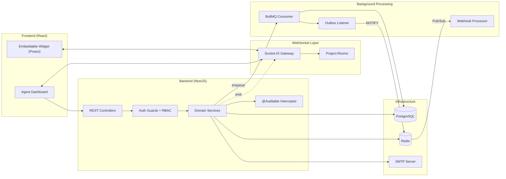

<LayoutDiagram title="System Architecture Overview">

</LayoutDiagram>

---

<LayoutTitleContent title="Product Features & Workflow">

<!--
Presenter: Member 4 (Product Owner)
-->

- **Agent Workspace**: Daily operations
- **Productivity**: Canned responses, Macros
- **Collaboration**: Assignments and Notes

</LayoutTitleContent>
