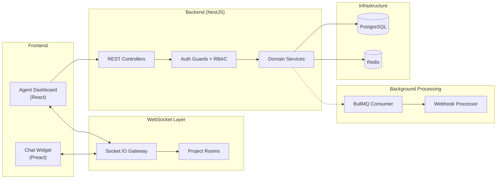
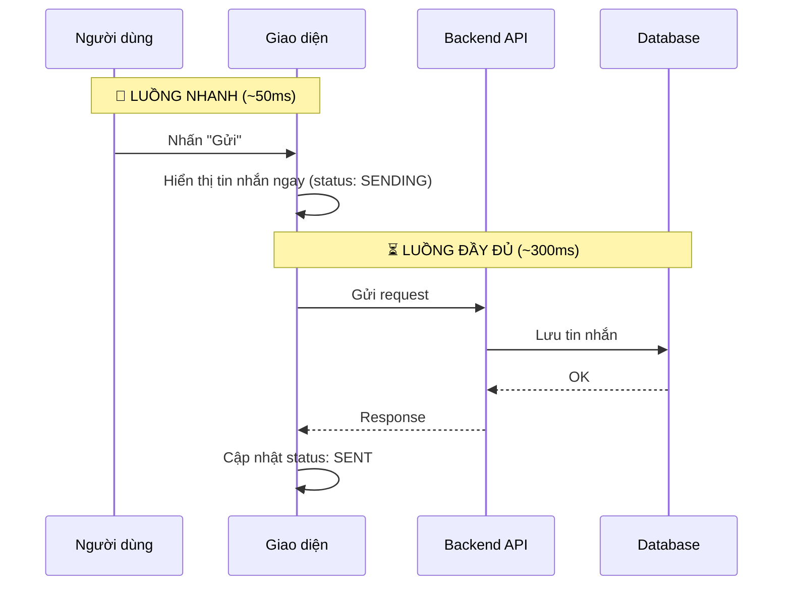
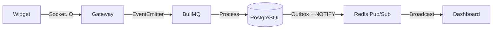
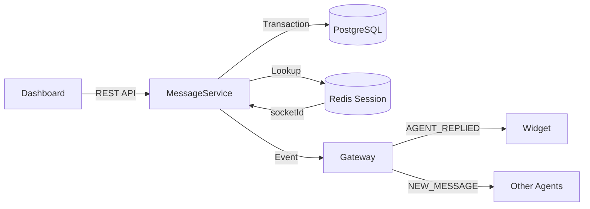
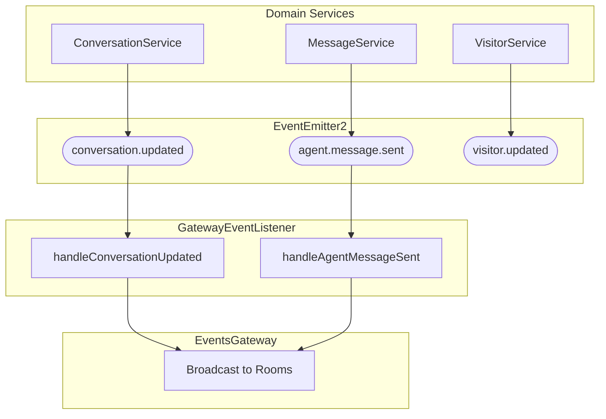
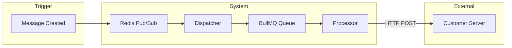

<LayoutSection title="System Architecture">

**Member 1: System Architect**

Kiến trúc tổng thể, triển khai, Event-Driven Core, Webhooks, và Audit Logs

</LayoutSection>

---
transition: slide-up
---


<LayoutTwoCol title="System Overview">

<template #left>

### 🎯 Application Type
**Customer Support Chat Platform**

- Real-time messaging giữa Visitor và Agent
- Widget nhúng vào website khách hàng
- Dashboard quản lý cho nhân viên hỗ trợ

</template>

<template #right>

### 🏗️ Architecture Style
**Event-Driven Microservices**

| Đặc điểm | Mô tả |
|----------|-------|
| **Real-time** | WebSocket (Socket.IO) |
| **Multi-tenant** | Cô lập dữ liệu theo Project |
| **Decoupled** | EventEmitter2 Bus |

</template>

</LayoutTwoCol>

---
transition: slide-up
---


<LayoutDiagram title="System Components Overview">



</LayoutDiagram>

---
transition: slide-up
---

<LayoutTwoCol title="Multi-Tenancy with Projects">

<template #left>

### 🔐 Data Isolation

```
Mọi entity → projectId → Cô lập hoàn toàn
```

- **Project**: Đơn vị cô lập dữ liệu gốc
- **ProjectMember**: Liên kết User với Project
- Mọi request phải validate **project membership**

</template>

<template #right>

### 👥 Role Hierarchy

| Role | Quyền hạn |
|------|-----------|
| **MANAGER** | Toàn quyền: cấu hình, báo cáo, quản lý team |
| **AGENT** | Chat với khách, quản lý conversation |

> Dữ liệu công ty A **không bao giờ lẫn** với công ty B

</template>

</LayoutTwoCol>

---
transition: slide-up
---

<LayoutDiagram title="Message Flow - Optimistic UI Pattern">



</LayoutDiagram>

---
transition: slide-up
---

<LayoutDiagram title="Visitor → Agent Message Flow">



</LayoutDiagram>

---
transition: slide-up
---

<LayoutTitleContent title="Visitor → Agent: Step by Step">

| Bước | Công nghệ | Mục đích |
|------|-----------|----------|
| 1 | Socket.IO | Gửi tin nhắn real-time |
| 2 | EventEmitter2 | Decouple components |
| 3 | BullMQ | Xử lý bất đồng bộ |
| 4 | Outbox Pattern | Đảm bảo exactly-once delivery |
| 5 | Redis Pub/Sub | Broadcast đa server |

> **Outbox Pattern** đảm bảo tin nhắn không bao giờ bị mất dù server crash giữa chừng

</LayoutTitleContent>

---
transition: slide-up
---

<LayoutDiagram title="Agent → Visitor Message Flow">



</LayoutDiagram>

---
transition: slide-up
---

<LayoutSection title="Deployment & Tech Stack">

Công nghệ và cấu trúc Monorepo

</LayoutSection>

---
transition: slide-up
---

<LayoutTwoCol title="Technology Stack">

<template #left>

### 🖥️ Backend
| Layer | Technology |
|-------|------------|
| **Runtime** | Node.js ≥18.x |
| **Framework** | NestJS |
| **Database** | PostgreSQL |
| **Cache/Queue** | Redis + BullMQ |
| **Real-time** | Socket.IO |

</template>

<template #right>

### 🎨 Frontend
| Component | Technology |
|-----------|------------|
| **Dashboard** | React |
| **Widget** | Preact (nhẹ hơn) |
| **State** | Zustand |
| **Styling** | TailwindCSS |

### 📦 DevOps
- **Container**: Docker Compose ≥2.x
- **Monorepo**: npm workspaces

</template>

</LayoutTwoCol>

---
transition: slide-up
---

<LayoutTitleContent title="Monorepo Structure">

```
live_chat/
├── packages/
│   ├── backend/        # NestJS API + Worker
│   │   ├── src/
│   │   │   ├── auth/       # Authentication
│   │   │   ├── inbox/      # Messages & Conversations
│   │   │   ├── gateway/    # WebSocket
│   │   │   └── webhooks/   # External integration
│   │   └── ...
│   ├── frontend/       # React Dashboard + Widget
│   └── shared-*/       # Shared DTOs & Types
└── docs/               # Documentation
```

> Cấu trúc này giúp **code sharing dễ dàng** và **build/deploy thống nhất**

</LayoutTitleContent>

---
transition: slide-up
---

<LayoutSection title="Event-Driven Core">

Kiến trúc Event và Socket.IO Room Isolation

</LayoutSection>

---
transition: slide-up
---

<LayoutDiagram title="Event Architecture">



</LayoutDiagram>

---
transition: slide-up
---

<LayoutTitleContent title="Socket.IO Room Isolation">

```typescript
// Khi agent join project
async handleJoinProjectRoom(client, payload) {
  // 1. Phải đăng nhập
  if (!client.data.user) 
    throw new WsException('Unauthorized');
  
  // 2. Phải là member của project
  await this.projectService.validateProjectMembership(
    payload.projectId, 
    client.data.user.id
  );
  
  // 3. Join room
  client.join(`project:${payload.projectId}`);
}

// Broadcast chỉ đến project room
this.server
  .to(`project:${projectId}`)
  .emit('conversationUpdated', payload);
```

> Agent của công ty A **không nhận được event** của công ty B

</LayoutTitleContent>

---
transition: slide-up
---

<LayoutTwoCol title="Event Catalog">

<template #left>

### 📨 Inbox Events
| Event | Trigger |
|-------|---------|
| conversationUpdated | Assign, status change |
| newMessage | Tin nhắn mới |

</template>

<template #right>

### 👤 Visitor Events
| Event | Trigger |
|-------|---------|
| visitorStatusChanged | Connect/Disconnect |
| visitorIsTyping | Visitor gõ phím |
| visitorContextUpdated | URL thay đổi |

</template>

</LayoutTwoCol>

---
transition: slide-up
---

<LayoutSection title="Webhooks">

External Integration với SSRF Protection

</LayoutSection>

---
transition: slide-up
---

<LayoutDiagram title="Webhook Architecture">



</LayoutDiagram>

---
transition: slide-up
---

<LayoutTwoCol title="Webhook Components & Security">

<template #left>

### ⚙️ Components
| Thành phần | Chức năng |
|------------|-----------|
| **Dispatcher** | Lắng nghe Redis → Enqueue jobs |
| **Processor** | HTTP POST + retry + HMAC |
| **Delivery Log** | Theo dõi trạng thái gửi |

</template>

<template #right>

### 🛡️ SSRF Protection
| Bảo vệ | Chi tiết |
|--------|----------|
| **HTTPS only** | Chỉ URL https:// |
| **DNS Validation** | Resolve hostname trước |
| **Block Private IPs** | 127.0.0.0/8, 10.0.0.0/8... |
| **HMAC Signature** | X-Hub-Signature-256 |

</template>

</LayoutTwoCol>

---
transition: slide-up
---

<LayoutSection title="Audit Logs">

Security Compliance & Investigation

</LayoutSection>

---
transition: slide-up
---

<LayoutTwoCol title="Audit System">

<template #left>

### 📋 Overview
| Đặc điểm | Mô tả |
|----------|-------|
| **Mục đích** | Security compliance |
| **Cơ chế** | Decorator-based Interceptor |
| **Pattern** | Fail-Open |
| **Storage** | PostgreSQL + JSONB |

```typescript
@Auditable({ 
  action: AuditAction.UPDATE, 
  entity: 'Conversation' 
})
@Patch(':id/assign')
async assign(@Body() dto) { ... }
```

</template>

<template #right>

### 🔒 Sensitive Data Redaction

```typescript
const SENSITIVE_KEYS = [
  'password', 'token', 'secret', 
  'authorization', 'apikey',
  'creditcard', 'cvv', 'ssn'
];

// Kết quả trong log
{
  "email": "user@example.com",
  "password": "[REDACTED]",
  "token": "[REDACTED]"
}
```

> Matching là **case-insensitive** và **recursive**

</template>

</LayoutTwoCol>

---
transition: slide-up
---

<LayoutSection title="Summary">

Tổng kết phần System Architecture

</LayoutSection>

---
transition: slide-up
---

<LayoutTitleContent title="Architecture Recap">

| Chủ đề | Điểm chính |
|--------|-----------|
| **Kiến trúc** | Event-Driven Microservices với NestJS |
| **Multi-tenancy** | Project-based isolation với RBAC |
| **Real-time** | Socket.IO Rooms + EventEmitter2 |
| **Message Flow** | Optimistic UI + Outbox Pattern |
| **External Integration** | Webhooks với SSRF Protection |
| **Compliance** | Audit Logs với Fail-Open + Redaction |

</LayoutTitleContent>

---
transition: slide-left
---

<LayoutTwoCol title="Handoff to Next Presenter">

<template #left>

### ✅ Covered Topics
- System Architecture Overview
- Multi-tenancy & Project Isolation
- Message Flow Patterns
- Event-Driven Core
- Webhooks & Security
- Audit Logs

</template>

<template #right>

### ➡️ Next: Member 2
**Core Developer - Authentication**

- JWT Authentication
- OAuth Integration
- Two-Factor Authentication (2FA)
- Session Management

</template>

</LayoutTwoCol>
