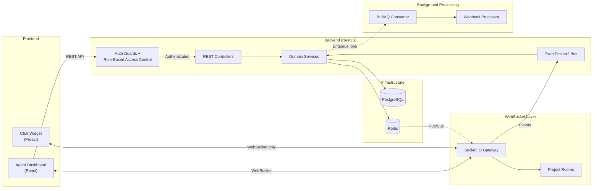
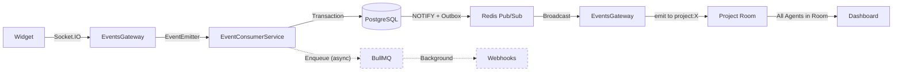
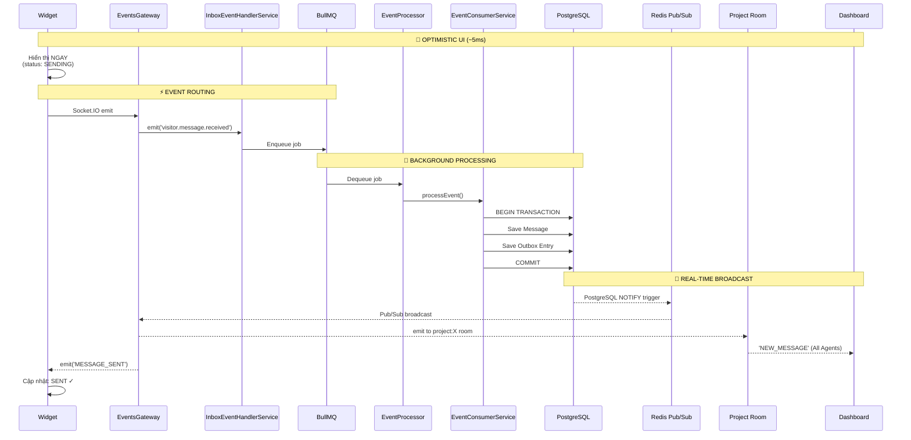
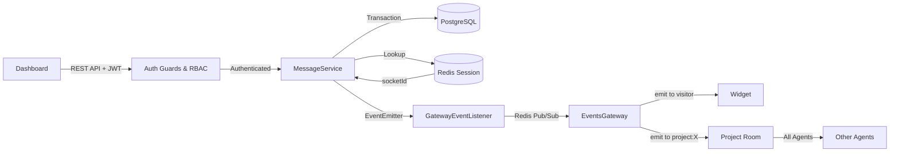
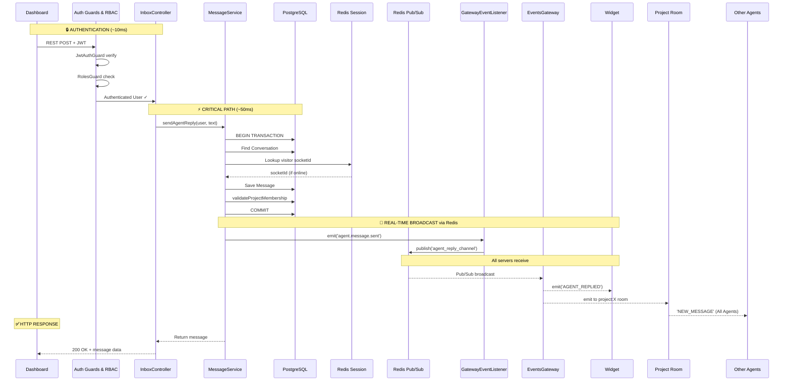
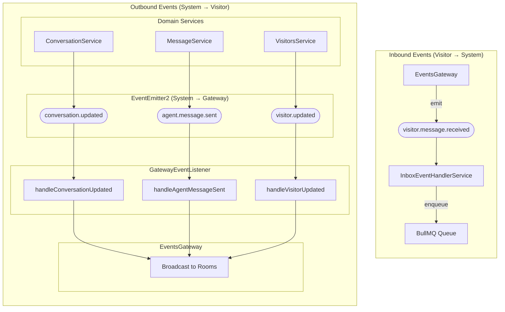
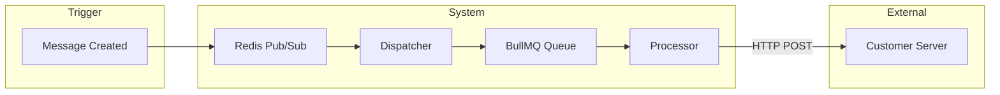
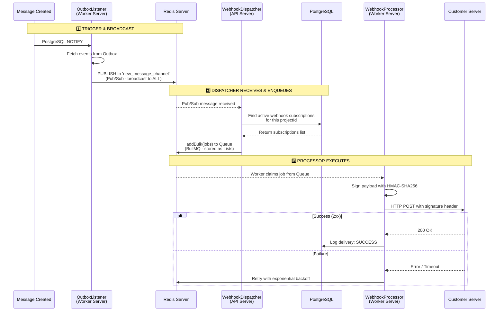

<LayoutSection title="System Architecture">

**Member 1: System Architect**

Kiến trúc tổng thể, triển khai, Event-Driven Core, Webhooks, và Audit Logs

</LayoutSection>

---
transition: slide-up
---


<LayoutTwoCol title="System Overview">

<template #left>

### 🎯 Application Type
**Customer Support Chat Platform**

- Real-time messaging giữa Visitor và Agent
- Widget nhúng vào website khách hàng
- Dashboard quản lý cho nhân viên hỗ trợ

</template>

<template #right>

### 🏗️ Architecture Style
**Event-Driven Microservices**

| Đặc điểm | Mô tả |
|----------|-------|
| **Real-time** | WebSocket (Socket.IO) |
| **Multi-tenant** | Cô lập dữ liệu theo Project |
| **Decoupled** | EventEmitter2 Bus |

</template>

</LayoutTwoCol>

<!--
"Trước tiên, để các bạn có cái nhìn tổng quan về hệ thống chúng tôi đang xây dựng.

Về Application Type: Đây là một nền tảng Customer Support Chat Platform, cho phép real-time messaging giữa Visitor - người truy cập website - và Agent - nhân viên hỗ trợ. Hệ thống bao gồm một chat widget có thể nhúng vào bất kỳ website nào của khách hàng, và một dashboard quản lý dành cho các nhân viên hỗ trợ.

Về Architecture Style: Chúng tôi chọn kiến trúc Event-Driven Microservices. Các điểm đặc biệt là:

Real-time: Sử dụng WebSocket thông qua Socket.IO để đảm bảo tin nhắn được truyền trong thời gian thực
Multi-tenant: Hỗ trợ nhiều công ty khác nhau sử dụng cùng hệ thống, với dữ liệu được cô lập hoàn toàn theo từng Project
Decoupled: Các thành phần giao tiếp thông qua EventEmitter2 Bus, giúp hệ thống linh hoạt và dễ mở rộng"
-->

---

<LayoutDiagram title="System Components Overview">



</LayoutDiagram>

<!--
"Bây giờ chúng ta sẽ đi sâu vào các thành phần chính của hệ thống qua sơ đồ này.

Hệ thống được chia thành 5 tầng chính:

Tầng Frontend gồm hai phần:
Agent Dashboard: Được viết bằng React, đây là giao diện làm việc của nhân viên hỗ trợ
Chat Widget: Được viết bằng Preact - một phiên bản nhẹ hơn của React - để đảm bảo tải nhanh khi nhúng vào website khách hàng

Tầng WebSocket Layer: Sử dụng Socket.IO Gateway để xử lý tất cả các kết nối real-time. Đặc biệt, chúng tôi sử dụng cơ chế Project Rooms để cô lập các sự kiện theo từng project.

Tầng Backend: Xây dựng trên NestJS framework, bao gồm:

REST Controllers để xử lý các API request
Domain Services chứa business logic
Auth Guards và RBAC để kiểm soát quyền truy cập
Background Workers: Xử lý các tác vụ nặng như gửi webhook mà không làm block main thread. Chúng tôi dùng BullMQ để quản lý queue.

Cuối cùng là Infrastructure layer: Gồm PostgreSQL để lưu trữ dữ liệu, và Redis phục vụ cho cache, queue, và pub/sub.

Các thành phần này làm việc phối hợp với nhau để tạo nên một hệ thống real-time hiệu quả và scalable."
-->

---

<LayoutTwoCol title="Multi-Tenancy with Projects">

<template #left>

### 🔐 Data Isolation

```
Mọi entity → projectId → Cô lập hoàn toàn
```

- **Project**: Đơn vị cô lập dữ liệu gốc
- **ProjectMember**: Liên kết User với Project
- Mọi request phải validate **project membership**

</template>

<template #right>

### 👥 Role Hierarchy

| Role | Quyền hạn |
|------|-----------|
| **MANAGER** | Toàn quyền: cấu hình, báo cáo, quản lý team |
| **AGENT** | Chat với khách, quản lý conversation |

> Dữ liệu công ty A **không bao giờ lẫn** với công ty B

</template>

</LayoutTwoCol>

<!--
"Một trong những đặc điểm quan trọng nhất của hệ thống là khả năng Multi-Tenancy.

Về Data Isolation: Mọi entity trong hệ thống đều có projectId. Đây là đơn vị cô lập dữ liệu gốc. Điều này có nghĩa là:

Project là container chứa tất cả dữ liệu của một công ty
ProjectMember liên kết User với Project
Mọi request đều phải validate project membership trước khi cho phép truy cập
Về Role Hierarchy: Hệ thống có 2 role chính:

MANAGER: Có toàn quyền quản lý - bao gồm cấu hình hệ thống, xem báo cáo, và quản lý team members
AGENT: Quyền chat với khách hàng và quản lý conversation
Điểm quan trọng nhất là: Dữ liệu của công ty A không bao giờ có thể lẫn với công ty B. Mỗi project là một môi trường độc lập hoàn toàn."
-->

---

<LayoutDiagram title="Visitor → Agent Flow">



</LayoutDiagram>

<!--
"Đây là tổng quan luồng Visitor gửi tin nhắn đến Agent.

Widget gửi tin nhắn qua Socket.IO đến EventsGateway. Gateway phát event qua EventEmitter đến EventConsumerService.

EventConsumerService lưu Message và Outbox entry vào PostgreSQL trong cùng một transaction. Sau khi commit, PostgreSQL NOTIFY trigger kết hợp Outbox Pattern đảm bảo message được broadcast qua Redis Pub/Sub.

EventsGateway nhận event từ Redis và emit đến Project Room cụ thể (project:X). Chỉ các Agents đã join room này mới nhận được message - đây là cơ chế multi-tenancy isolation.

Background path: EventConsumerService enqueue webhook job vào BullMQ để xử lý sau, không block real-time flow.

Critical path từ Widget đến Dashboard chỉ mất ~60ms."
-->

---

<LayoutDiagram title="Visitor → Agent: Complete Flow">



</LayoutDiagram>

<!--
"Đây là luồng HOÀN CHỈNH khi Visitor gửi tin nhắn đến Agent.

OPTIMISTIC UI (~5ms): Ngay khi visitor nhấn gửi, Widget hiển thị tin nhắn NGAY LẬP TỨC với status SENDING. Người dùng không phải chờ.

CRITICAL PATH (~60ms - Synchronous):
- Widget emit event qua Socket.IO đến EventsGateway
- Gateway forward event qua EventEmitter đến EventConsumerService
- EventConsumerService bắt đầu database TRANSACTION:
  + Save Message vào messages table
  + Save Outbox Entry vào outbox table (cùng transaction!)
  + COMMIT transaction - đảm bảo ATOMIC operation
  
REAL-TIME BROADCAST (~10ms):
- PostgreSQL trigger tự động phát NOTIFY event sau khi commit
- Redis Pub/Sub nhận NOTIFY và broadcast đến TẤT CẢ servers
- EventsGateway ở mọi servers nhận event từ Redis
- Gateway emit 'NEW_MESSAGE' đến Dashboard của Agent đang online
- Gateway cũng emit 'MESSAGE_SENT' confirmation đến Widget
- Widget cập nhật status từ SENDING thành SENT

BACKGROUND PROCESSING (Asynchronous - không block):
- EventConsumerService enqueue webhook job vào BullMQ
- BullMQ xử lý background: gửi HTTP POST đến external systems
- Hoàn toàn không ảnh hưởng đến real-time performance

Điểm quan trọng: Outbox Pattern đảm bảo nếu server crash SAU khi commit transaction, message đã được lưu và outbox processor sẽ retry broadcast. Đây là exactly-once delivery guarantee."
-->

---

<LayoutDiagram title="Agent → Visitor Flow">



</LayoutDiagram>

<!--
"Đây là tổng quan luồng Agent gửi tin nhắn đến Visitor.

Dashboard gửi REST API request với JWT token. Request đi qua Auth Guards & RBAC để verify authentication và authorization.

MessageService nhận authenticated user, lưu message vào PostgreSQL transaction, đồng thời lookup visitor's socketId từ Redis Session.

Sau transaction, MessageService emit event qua EventEmitter đến GatewayEventListener. Listener publish lên Redis Pub/Sub để broadcast cross-server.

EventsGateway nhận từ Redis và emit tin nhắn đến Widget của visitor. Đồng thời, Gateway emit đến Project Room để broadcast 'NEW_MESSAGE' cho tất cả Agents khác đang join room này - đảm bảo multi-tenancy isolation.

Điểm quan trọng: Redis Pub/Sub đảm bảo tin nhắn được deliver ngay cả khi visitor socket ở server khác."
-->

---
transition: slide-up
---

<LayoutDiagram title="Agent → Visitor: Complete Flow">



</LayoutDiagram>

<!--
"Đây là luồng HOÀN CHỈNH khi Agent gửi tin reply đến Visitor.

AUTHENTICATION (~10ms):
- Dashboard gửi REST API request với JWT token
- JwtAuthGuard verify token signature và extract user
- RolesGuard kiểm tra user có role AGENT/MANAGER trong project
- Chỉ khi pass cả 2 guards mới được tiếp tục

CRITICAL PATH (~50ms - Synchronous):
- InboxController gọi MessageService.sendAgentReply()
- MessageService bắt đầu database TRANSACTION:
  + Find Conversation và validate permissions
  + Lookup visitor's socketId từ Redis Session
  + Save Message với status SENT (nếu visitor online) hoặc DELIVERED (nếu offline)
  + validateProjectMembership để đảm bảo conversation thuộc đúng project
  + COMMIT transaction
  
REAL-TIME BROADCAST via Redis Pub/Sub (~10ms):
- Sau transaction, MessageService emit event local 'agent.message.sent'
- GatewayEventListener nhận event
- Listener PUBLISH message lên Redis channel 'agent_reply_channel'
- Redis broadcast đến TẤT CẢ servers (critical cho multi-server!)
- EventsGateway ở mọi servers nhận event:
  + Server có visitor socket → emit 'AGENT_REPLIED' đến Widget
  + Broadcast 'NEW_MESSAGE' đến Other Agents trong project room
  
HTTP RESPONSE:
- MessageService return saved message object
- InboxController return HTTP 200 OK với message data
- Dashboard nhận response và biết chắc message đã gửi thành công

Điểm QUAN TRỌNG: Redis Pub/Sub là BẮT BUỘC cho multi-server deployment! Vì visitor socket có thể ở server khác với server xử lý agent request. Nếu chỉ emit local Socket.IO, visitor sẽ KHÔNG BAO GIỜ nhận được message."
-->


---

<LayoutSection title="Deployment & Tech Stack">

Công nghệ và cấu trúc Monorepo

</LayoutSection>

---
transition: slide-up
---

<LayoutTwoCol title="Technology Stack">

<template #left>

### 🖥️ Backend
| Layer | Technology |
|-------|------------|
| **Runtime** | Node.js ≥18.x |
| **Framework** | NestJS |
| **Database** | PostgreSQL |
| **Cache/Queue** | Redis + BullMQ |
| **Real-time** | Socket.IO |

</template>

<template #right>

### 🎨 Frontend
| Component | Technology |
|-----------|------------|
| **Dashboard** | React |
| **Widget** | Preact (nhẹ hơn) |
| **State** | Zustand |
| **Styling** | TailwindCSS |

### 📦 DevOps
- **Container**: Docker Compose ≥2.x
- **Monorepo**: npm workspaces

</template>

</LayoutTwoCol>

---
transition: slide-up
---

<LayoutTitleContent title="Monorepo Structure">

```
live_chat/
├── packages/
│   ├── backend/        # NestJS API + Worker
│   │   ├── src/
│   │   │   ├── auth/       # Authentication
│   │   │   ├── inbox/      # Messages & Conversations
│   │   │   ├── gateway/    # WebSocket
│   │   │   └── webhooks/   # External integration
│   │   └── ...
│   ├── frontend/       # React Dashboard + Widget
│   └── shared-*/       # Shared DTOs & Types
└── docs/               # Documentation
```

> Cấu trúc này giúp **code sharing dễ dàng** và **build/deploy thống nhất**

</LayoutTitleContent>

---
transition: slide-up
---

<LayoutSection title="Event-Driven Core">

Kiến trúc Event và Socket.IO Room Isolation

</LayoutSection>

---
transition: slide-up
---

<LayoutDiagram title="Event Architecture">



</LayoutDiagram>

---
transition: slide-up
---

<LayoutTitleContent title="Socket.IO Room Isolation">

```typescript
// Khi agent join project
async handleJoinProjectRoom(client, payload) {
  // 1. Phải đăng nhập
  if (!client.data.user) 
    throw new WsException('Unauthorized');
  
  // 2. Phải là member của project
  await this.projectService.validateProjectMembership(
    payload.projectId, 
    client.data.user.id
  );
  
  // 3. Join room
  client.join(`project:${payload.projectId}`);
}

// Broadcast chỉ đến project room
this.server
  .to(`project:${projectId}`)
  .emit('conversationUpdated', payload);
```

> Agent của công ty A **không nhận được event** của công ty B

</LayoutTitleContent>

---
transition: slide-up
---

<LayoutTwoCol title="Event Catalog">

<template #left>

### 📨 Inbox Events
| Event | Trigger |
|-------|---------|
| conversationUpdated | Assign, status change |
| newMessage | Tin nhắn mới |

</template>

<template #right>

### 👤 Visitor Events
| Event | Trigger |
|-------|---------|
| visitorStatusChanged | Connect/Disconnect |
| visitorIsTyping | Visitor gõ phím |
| visitorContextUpdated | URL thay đổi |

</template>

</LayoutTwoCol>

---
transition: slide-up
---

<LayoutSection title="Webhooks">

External Integration với SSRF Protection

</LayoutSection>

---
transition: slide-up
---

<LayoutDiagram title="Webhook Architecture">



</LayoutDiagram>

<!--
"Đây là sơ đồ tổng quan về Webhook Architecture.

Khi một Message được tạo (Trigger), sự kiện được broadcast qua Redis Pub/Sub đến Dispatcher. 

Dispatcher lắng nghe channel này, tìm các webhook subscriptions cần gửi, rồi đẩy jobs vào BullMQ Queue.

BullMQ Queue thực chất là data structures được lưu trong Redis - đảm bảo persistence và retry mechanism.

Processor (BullMQ Worker) lấy jobs từ queue và gửi HTTP POST đến Customer Server của khách hàng.

Slide tiếp theo sẽ giải thích chi tiết hơn về infrastructure và luồng xử lý."
-->

---

<LayoutDiagram title="Webhook Architecture: Detailed Flow">



</LayoutDiagram>

<!--
"Đây là luồng chi tiết của Webhook Architecture.

ĐIỂM QUAN TRỌNG: Redis Pub/Sub và BullMQ Queue đều sử dụng CÙNG MỘT Redis Server, nhưng với cơ chế khác nhau:
- Pub/Sub: Broadcast message đến TẤT CẢ subscribers (fire-and-forget)
- BullMQ: Lưu jobs trong Redis dưới dạng Lists, chỉ 1 worker claim mỗi job

BƯỚC 1 - TRIGGER & BROADCAST:
- Khi message được tạo, OutboxListener (chạy trong Worker Server) phát hiện thông qua PostgreSQL NOTIFY
- OutboxListener publish event lên Redis Pub/Sub channel 'new_message_channel'
- Đây là broadcast - mọi Dispatcher trên tất cả servers đều nhận được

BƯỚC 2 - DISPATCHER RECEIVES & ENQUEUES:
- WebhookDispatcher (chạy trong API Server) đã subscribe vào channel từ trước
- Khi nhận message, Dispatcher query database để tìm active subscriptions cho project
- Với mỗi subscription, Dispatcher tạo job và đẩy vào BullMQ Queue
- Queue này được lưu trong Redis, shared cho tất cả servers

BƯỚC 3 - PROCESSOR EXECUTES:
- WebhookProcessor (BullMQ Worker, chạy trong Worker Server) liên tục polling queue
- Khi có job, Worker claim bằng distributed lock - đảm bảo chỉ 1 worker xử lý
- Processor ký payload bằng HMAC-SHA256 và gửi HTTP POST đến Customer Server
- Nếu thành công: log SUCCESS
- Nếu thất bại: retry với exponential backoff (1s, 2s, 4s, 8s, 16s)

Cơ chế này đảm bảo: Reliability (retry), Scalability (distributed workers), Security (HMAC signature)."
-->

---

<LayoutTwoCol title="Webhook Components & Security">

<template #left>

### ⚙️ Components
| Thành phần | Chức năng |
|------------|-----------|
| **Dispatcher** | Lắng nghe Redis → Enqueue jobs |
| **Processor** | HTTP POST + retry + HMAC |
| **Delivery Log** | Theo dõi trạng thái gửi |

</template>

<template #right>

### 🛡️ SSRF Protection
| Bảo vệ | Chi tiết |
|--------|----------|
| **HTTPS only** | Chỉ URL https:// |
| **DNS Validation** | Resolve hostname trước |
| **Block Private IPs** | 127.0.0.0/8, 10.0.0.0/8... |
| **HMAC Signature** | X-Hub-Signature-256 |

</template>

</LayoutTwoCol>

---
transition: slide-up
---

<LayoutSection title="Audit Logs">

Security Compliance & Investigation

</LayoutSection>

---
transition: slide-up
---

<LayoutTwoCol title="Audit System">

<template #left>

### 📋 Overview
| Đặc điểm | Mô tả |
|----------|-------|
| **Mục đích** | Security compliance |
| **Cơ chế** | Decorator-based Interceptor |
| **Pattern** | Fail-Open |
| **Storage** | PostgreSQL + JSONB |

```typescript
@Auditable({ 
  action: AuditAction.UPDATE, 
  entity: 'Conversation' 
})
@Patch(':id/assign')
async assign(@Body() dto) { ... }
```

</template>

<template #right>

### 🔒 Sensitive Data Redaction

```typescript
const SENSITIVE_KEYS = [
  'password', 'token', 'secret', 
  'authorization', 'apikey',
  'creditcard', 'cvv', 'ssn'
];

// Kết quả trong log
{
  "email": "user@example.com",
  "password": "[REDACTED]",
  "token": "[REDACTED]"
}
```

> Matching là **case-insensitive** và **recursive**

</template>

</LayoutTwoCol>

---
transition: slide-up
---

<LayoutSection title="Summary">

Tổng kết phần System Architecture

</LayoutSection>

---
transition: slide-left
---

<LayoutTitleContent title="Architecture Recap">

| Chủ đề | Điểm chính |
|--------|-----------|
| **Kiến trúc** | Event-Driven Microservices với NestJS |
| **Multi-tenancy** | Project-based isolation với RBAC |
| **Real-time** | Socket.IO Rooms + EventEmitter2 |
| **Message Flow** | Optimistic UI + Outbox Pattern |
| **External Integration** | Webhooks với SSRF Protection |
| **Compliance** | Audit Logs với Fail-Open + Redaction |

</LayoutTitleContent>