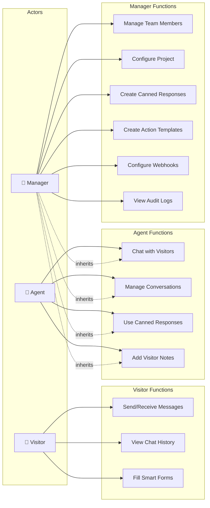
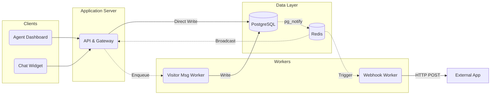
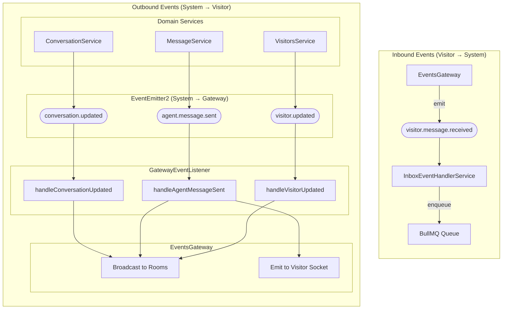
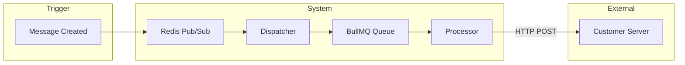
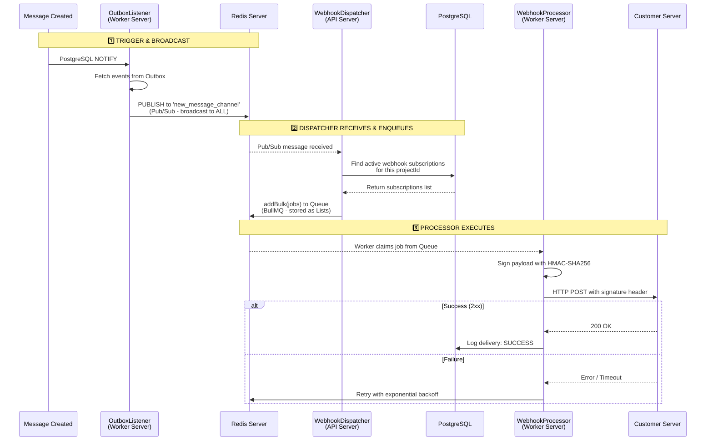

<LayoutSection title="System Architecture">

**Member 1: System Architect**

Kiến trúc tổng thể, triển khai, Event-Driven Core, Webhooks, và Audit Logs

</LayoutSection>

---


<LayoutTwoCol title="System Overview">

<template #left>

### 🎯 Application Type
**Customer Support Chat Platform**

- Real-time messaging giữa Visitor và Agent
- Widget nhúng vào website khách hàng
- Dashboard quản lý cho nhân viên hỗ trợ

</template>

<template #right>

### 🏗️ Architecture Style
**Event-Driven Microservices**

| Đặc điểm | Mô tả |
|----------|-------|
| **Real-time** | WebSocket (Socket.IO) |
| **Multi-tenant** | Cô lập dữ liệu theo Project |
| **Decoupled** | EventEmitter2 Bus |

</template>

</LayoutTwoCol>

<!--
"Trước tiên, để các bạn có cái nhìn tổng quan về hệ thống chúng tôi đang xây dựng.

Về Application Type: Đây là một nền tảng Customer Support Chat Platform, cho phép real-time messaging giữa Visitor - người truy cập website - và Agent - nhân viên hỗ trợ. Hệ thống bao gồm một chat widget có thể nhúng vào bất kỳ website nào của khách hàng, và một dashboard quản lý dành cho các nhân viên hỗ trợ.

Về Architecture Style: Chúng tôi chọn kiến trúc Event-Driven Microservices. Các điểm đặc biệt là:

Real-time: Sử dụng WebSocket thông qua Socket.IO để đảm bảo tin nhắn được truyền trong thời gian thực
Multi-tenant: Hỗ trợ nhiều công ty khác nhau sử dụng cùng hệ thống, với dữ liệu được cô lập hoàn toàn theo từng Project
Decoupled: Các thành phần giao tiếp thông qua EventEmitter2 Bus, giúp hệ thống linh hoạt và dễ mở rộng"
-->

---

<LayoutDiagram title="Use Case Diagram">



</LayoutDiagram>

<!--
"Đây là Use Case Diagram của hệ thống Live Chat.

Hệ thống có 3 loại người dùng chính:

1. Visitor - Người truy cập website:
   - Có thể gửi và nhận tin nhắn real-time
   - Xem lịch sử chat của mình
   - Điền các Smart Forms mà Agent gửi

2. Agent - Nhân viên hỗ trợ:
   - Chat trực tiếp với Visitor
   - Quản lý conversations: assign, đổi status (Open, Resolved, Pending)
   - Sử dụng Canned Responses để trả lời nhanh
   - Thêm ghi chú riêng về Visitor

3. Manager - Quản lý:
   - Có toàn bộ quyền của Agent (inherits)
   - Quản lý team: thêm/xóa Agent
   - Cấu hình Project: domain whitelist, settings
   - Tạo Canned Responses và Action Templates
   - Cấu hình Webhooks cho external integration
   - Xem Audit Logs để theo dõi hoạt động

Điểm quan trọng: Manager thừa kế (inherits) tất cả use cases của Agent, thể hiện bằng đường nét đứt."
-->

---

<LayoutDiagram title="System Components Overview">



</LayoutDiagram>

<!--
"Bây giờ chúng ta sẽ đi sâu vào các thành phần chính của hệ thống qua sơ đồ này.

Hệ thống được chia thành 5 tầng chính:

Tầng Frontend gồm hai phần:
- Agent Dashboard: Được viết bằng React, đây là giao diện làm việc của nhân viên hỗ trợ
- Chat Widget: Được viết bằng Preact - một phiên bản nhẹ hơn của React - để đảm bảo tải nhanh khi nhúng vào website khách hàng

Tầng WebSocket Layer: Sử dụng Socket.IO Gateway để xử lý tất cả các kết nối real-time. Đặc biệt, chúng tôi sử dụng cơ chế Project Rooms để cô lập các sự kiện theo từng project.

Tầng Backend: Xây dựng trên NestJS framework, bao gồm REST Controllers, Domain Services, và Auth Guards với RBAC.

ĐIỂM QUAN TRỌNG - Luồng xử lý Message:
1. Domain Services KHÔNG ghi trực tiếp vào database, mà đẩy job vào BullMQ (events-queue)
2. Event Processor (Worker) lấy job và thực hiện ghi vào PostgreSQL
3. Đồng thời, Worker insert event vào Outbox Table
4. PostgreSQL trigger pg_notify thông báo cho Redis
5. Redis broadcast qua Pub/Sub đến Socket.IO Gateway để gửi real-time cho client

Về Webhook Flow:
6. WebhookDispatcher subscribe Redis channel, khi nhận event thì đẩy job vào BullMQ (webhooks-queue) - đây là queue RIÊNG BIỆT
7. Webhook Processor lấy job và gửi HTTP POST đến External Server

Lưu ý: Hệ thống sử dụng 2 BullMQ Queues riêng biệt để tách biệt concerns và đảm bảo reliability."
-->
---

<LayoutSection title="Deployment & Tech Stack">

Công nghệ và cấu trúc Monorepo

</LayoutSection>

---

<LayoutTwoCol title="Technology Stack">

<template #left>

### 🖥️ Backend
| Layer | Technology |
|-------|------------|
| **Runtime** | Node.js ≥18.x |
| **Framework** | NestJS |
| **Database** | PostgreSQL |
| **Cache/Queue** | Redis + BullMQ |
| **Real-time** | Socket.IO |

</template>

<template #right>

### 🎨 Frontend
| Component | Technology |
|-----------|------------|
| **Dashboard** | React |
| **Widget** | Preact (nhẹ hơn) |
| **State** | Zustand |
| **Styling** | TailwindCSS |

### 📦 DevOps
- **Container**: Docker Compose ≥2.x
- **Monorepo**: npm workspaces
- **CI/CD**: GitHub Actions (Auto Testing & Linting)

</template>

</LayoutTwoCol>

---

<LayoutTwoCol title="Development Process">
<template #left>

### 🔄 Agile & Iterative
**Philosophy: "Build Small, Scale Fast"**

1.  **Phase 1 (Core)**: Chat text-only (Agent ↔ Visitor)
2.  **Phase 2 (Real-time)**: WebSocket + Optimistic UI
3.  **Phase 3 (Enterprise)**: Multi-tenancy + Security
4.  **Final**: AI Orchestration

</template>
<template #right>

### 🛠️ Why NestJS?
**Structure & Scalability**

- **Modular**: Dễ chia tách features (Auth, Inbox, Gateway)
- **Opinionated**: Chuẩn hóa cách viết code cho Team 4 người
- **Ecosystem**: Support Native cho WebSocket & Microservices

</template>
</LayoutTwoCol>

---

<LayoutTitleContent title="Monorepo Structure">

```
live_chat/
├── packages/
│   ├── backend/        # NestJS API + Worker
│   │   ├── src/
│   │   │   ├── auth/       # Authentication
│   │   │   ├── inbox/      # Messages & Conversations
│   │   │   ├── gateway/    # WebSocket
│   │   │   └── webhooks/   # External integration
│   │   └── ...
│   ├── frontend/       # React Dashboard + Widget
│   └── shared-*/       # Shared DTOs & Types
└── docs/               # Documentation
```

> Cấu trúc này giúp **code sharing dễ dàng** và **build/deploy thống nhất**

</LayoutTitleContent>

---

<LayoutSection title="Event-Driven Core">

Kiến trúc Event và Socket.IO Room Isolation

</LayoutSection>

---

<LayoutDiagram title="Event Architecture">



</LayoutDiagram>

---

<LayoutTwoCol title="Event Catalog">

<template #left>

### 📨 Inbox Events
| Event | Trigger |
|-------|---------|
| conversationUpdated | Assign, status change |
| newMessage | Tin nhắn mới |

</template>

<template #right>

### 👤 Visitor Events
| Event | Trigger |
|-------|---------|
| visitorStatusChanged | Connect/Disconnect |
| visitorIsTyping | Visitor gõ phím |
| visitorContextUpdated | URL thay đổi |

</template>

</LayoutTwoCol>

---

<LayoutSection title="Webhooks">

External Integration với SSRF Protection

</LayoutSection>

---

<LayoutDiagram title="Webhook Architecture">



</LayoutDiagram>

<!--
"Đây là sơ đồ tổng quan về Webhook Architecture.

Khi một Message được tạo (Trigger), sự kiện được broadcast qua Redis Pub/Sub đến Dispatcher. 

Dispatcher lắng nghe channel này, tìm các webhook subscriptions cần gửi, rồi đẩy jobs vào BullMQ Queue.

BullMQ Queue thực chất là data structures được lưu trong Redis - đảm bảo persistence và retry mechanism.

Processor (BullMQ Worker) lấy jobs từ queue và gửi HTTP POST đến Customer Server của khách hàng.

Slide tiếp theo sẽ giải thích chi tiết hơn về infrastructure và luồng xử lý."
-->
---

<LayoutDiagram title="Webhook Architecture: Detailed Flow">



</LayoutDiagram>

<!--
"Đây là luồng chi tiết của Webhook Architecture.

ĐIỂM QUAN TRỌNG: Redis Pub/Sub và BullMQ Queue đều sử dụng CÙNG MỘT Redis Server, nhưng với cơ chế khác nhau:
- Pub/Sub: Broadcast message đến TẤT CẢ subscribers (fire-and-forget)
- BullMQ: Lưu jobs trong Redis dưới dạng Lists, chỉ 1 worker claim mỗi job

BƯỚC 1 - TRIGGER & BROADCAST:
- Khi message được tạo, OutboxListener (chạy trong Worker Server) phát hiện thông qua PostgreSQL NOTIFY
- OutboxListener publish event lên Redis Pub/Sub channel 'new_message_channel'
- Đây là broadcast - mọi Dispatcher trên tất cả servers đều nhận được

BƯỚC 2 - DISPATCHER RECEIVES & ENQUEUES:
- WebhookDispatcher (chạy trong API Server) đã subscribe vào channel từ trước
- Khi nhận message, Dispatcher query database để tìm active subscriptions cho project
- Với mỗi subscription, Dispatcher tạo job và đẩy vào BullMQ Queue
- Queue này được lưu trong Redis, shared cho tất cả servers

BƯỚC 3 - PROCESSOR EXECUTES:
- WebhookProcessor (BullMQ Worker, chạy trong Worker Server) liên tục polling queue
- Khi có job, Worker claim bằng distributed lock - đảm bảo chỉ 1 worker xử lý
- Processor ký payload bằng HMAC-SHA256 và gửi HTTP POST đến Customer Server
- Nếu thành công: log SUCCESS
- Nếu thất bại: retry với exponential backoff (1s, 2s, 4s, 8s, 16s)

Cơ chế này đảm bảo: Reliability (retry), Scalability (distributed workers), Security (HMAC signature)."
-->

---

<LayoutTwoCol title="Webhook Components & Security">

<template #left>

### ⚙️ Components
| Thành phần | Chức năng |
|------------|-----------|
| **Dispatcher** | Lắng nghe Redis → Enqueue jobs |
| **Processor** | HTTP POST + retry + HMAC |
| **Delivery Log** | Theo dõi trạng thái gửi |

</template>

<template #right>

### 🛡️ SSRF Protection
| Bảo vệ | Chi tiết |
|--------|----------|
| **HTTPS only** | Chỉ URL https:// |
| **DNS Validation** | Resolve hostname trước |
| **Block Private IPs** | 127.0.0.0/8, 10.0.0.0/8... |
| **HMAC Signature** | X-Hub-Signature-256 |

</template>

</LayoutTwoCol>

---

<LayoutSection title="Audit Logs">

Security Compliance & Investigation

</LayoutSection>

---

<LayoutTwoCol title="Audit System">

<template #left>

### 📋 Overview
| Đặc điểm | Mô tả |
|----------|-------|
| **Mục đích** | Security compliance |
| **Cơ chế** | Decorator-based Interceptor |
| **Pattern** | Fail-Open |
| **Storage** | PostgreSQL + JSONB |

```typescript
@Auditable({ 
  action: AuditAction.UPDATE, 
  entity: 'Conversation' 
})
@Patch(':id/assign')
async assign(@Body() dto) { ... }
```

</template>

<template #right>

### 🔒 Sensitive Data Redaction

```typescript
const SENSITIVE_KEYS = [
  'password', 'token', 'secret', 
  'authorization', 'apikey',
  'creditcard', 'cvv', 'ssn'
];

// Kết quả trong log
{
  "email": "user@example.com",
  "password": "[REDACTED]",
  "token": "[REDACTED]"
}
```

> Matching là **case-insensitive** và **recursive**

</template>

</LayoutTwoCol>

---

<LayoutSection title="Summary">

Tổng kết phần System Architecture

</LayoutSection>

---
transition: slide-up
---

<LayoutTitleContent title="Architecture Recap">

| Chủ đề | Điểm chính |
|--------|-----------|
| **Kiến trúc** | Event-Driven Microservices với NestJS |
| **Multi-tenancy** | Project-based isolation với RBAC |
| **Real-time** | Socket.IO Rooms + EventEmitter2 |
| **Message Flow** | Optimistic UI + Outbox Pattern |
| **External Integration** | Webhooks với SSRF Protection |
| **Compliance** | Audit Logs với Fail-Open + Redaction |

</LayoutTitleContent>