# Chương I: Hướng dẫn Kỹ thuật Chuẩn về Reveal.js

## Giới thiệu

### Mục đích và Phạm vi

Tài liệu này thiết lập quy trình chính thức, được chuẩn hóa để tạo các bài trình chiếu kỹ thuật bằng framework Reveal.js trong tổ chức của chúng ta. Nó được thiết kế để đảm bảo tính nhất quán, chính xác và khả năng bảo trì cho tất cả các sản phẩm trình chiếu.

### Nguồn Thông tin Chuẩn

Mọi thông tin, quy trình và ví dụ mã nguồn trong tài liệu này đều được lấy độc quyền từ hai nguồn chính thức: tài liệu của Reveal.js (revealjs.com) và kho mã nguồn GitHub tương ứng ([github.com/hakimel/reveal.js](https://github.com/hakimel/reveal.js)). Việc tuân thủ nghiêm ngặt các nguồn này đảm bảo rằng hướng dẫn phản ánh đúng mục đích sử dụng của framework do chính các tác giả định nghĩa. Tuyệt đối không tham khảo các blog của bên thứ ba, các diễn đàn hướng dẫn hoặc các nguồn không chính thức khác.

### Đối tượng

Hướng dẫn này dành cho các kỹ sư phần mềm và nhân viên kỹ thuật đã thành thạo HTML, CSS và JavaScript. Nó đóng vai trò vừa là tài liệu giới thiệu toàn diện, vừa là một tài liệu tham khảo chuẩn mực.

## 1\. Cài đặt và Thiết lập Môi trường

Phần này trình bày chi tiết hai phương pháp được phê chuẩn chính thức để thiết lập một dự án Reveal.js. Việc lựa chọn phương pháp có ảnh hưởng trực tiếp đến các tính năng có sẵn và quy trình phát triển.

### 1.1. Basic Setup (Triển khai Độc lập)

Phương pháp này là cách nhanh nhất để bắt đầu và không yêu cầu công cụ xây dựng hay bất kỳ sự phụ thuộc nào ngoài một trình duyệt web.

- **Quy trình**:

  1.  Tải xuống phiên bản mới nhất của Reveal.js dưới dạng tệp `master.zip` từ kho lưu trữ GitHub chính thức.
  2.  Giải nén tệp đã tải xuống.
  3.  Chỉnh sửa tệp `index.html` để thay thế nội dung mẫu bằng nội dung trình chiếu của bạn.

- **Trường hợp sử dụng**: Lý tưởng cho các bài trình chiếu đơn giản, khép kín, không yêu cầu tải tệp bên ngoài hoặc sửa đổi mã nguồn của framework.
- **Thực thi**: Bài trình chiếu được xem bằng cách mở tệp `index.html` trực tiếp trong trình duyệt web.

### 1.2. Full Setup (Khuyến nghị cho Phát triển)

Thiết lập này cung cấp quyền truy cập vào các công cụ xây dựng cần thiết để thay đổi mã nguồn Reveal.js và bao gồm một máy chủ web, điều này là bắt buộc đối với các tính năng nâng cao.

- **Yêu cầu tiên quyết**: Cần cài đặt Node.js (phiên bản 10.0.0 trở lên) và Git trên máy phát triển.
- **Quy trình**:

  1.  Sao chép (clone) kho mã nguồn: `$ git clone https://github.com/hakimel/reveal.js.git`
  2.  Di chuyển vào thư mục dự án: `$ cd reveal.js`
  3.  Cài đặt các gói phụ thuộc: `$ npm install`
  4.  Khởi động máy chủ phát triển: `$ npm start`.

- **Lợi ích Cốt lõi - Tải lại Trực tiếp (Live Reloading)**: Lệnh `npm start` khởi tạo một máy chủ web cục bộ (mặc định tại `http://localhost:8000`) có khả năng tự động theo dõi các thay đổi trong tệp nguồn và tải lại trình duyệt. Điều này giúp tăng tốc đáng kể chu kỳ phát triển.
- **Chức năng Bắt buộc**: Việc lựa chọn giữa "Basic" và "Full" không chỉ là vấn đề tiện lợi mà là một quyết định kiến trúc. "Full Setup" là bắt buộc đối với các tính năng yêu cầu truy cập phía máy chủ, chẳng hạn như tải các tệp Markdown bên ngoài. Các trình duyệt hiện đại áp đặt các hạn chế bảo mật (CORS) đối với việc truy cập tệp cục bộ, do đó một máy chủ web là cần thiết để các tính năng này hoạt động đúng cách.

## 2\. Cấu trúc Slide Cơ bản

Phần này phân tích cấu trúc HTML thiết yếu cần có cho bất kỳ bài trình chiếu Reveal.js nào, tạo nền tảng kiến thức cho tất cả các chủ đề tiếp theo.

### 2.1. Phân cấp HTML Cốt lõi

Cấu trúc phân cấp của một bài trình chiếu Reveal.js rất rõ ràng và phải được tuân thủ nghiêm ngặt: `.reveal >.slides > section`.

- Toàn bộ bài trình chiếu phải được gói trong một thẻ bao bọc chính: `
`.
- Bên trong thẻ này, tất cả các slide được đặt trong một vùng chứa: `
`.
- Mỗi slide riêng lẻ được định nghĩa bằng một thẻ `<section>`.

Dưới đây là một ví dụ cấu trúc `index.html` tối thiểu, bao gồm các liên kết CSS cần thiết và khối khởi tạo JavaScript:

HTML

    <!doctype html>
    <html>
    <head>
      <link rel="stylesheet" href="dist/reveal.css">
      <link rel="stylesheet" href="dist/theme/black.css">
    </head>
    <body>
      

        

          <section>Slide 1</section>
          <section>Slide 2</section>
        

      

      
      
    </body>
    </html>

### 2.2. Điều hướng Slide Ngang và Dọc

Reveal.js hỗ trợ điều hướng hai chiều, cho phép tạo ra các cấu trúc trình bày phi tuyến tính, rất phù hợp cho các chủ đề kỹ thuật phức tạp.

- **Slide Ngang**: Một chuỗi các thẻ `<section>` ngang hàng nhau tạo ra một luồng trình bày tuyến tính tiêu chuẩn, được điều hướng bằng các phím mũi tên trái và phải.
- **Slide Dọc**: Để tạo một "chồng" slide, một hoặc nhiều thẻ `<section>` được lồng vào bên trong một thẻ `<section>` cha. Thẻ cha là một phần của luồng ngang, và các slide con được điều hướng bằng các phím mũi tên lên và xuống. Cấu trúc này cho phép người trình bày đi sâu vào các chủ đề phụ hoặc phần phụ lục mà không làm gián đoạn luồng tường thuật chính.

Ví dụ về cấu trúc slide dọc:

HTML

    

      <section>Slide Ngang 1</section>
      <section>
        <section>Slide Dọc 1.1</section>
        <section>Slide Dọc 1.2</section>
      </section>
      <section>Slide Ngang 2</section>
    

## 3\. TRỌNG TÂM - Tích hợp Mermaid cho Sơ đồ Kỹ thuật

Phần này cung cấp quy trình chuẩn, tuân thủ nguồn chính thức để tích hợp sơ đồ Mermaid.js vào các bài trình chiếu Reveal.js.

### 3.1. Tình trạng Chính thức và Phân tích

Dựa trên việc rà soát kỹ lưỡng danh sách "Plugin Tích hợp" trong tài liệu chính thức và cấu trúc thư mục `/plugin` trong kho mã nguồn GitHub, có thể khẳng định rằng Mermaid.js **không phải** là một plugin được tích hợp sẵn hoặc được hỗ trợ chính thức bởi Reveal.js. Danh sách các plugin tích hợp bao gồm Markdown, Highlight, Search, Notes, Math, và Zoom, nhưng không có Mermaid. Các cuộc thảo luận trong mục "Issues" của kho mã nguồn cũng xác nhận điều này, khi các nhà phát triển thảo luận về các phương pháp tích hợp thủ công khác nhau, điều này sẽ không cần thiết nếu có một plugin gốc tồn tại.

### 3.2. Quy trình Chuẩn để Tích hợp Thư viện Bên thứ ba

Vì Mermaid không phải là một plugin gốc, việc tích hợp nó tuân theo quy trình phát triển web tiêu chuẩn để thêm bất kỳ thư viện JavaScript của bên thứ ba nào.

- **Bước 1: Tải Thư viện**: Thêm script Mermaid.js vào tệp `index.html` của bạn, thường là trước thẻ đóng `</body>`. Có thể sử dụng CDN để thuận tiện.

  HTML

      

- **Bước 2: Khởi tạo Thư viện**: Sau khi đã tải script, và quan trọng là _sau_ lệnh gọi `Reveal.initialize()`, hãy thêm một khối script để khởi tạo Mermaid.

  JavaScript

      

  Thứ tự này đảm bảo rằng Reveal.js đã thiết lập xong cấu trúc DOM của bài trình chiếu trước khi Mermaid bắt đầu quét tìm các sơ đồ để render.

### 3.3. Cú pháp và Triển khai

- **Cú pháp Cốt lõi**: Để nhúng một sơ đồ, hãy tạo một thẻ `
` với class là `mermaid` và đặt nội dung văn bản theo cú pháp của Mermaid vào bên trong nó. Đây là phương pháp tiêu chuẩn mà thư viện Mermaid tìm kiếm để render sơ đồ.

  HTML

      <section>
        <h2>Lưu đồ Hệ thống</h2>
        

          graph TD
              A --> B{Hệ thống hoạt động?};
              B -- Có --> C[Kết thúc];
              B -- Không --> D[Kiểm tra logs];
        

      </section>

- **Ví dụ: Sơ đồ Tuần tự (Sequence Diagram)**

  HTML

      

        sequenceDiagram
            participant User
            participant API
            participant Database
            User->>API: Gửi yêu cầu GET /data
            API->>Database: Truy vấn dữ liệu
            Database-->>API: Trả về kết quả
            API-->>User: Phản hồi JSON
      

- **Ví dụ: Biểu đồ Gantt (Gantt Chart)**

  HTML

      

        gantt
            title Kế hoạch Dự án
            dateFormat  YYYY-MM-DD
            section Giai đoạn 1
            Phân tích yêu cầu :crit, a1, 2024-01-01, 30d
            Thiết kế hệ thống  :after a1, 20d
            section Giai đoạn 2
            Phát triển        :2024-03-01, 60d
            Kiểm thử          :2024-05-01, 30d
      

### 3.4. Cấu hình và Tùy chỉnh

Đối tượng cấu hình `Reveal.initialize({})` của Reveal.js không cung cấp bất kỳ thuộc tính nào để cấu hình hoặc tùy chỉnh Mermaid. Mọi tùy chỉnh (ví dụ: theme, padding, font) phải được thực hiện thông qua API riêng của Mermaid (ví dụ: `mermaid.initialize({ theme: 'dark' })`) hoặc thông qua CSS tùy chỉnh nhắm vào các phần tử SVG do Mermaid tạo ra. Việc này nằm ngoài phạm vi của framework Reveal.js.

## 4\. Các Tính năng và Plugin Tích hợp Quan trọng

Phần này bao gồm các plugin và tính năng của bên thứ nhất cần thiết nhất để tạo ra các bài trình chiếu kỹ thuật phong phú.

### 4.1. Soạn thảo bằng Markdown (RevealMarkdown)

- **Kích hoạt**: Tải script của plugin (`plugin/markdown/markdown.js`) và thêm `RevealMarkdown` vào mảng `plugins` trong `Reveal.initialize`.
- **Tạo Slide**: Sử dụng một thẻ `<section>` với thuộc tính `data-markdown`. Nội dung Markdown được đặt bên trong một thẻ `<textarea data-template>` bên trong section đó.
- **Phân tách Slide**: Một quy tắc ngang được bao quanh bởi dòng mới (`---`) là dấu phân tách mặc định để tạo nhiều slide ngang từ một section `data-markdown` duy nhất.
- **Tệp bên ngoài**: Tải nội dung từ một tệp bên ngoài bằng cách sử dụng `data-markdown="path/to/file.md"`. Tính năng này yêu cầu sử dụng "Full Setup".

### 4.2. Trình bày Mã nguồn (RevealHighlight)

- **Kích hoạt**: Tải script của plugin (`plugin/highlight/highlight.js`) và thêm `RevealHighlight` vào mảng `plugins`.
- **Cú pháp**: Đặt mã nguồn vào bên trong một khối `<pre><code>`. Plugin sẽ tự động phát hiện ngôn ngữ và áp dụng tô sáng cú pháp. Đối với các slide Markdown, hãy sử dụng hàng rào mã (code fences) tiêu chuẩn (ví dụ: `javascript...` ).
- **Tô sáng Dòng**: Plugin Markdown hỗ trợ cú pháp đặc biệt để tô sáng các dòng cụ thể trong một khối mã (ví dụ: `[1-2|3]`), rất hữu ích để tập trung sự chú ý trong các buổi thuyết trình kỹ thuật.

### 4.3. Ghi chú và Chế độ Diễn giả

- **Kích hoạt**: Tính năng này được cung cấp bởi plugin Notes (`plugin/notes/notes.js`), được bao gồm mặc định trong các thiết lập chuẩn.
- **Cú pháp**: Thêm ghi chú của diễn giả vào bất kỳ slide nào bằng cách bao gồm một phần tử `<aside class="notes">` bên trong thẻ `<section>` của slide đó.
- **Truy cập Chế độ Diễn giả**: Nhấn phím 'S' trên bàn phím để mở cửa sổ diễn giả trong một cửa sổ riêng biệt.
- **Giao diện**: Cửa sổ diễn giả chứa đồng hồ bấm giờ, bản xem trước của slide hiện tại và slide tiếp theo, cùng với nội dung của phần tử `<aside class="notes">`.

### 4.4. Hiển thị Nội dung Từng phần (Fragments)

- **Chức năng**: Fragments được sử dụng để hiển thị các phần tử trên một slide một cách tuần tự. Điều này đạt được bằng cách thêm class `.fragment` vào các phần tử mong muốn.
- **Ví dụ**: Áp dụng `.fragment` cho các mục trong danh sách sẽ khiến mỗi mục xuất hiện tuần tự mỗi khi nhấn phím mũi tên tiếp theo.

  HTML

      <ul>
        <li class="fragment">Điểm thứ nhất</li>
        <li class="fragment">Điểm thứ hai</li>
        <li class="fragment">Điểm thứ ba</li>
      </ul>

- **Kiểu hiệu ứng**: Có thể áp dụng các kiểu hoạt ảnh khác nhau, chẳng hạn như `grow`, `shrink`, `fade-out`, và `fade-up`.

### 4.5. Theme và Tùy chỉnh Giao diện

- **Thay đổi Theme**: Giao diện của bài trình chiếu được kiểm soát bởi một tệp CSS duy nhất. Để thay đổi theme, hãy sửa đổi thẻ `<link>` trong phần `<head>` của `index.html`. Ví dụ, thay đổi `dist/theme/black.css` thành `dist/theme/white.css`. Các theme có sẵn bao gồm: `black`, `white`, `league`, `beige`, `sky`, `night`, `serif`, `simple`, `solarized`, `blood`, `moon`, `dracula`.
- **Tùy chỉnh**: Tất cả các biến của theme được định nghĩa dưới dạng thuộc tính tùy chỉnh CSS (CSS custom properties) trên phần tử `:root`, cho phép ghi đè có chủ đích mà không cần viết lại toàn bộ tệp theme.

## 5\. Cấu hình Toàn cục

Phần này cung cấp một tài liệu tham khảo chi tiết về đối tượng cấu hình toàn cục, nơi kiểm soát hành vi và giao diện của toàn bộ bài trình chiếu.

### 5.1. Đối tượng `Reveal.initialize()`

Đối tượng JavaScript này, được truyền vào hàm `Reveal.initialize()`, là bảng điều khiển trung tâm cho bài trình chiếu. Tất cả các giá trị cấu hình đều là tùy chọn và có các giá trị mặc định hợp lý. Cấu hình cũng có thể được cập nhật trong thời gian chạy bằng cách sử dụng `Reveal.configure()`.

### 5.2. Bảng Tham khảo các Tùy chọn Cấu hình Chính

Việc tổ chức các tùy chọn cấu hình thành một bảng có cấu trúc giúp truy cập thông tin hiệu quả hơn so với danh sách dài trong tài liệu gốc. Bảng dưới đây liệt kê các tùy chọn quan trọng nhất.

| Thể loại       | Thuộc tính             | Mặc định    | Mô tả                                                                                                            |
| :------------- | :--------------------- | :---------- | :--------------------------------------------------------------------------------------------------------------- |
| **Hiển thị**   | `controls`             | `true`      | Bật/tắt các mũi tên điều khiển trình chiếu.                                                                      |
|                | `progress`             | `true`      | Bật/tắt thanh tiến trình của bài trình chiếu.                                                                    |
|                | `slideNumber`          | `false`     | Hiển thị số slide hiện tại. Chấp nhận chuỗi định dạng như `'c/t'`.                                               |
|                | `history`              | `false`     | Đẩy mỗi thay đổi slide vào lịch sử trình duyệt. Bao hàm `hash: true`.                                            |
|                | `center`               | `true`      | Căn giữa các slide theo chiều dọc trên màn hình.                                                                 |
|                | `loop`                 | `false`     | Lặp lại bài trình chiếu từ slide cuối cùng trở về slide đầu tiên.                                                |
| **Điều hướng** | `navigationMode`       | `'default'` | Thay đổi hành vi điều hướng. Các tùy chọn: `'default'`, `'linear'`, `'grid'`.                                    |
|                | `keyboard`             | `true`      | Kích hoạt các phím tắt để điều hướng.                                                                            |
|                | `mouseWheel`           | `false`     | Cho phép điều hướng slide bằng con lăn chuột.                                                                    |
| **Hiệu ứng**   | `transition`           | `'slide'`   | Kiểu chuyển tiếp slide toàn cục. Các tùy chọn: `'none'`, `'fade'`, `'slide'`, `'convex'`, `'concave'`, `'zoom'`. |
|                | `transitionSpeed`      | `'default'` | Tốc độ chuyển tiếp toàn cục. Các tùy chọn: `'default'`, `'fast'`, `'slow'`.                                      |
|                | `backgroundTransition` | `'fade'`    | Kiểu chuyển tiếp cho nền slide toàn trang.                                                                       |
| **Plugin**     | `plugins`              | `[]`        | Một mảng các đối tượng plugin để khởi tạo, ví dụ: `[ RevealMarkdown, RevealHighlight ]`.                         |
|                | `markdown`             | `{}`        | Một đối tượng chứa các tùy chọn để truyền vào thư viện Marked.js.                                                |

## Kết luận

### Tóm tắt các Thực hành Tốt nhất

Tài liệu này đã cung cấp một lộ trình rõ ràng để tạo các bài trình chiếu kỹ thuật chất lượng cao. Các điểm chính cần ghi nhớ bao gồm:

- Lựa chọn phương pháp thiết lập phù hợp ("Full Setup" cho các dự án phức tạp, "Basic Setup" cho các bản trình bày nhanh).
- Tận dụng bản chất khai báo của HTML để cấu trúc nội dung thông qua các thuộc tính `data-` và các lớp CSS.
- Hiểu rõ kiến trúc plugin để mở rộng chức năng một cách nhất quán.
- Áp dụng quy trình chuẩn để tích hợp các thư viện của bên thứ ba như Mermaid, thay vì tìm kiếm các plugin không tồn tại.

### Củng cố Tiêu chuẩn

Hướng dẫn này là nguồn thông tin chính thức duy nhất trong tổ chức để xây dựng các bài trình chiếu kỹ thuật với Reveal.js. Việc tuân thủ các tiêu chuẩn này sẽ đảm bảo chất lượng, tính nhất quán và khả năng bảo trì trên tất cả các dự án.

---

# Chương II: Cú pháp Mermaid cho Tài liệu Kiến trúc & Luồng Ứng dụng Web

## Lời nói đầu: Thiết lập một Nguồn Chân lý Duy nhất

### Mục đích

Tài liệu này đóng vai trò là kim chỉ nam nội bộ chính thức và duy nhất cho việc tạo ra các sơ đồ kiến trúc bằng **Mermaid**. Mục đích của nó là loại bỏ sự mơ hồ và đảm bảo tất cả các sơ đồ kỹ thuật trong toàn tổ chức đều **nhất quán, chính xác và có thể bảo trì**.

Bằng cách tiêu chuẩn hóa cú pháp và các trường hợp sử dụng, chúng ta có thể nâng cao sự rõ ràng trong giao tiếp kỹ thuật, đẩy nhanh quá trình giới thiệu thành viên mới và duy trì tài liệu kiến trúc sống động, song hành cùng với sự phát triển của hệ thống.

### Vấn đề "Doc-Rot"

Trong ngành phát triển phần mềm, một thách thức cố hữu là **"Doc-Rot"** (sự lỗi thời của tài liệu). Đây là tình trạng tài liệu kỹ thuật, đặc biệt là các sơ đồ, nhanh chóng trở nên lạc hậu khi hệ thống phát triển. Nguyên nhân cốt lõi là do tài liệu thường tồn tại tách biệt với mã nguồn, đòi hỏi nỗ lực thủ công để cập nhật—một công việc tốn thời gian quý báu của nhà phát triển và thường bị bỏ qua.

Kết quả là tài liệu không còn phản ánh đúng thực tế của hệ thống, làm giảm năng suất và cản trở việc chia sẻ kiến thức trong tổ chức.

### Triết lý Mermaid

Mermaid được tạo ra để giải quyết trực tiếp vấn đề "Doc-Rot". Đây là một công cụ tạo sơ đồ và biểu đồ dựa trên JavaScript, sử dụng các định nghĩa văn bản lấy cảm hứng từ Markdown để tạo và sửa đổi sơ đồ một cách linh hoạt.

Cách tiếp cận **"sơ đồ dưới dạng mã"** (diagrams as code) này cho phép tài liệu kiến trúc được quản lý phiên bản, được xem xét (review) và được duy trì ngay bên cạnh mã nguồn của ứng dụng. Điều này biến tài liệu từ một tạo tác tĩnh, dễ lỗi thời thành một phần sống động, được kiểm soát của quy trình phát triển, đảm bảo tính chính xác và phù hợp theo thời gian.

### Nguồn Thông tin Chính thức

Toàn bộ nội dung trong tài liệu này được tổng hợp và trình bày **duy nhất** từ trang tài liệu chính thức của Mermaid (**mermaid.js.org**) và các trang con của nó.

Việc tuân thủ nghiêm ngặt nguồn thông tin này đảm bảo rằng tiêu chuẩn nội bộ của chúng ta hoàn toàn phù hợp với cách sử dụng và các khả năng dự kiến của công cụ, như đã được các nhà phát triển của nó định nghĩa. Đây là nền tảng để xây dựng một "nguồn chân lý duy nhất" đáng tin cậy cho toàn bộ tổ chức.

---

## 1.0 Sequence Diagrams (Biểu đồ Tuần tự)

Biểu đồ tuần tự là công cụ quan trọng nhất để trực quan hóa các tương tác động trong các ứng dụng web hiện đại, chẳng hạn như các lệnh gọi API, giao tiếp giữa các microservice và các luồng xác thực phức tạp.

### 1.1 Mô tả & Ứng dụng

**Định nghĩa Chính thức:**

Biểu đồ Tuần tự (Sequence Diagram) là một loại biểu đồ tương tác, cho thấy cách các quy trình hoặc đối tượng hoạt động với nhau và quan trọng hơn là **thứ tự thời gian** của các tương tác đó.

#### Ứng dụng chính cho Kiến trúc Web

- **Luồng tương tác API:** Lý tưởng để lập bản đồ các lệnh gọi API phức tạp (ví dụ: luồng xác thực OAuth 2.0). Cú pháp cho phép mô tả rõ ràng từng bước, từ yêu cầu ban đầu đến việc trao đổi mã thông báo và truy cập tài nguyên.
- **Giao tiếp Microservice:** Cần thiết để trực quan hóa sự phối hợp giữa các microservice, hiển thị cả các mẫu giao tiếp đồng bộ (chặn) và không đồng bộ (dựa trên sự kiện).
- **Logic Client-Server:** Chi tiết hóa chuỗi sự kiện giữa trình duyệt, máy chủ web, API backend và cơ sở dữ liệu, giúp gỡ lỗi và tối ưu hóa các luồng dữ liệu phức tạp.

### 1.2 Cú pháp

#### 1.2.1 Participants và Actors

- **Khai báo:** Có thể khai báo ngầm định hoặc tường minh bằng từ khóa `participant` để kiểm soát bố cục và tăng tính rõ ràng.
- **Actors:** Sử dụng từ khóa `actor` để hiển thị một participant bằng biểu tượng "người que", thường đại diện cho người dùng cuối.
- **Bí danh (Aliases):** Dùng `as` để gán một định danh ngắn gọn cho một participant có tên dài (`participant AS as "Authentication Service"`), giúp cải thiện khả năng đọc.
- **Tạo và Hủy động (v10.3.0+):** Dùng `create participant` và `destroy` để mô hình hóa vòng đời động của các đối tượng hoặc quy trình.

#### 1.2.2 Thông điệp và Mũi tên

Việc lựa chọn mũi tên không chỉ mang tính thẩm mỹ mà còn mã hóa một chi tiết kiến trúc quan trọng.

| Cú pháp | Mũi tên được hiển thị | Mô tả                               | Trường hợp sử dụng phổ biến             |
| :------ | :-------------------- | :---------------------------------- | :-------------------------------------- |
| `->`    | ─────────             | Đường liền nét không có đầu mũi tên | Thông điệp chung, không xác định        |
| `-->`   | ‑‑‑‑‑‑‑‑‑             | Đường đứt nét không có đầu mũi tên  | Thông điệp trả về hoặc không đồng bộ    |
| `->>`   | ────────>             | Đường liền nét với đầu mũi tên      | **Thông điệp đồng bộ (lệnh gọi chặn)**  |
| `-->>`  | ‑‑‑‑‑‑‑‑>             | Đường đứt nét với đầu mũi tên       | Thông điệp trả về hoặc không đồng bộ    |
| `-x`    | ────────x             | Đường liền nét với dấu chéo         | Thông điệp đồng bộ bị mất/từ chối       |
| `--x`   | ‑‑‑‑‑‑‑‑x             | Đường đứt nét với dấu chéo          | Thông điệp không đồng bộ bị mất/từ chối |
| `-)`    | ────────)             | Đường liền nét, đầu mũi tên mở      | **Thông điệp không đồng bộ (tín hiệu)** |
| `--)`   | ‑‑‑‑‑‑‑‑)             | Đường đứt nét, đầu mũi tên mở       | Thông điệp trả về không đồng bộ         |

#### 1.2.3 Kích hoạt (Activations)

Các thanh dọc ("activations") trực quan hóa khoảng thời gian một quy trình đang hoạt động.

- **Kích hoạt Tường minh:** Dùng `activate` và `deactivate` để kiểm soát rõ ràng.
- **Ký hiệu Viết tắt:** Thêm `+` vào mũi tên để kích hoạt người nhận, và `-` trên thông điệp trả lời để hủy kích hoạt.
- **Kích hoạt Lồng nhau:** Mô hình hóa đệ quy hoặc các lệnh gọi lồng nhau trong cùng một dịch vụ.

#### 1.2.4 Các Cấu trúc Logic

- `loop`: Dành cho các chuỗi thông điệp lặp đi lặp lại.
- `alt/else`: Dành cho các luồng thay thế dựa trên điều kiện (if/else).
- `opt`: Dành cho các chuỗi tùy chọn (if không có else).
- `par`: Dành cho các hoạt động song song.
- `critical`: Dành cho các hoạt động nguyên tử (atomic), không thể bị gián đoạn.
- `break`: Để chỉ ra một sự gián đoạn khỏi luồng chính (xử lý ngoại lệ).

#### 1.2.5 Nhóm và Chú thích

- `box`: Nhóm các participant lại với nhau (ví dụ: "Backend Services").
- `note`: Thêm văn bản giải thích (`right of`, `left of`, `over`).
- `rect`: Sử dụng hình chữ nhật có màu để làm nổi bật các phần của luồng.
- `%%`: Thêm các bình luận không hiển thị vào mã.

### 1.3 Ví dụ từ Tài liệu gốc

#### Ví dụ 1: Tương tác Cơ bản

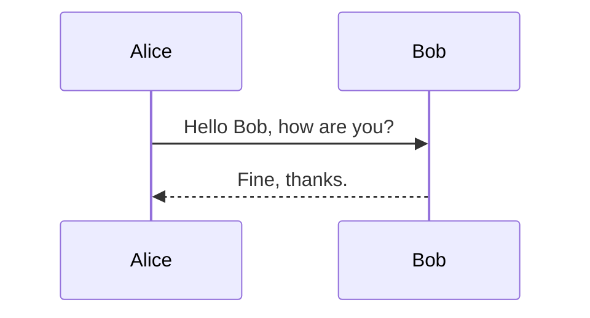

#### Ví dụ 2: Bí danh và Actors

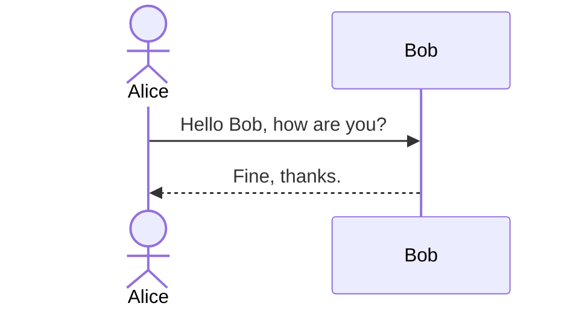

#### Ví dụ 3: Kích hoạt

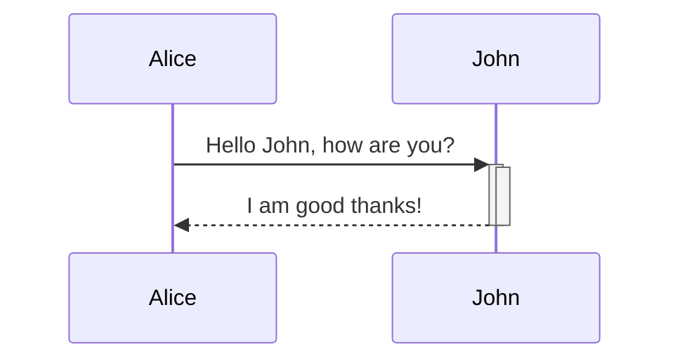

#### Ví dụ 4: Cấu trúc Logic

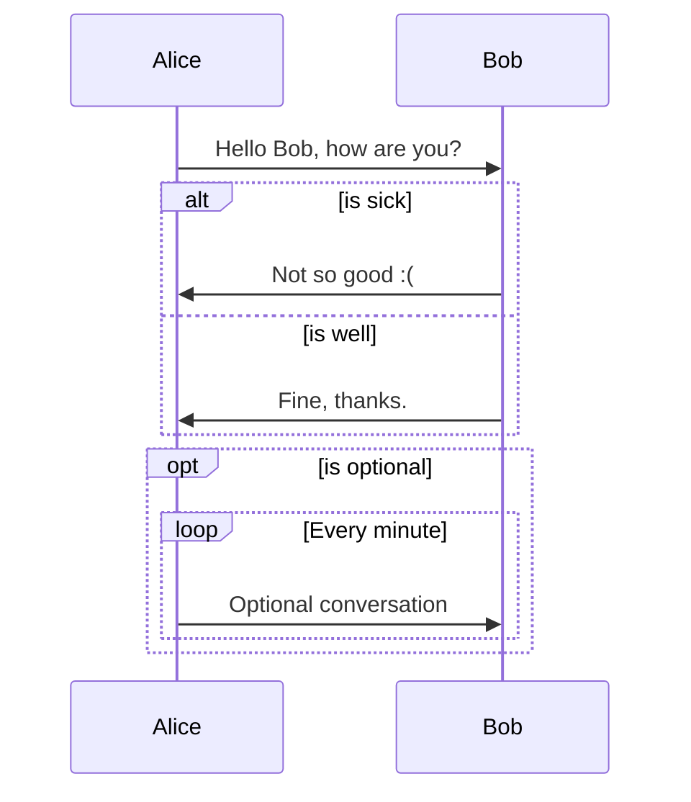

#### Ví dụ 5: Thực thi Song song

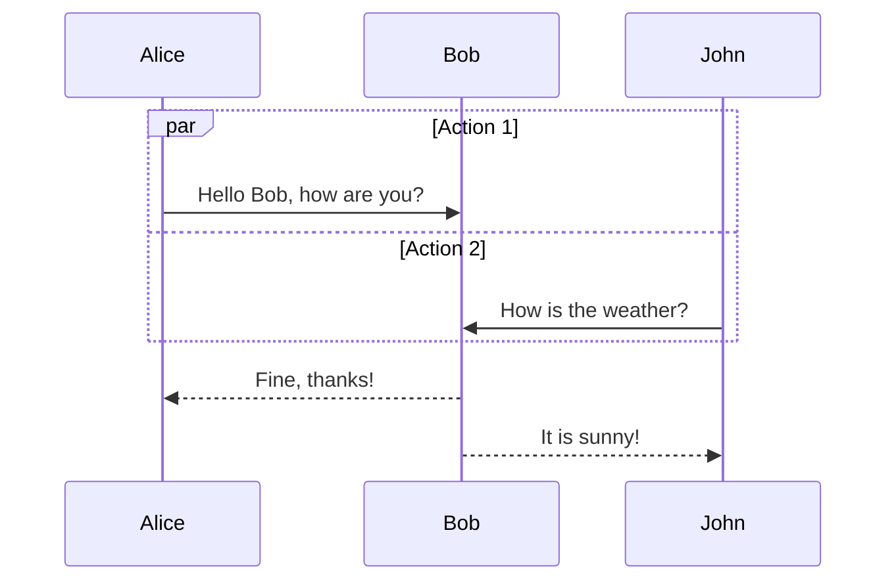

#### Ví dụ 6: Nhóm và Ghi chú

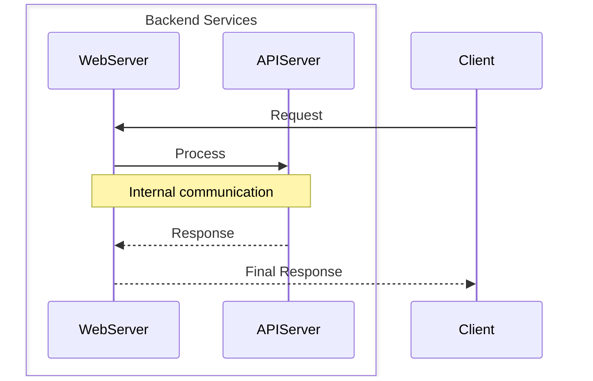

## 2.0 Flowcharts (Lưu đồ)

Lưu đồ là công cụ cơ bản để mô tả các quy trình công việc tĩnh, logic nghiệp vụ và các quy trình ra quyết định.

### 2.1 Mô tả & Ứng dụng

**Định nghĩa Chính thức:**

Lưu đồ trực quan hóa một quy trình, luồng công việc hoặc thuật toán bằng cách hiển thị các bước dưới dạng các hình dạng khác nhau và luồng điều khiển kết nối chúng. Chúng bao gồm các nút (nodes - hình dạng) và các cạnh (edges - đường/mũi tên).

#### Ứng dụng chính cho Kiến trúc Web

- **Vòng đời Yêu cầu (Request Lifecycle):** Lập bản đồ hành trình của một yêu cầu HTTP từ bộ cân bằng tải, qua các middleware, controllers, services, và xuống đến phản hồi của cơ sở dữ liệu.
- **Mô hình hóa Quy trình Nghiệp vụ:** Phác thảo các quy trình hướng tới người dùng như đăng ký, đặt lại mật khẩu hoặc thanh toán đơn hàng.
- **Cây Quyết định (Decision Trees):** Trực quan hóa logic điều kiện phức tạp, chẳng hạn như kiểm tra quyền hạn hoặc đánh giá cờ tính năng (feature flags).

### 2.2 Cú pháp

#### 2.2.1 Khai báo và Hướng

Sơ đồ phải bắt đầu bằng `flowchart` hoặc `graph`, theo sau là hướng: `TD` hoặc `TB` (từ trên xuống), `BT` (từ dưới lên), `LR` (từ trái sang phải), `RL` (từ phải sang trái).

#### 2.2.2 Nút và Hình dạng

Việc lựa chọn hình dạng phù hợp không chỉ mang tính thẩm mỹ mà còn mang ý nghĩa ngữ nghĩa, giúp tăng cường sự rõ ràng của sơ đồ.

- **Định nghĩa:** `id[Văn bản hiển thị]`.
- **Ký tự Đặc biệt & Markdown:** Sử dụng dấu ngoặc kép cho văn bản Unicode và dấu backtick (`` ` ``) cho định dạng Markdown trong văn bản của nút.

| Tên Hình dạng                 | Ví dụ Trực quan       | Cú pháp Cổ điển |
| :---------------------------- | :-------------------- | :-------------- |
| **Rectangle** (Process)       | Hình chữ nhật         | `id[Text]`      |
| **Rounded Rectangle** (Event) | Hình chữ nhật bo tròn | `id(Text)`      |
| **Stadium** (Terminal Point)  | Sân vận động          | `id([Text])`    |
| **Subroutine**                | Hình chữ nhật kép     | `id[[Text]]`    |
| **Cylinder** (Database)       | Hình trụ              | `id[(Text)]`    |
| **Circle**                    | Hình tròn             | `id((Text))`    |
| **Rhombus** (Decision)        | Hình thoi             | `id{Text}`      |
| **Hexagon** (Prepare)         | Hình lục giác         | `id{{Text}}`    |
| **Parallelogram**             | Hình bình hành        | `id[/Text/]`    |
| **Trapezoid**                 | Hình thang            | `id[\Text\]`    |

#### 2.2.3 Liên kết và Cạnh

- **Liên kết Cơ bản:** `-->` (mũi tên), `---` (đường thẳng).
- **Văn bản trên Liên kết:** `A-- text -->B`.
- **Cạnh Đặc biệt:** Mermaid hỗ trợ các cạnh đặc biệt như `---o` hoặc `---x`.

#### 2.2.4 Tạo kiểu và Tương tác

- **Tạo kiểu Trực tiếp:** Dùng `style` để áp dụng CSS trực tiếp cho một nút.
- **Tạo kiểu dựa trên Lớp (Class):** Dùng `classDef` để định nghĩa một lớp kiểu có thể tái sử dụng và áp dụng nó cho các nút bằng toán tử `:::` hoặc câu lệnh `class`.
- **Tương tác:** Chỉ thị `click` có thể liên kết một nút với một URL hoặc hàm JavaScript, biến sơ đồ tĩnh thành một công cụ tương tác, một **trung tâm điều hướng động** cho toàn bộ hệ thống.

### 2.3 Ví dụ từ Tài liệu gốc

#### Ví dụ 1: Lưu đồ Cơ bản

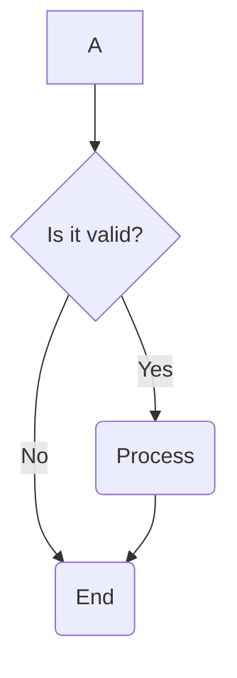

#### Ví dụ 2: Trình diễn các Hình dạng Nút

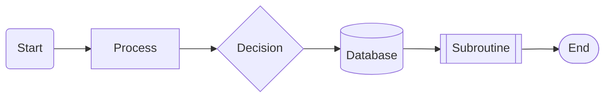

#### Ví dụ 3: Tạo kiểu với classDef

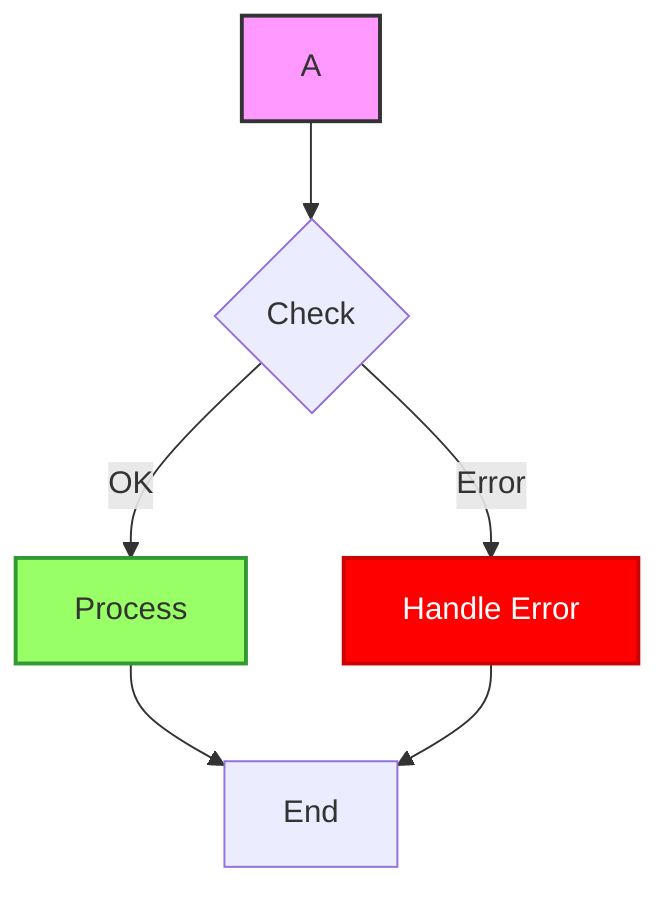

#### Ví dụ 4: Sơ đồ Tương tác

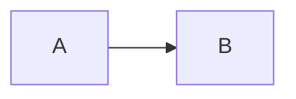

---

## 3.0 State Diagrams (Biểu đồ Trạng thái)

Biểu đồ trạng thái rất tuyệt vời để mô hình hóa vòng đời của một đối tượng hoặc trạng thái của một thành phần hệ thống.

### 3.1 Mô tả & Ứng dụng

**Định nghĩa Chính thức:**

Biểu đồ Trạng thái (State Diagram) mô tả hành vi của một hệ thống bằng cách hiển thị một số lượng hữu hạn các trạng thái và các chuyển đổi giữa chúng. Nó mô hình hóa cách một hệ thống phản ứng với các sự kiện bằng cách thay đổi từ trạng thái này sang trạng thái khác.

#### Ứng dụng chính cho Kiến trúc Web

- **Vòng đời Thực thể (Entity Lifecycle):** Mô hình hóa vòng đời của một thực thể cơ sở dữ liệu (ví dụ: `Order`: Pending -> Paid -> Shipped -> Completed).
- **Quản lý Phiên làm việc của Người dùng:** Theo dõi trạng thái phiên làm việc (`Unauthenticated` -> `Authenticated` -> `Expired`).
- **Máy trạng thái hữu hạn (FSM):** Mô tả hành vi của các thành phần giao diện, các trình xử lý công việc nền, hoặc bất kỳ hệ thống nào có tập hợp trạng thái xác định.

### 3.2 Cú pháp

#### 3.2.1 Trạng thái và Chuyển đổi

- **Khai báo:** Khai báo tường minh bằng `state "Tên Trạng thái" as StateID`.
- **Chuyển đổi:** Mũi tên `-->` định nghĩa một sự chuyển đổi. Thêm nhãn để mô tả sự kiện: `State1 --> State2 : eventTrigger`.

#### 3.2.2 Điểm Bắt đầu và Kết thúc

Cú pháp `[*]` được sử dụng để biểu thị điểm bắt đầu và kết thúc. Một mũi tên từ `[*]` chỉ ra trạng thái bắt đầu; một mũi tên đến `[*]` chỉ ra trạng thái kết thúc.

#### 3.2.3 Trạng thái Hợp thành và Đồng thời

- **Trạng thái Hợp thành (Nesting):** Một trạng thái có thể chứa biểu đồ trạng thái con của riêng nó, được định nghĩa trong `{}`.
- **Đồng thời (Concurrency):** Dấu phân cách `--` trong một trạng thái hợp thành được sử dụng để mô hình hóa các máy trạng thái song song.

#### 3.2.4 Luồng Điều khiển và Chú thích

- **Lựa chọn:** `<<choice>>` để mô hình hóa một nhánh có điều kiện.
- **Rẽ nhánh/Hợp nhất:** `<<fork>>` và `<<join>>` để chia và hợp nhất các luồng song song.
- **Ghi chú:** `note right of...` để thêm chú thích.

### 3.3 Ví dụ từ Tài liệu gốc

#### Ví dụ 1: Vòng đời Đơn giản

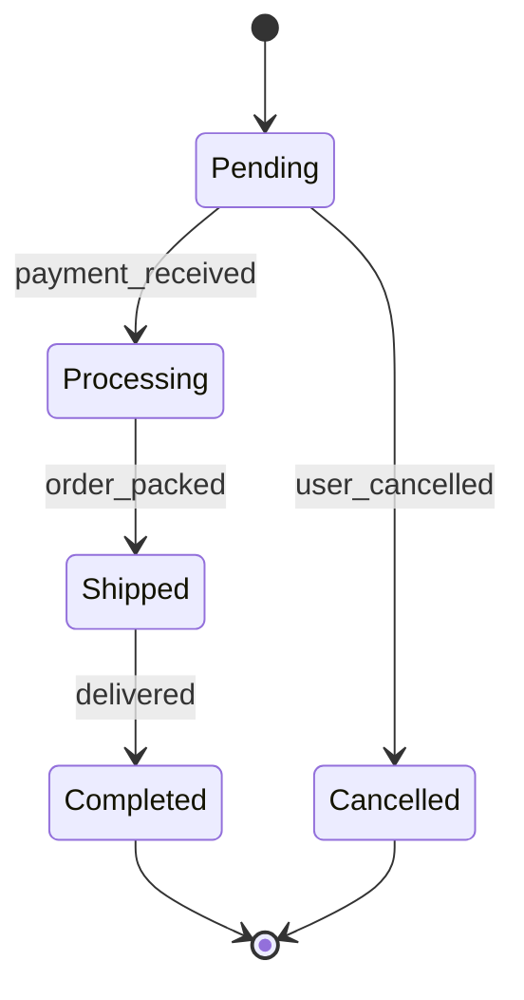

#### Ví dụ 2: Trạng thái Hợp thành

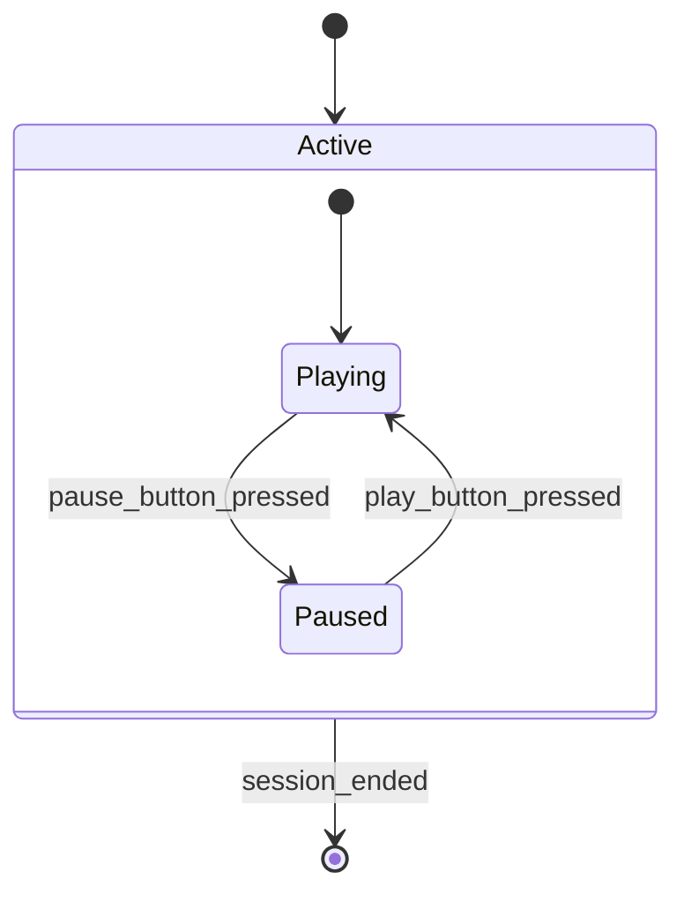

#### Ví dụ 3: Rẽ nhánh và Hợp nhất

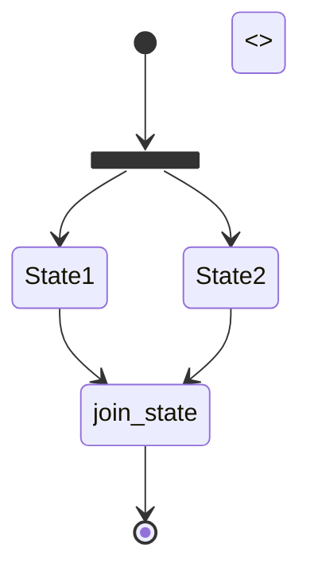

---

## 4.0 Class Diagrams (Biểu đồ Lớp)

Biểu đồ lớp mô tả cấu trúc tĩnh của một hệ thống, lý tưởng để mô hình hóa các cấu trúc dữ liệu và mã nguồn hướng đối tượng.

### 4.1 Mô tả & Ứng dụng

**Định nghĩa Chính thức:**

Biểu đồ Lớp (Class Diagram) là một loại biểu đồ cấu trúc tĩnh mô tả một hệ thống bằng cách hiển thị các lớp, thuộc tính, phương thức của nó, và các mối quan hệ giữa chúng. Nó là một khối xây dựng cốt lõi của mô hình hóa hướng đối tượng.

#### Ứng dụng chính cho Kiến trúc Web

- **Mô hình hóa ORM/Dữ liệu:** Trực quan hóa cấu trúc của các mô hình cơ sở dữ liệu và các mối quan hệ của chúng (một-một, một-nhiều, nhiều-nhiều).
- **Hợp đồng Dữ liệu API (Data Contracts):** Định nghĩa cấu trúc của các Đối tượng Truyền dữ liệu (DTOs) hoặc các payload yêu cầu/phản hồi.
- **Cấu trúc Hệ thống Cấp cao:** Minh họa các thành phần chính của một dịch vụ backend và các phụ thuộc của chúng.

### 4.2 Cú pháp

#### 4.2.1 Định nghĩa Lớp

- **Khai báo:** Dùng từ khóa `class` hoặc khai báo ngầm định.
- **Thành viên:** Các thuộc tính và phương thức được định nghĩa bên trong `{}` hoặc bằng toán tử `:`.
- **Tầm vực (Visibility):** `+` (public), `-` (private), `#` (protected), `~` (package/internal).
- **Kiểu Generic:** Sử dụng `~`, ví dụ: `List~User~`.

#### 4.2.2 Mối quan hệ

Bảng này đóng vai trò như một "Bảng Rosetta", giúp dịch kiến thức thiết kế hướng đối tượng sang cú pháp Mermaid.

| Loại Mối quan hệ | Mô tả                    | Mũi tên Mermaid | Ví dụ                         |
| :--------------- | :----------------------- | :-------------- | :---------------------------- |
| **Inheritance**  | Kế thừa (is a)           | `<`&#124;`--`   | `Animal <`&#124;`-- Duck`     |
| **Composition**  | Sở hữu (owns a, part of) | `*--`           | `Engine *-- Car`              |
| **Aggregation**  | Tập hợp (has a)          | `o--`           | `Wheel o-- Car`               |
| **Association**  | Liên kết (uses a)        | `-->`           | `Driver --> Car`              |
| **Dependency**   | Phụ thuộc                | `<..`           | `Car ..> Fuel`                |
| **Realization**  | Hiện thực hóa            | `<..`&#124;     | `interface <..`&#124;` class` |
| **Link (Solid)** | Liên kết chung           | `--`            | `Car -- ParkingSpot`          |

#### 4.2.3 Bản số và Nhãn

- **Nhãn:** Thêm nhãn vào mối quan hệ bằng dấu hai chấm: `ClassA --> ClassB : uses`.
- **Bản số (Cardinality):** Định nghĩa bội số bằng cách đặt chuỗi trong dấu ngoặc kép: `Customer "1" --> "*" Ticket`.

#### 4.2.4 Không gian tên (Namespaces)

Khối `namespace` cho phép nhóm các lớp liên quan, hữu ích để tổ chức các sơ đồ phức tạp.

### 4.3 Ví dụ từ Tài liệu gốc

#### Ví dụ 1: Lớp Cơ bản với các Thành viên

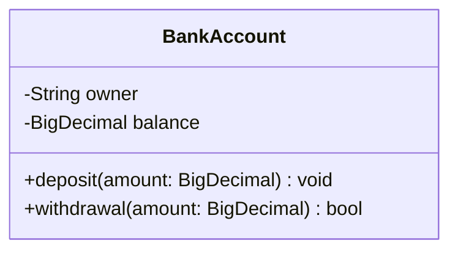

#### Ví dụ 2: Trình diễn các Mối quan hệ

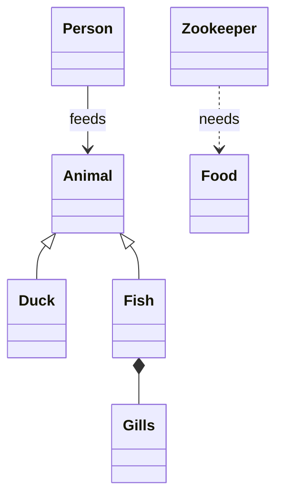

#### Ví dụ 3: Bản số

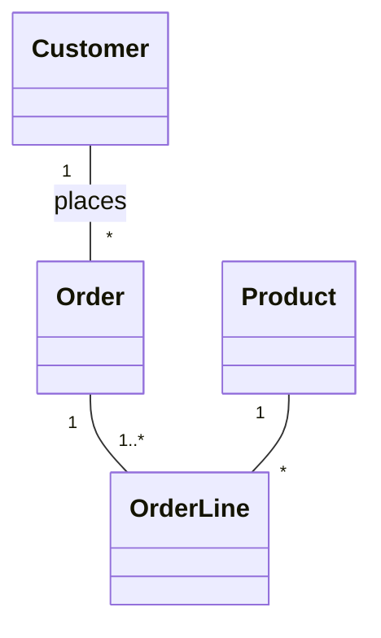

#### Ví dụ 4: Sử dụng Không gian tên

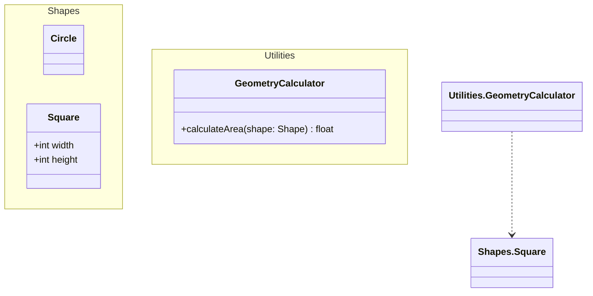

---

## Kết luận và Xác minh Cuối cùng

Việc áp dụng cách tiếp cận **"sơ đồ dưới dạng mã"** của Mermaid mang lại một sự thay đổi cơ bản trong cách chúng ta tạo và duy trì tài liệu kiến trúc. Bằng cách tích hợp tài liệu vào quy trình phát triển cốt lõe, chúng ta có thể chống lại hiệu quả vấn đề "Doc-Rot" và đảm bảo rằng các sơ đồ của chúng ta luôn là một nguồn thông tin chính xác, cập nhật và đáng tin cậy.

Tài liệu này, bằng cách tiêu chuẩn hóa cú pháp và các thực hành tốt nhất, cung cấp nền tảng để toàn bộ tổ chức khai thác toàn bộ tiềm năng của công cụ mạnh mẽ này.

**Toàn bộ thông tin, cú pháp và ví dụ được trình bày trong hướng dẫn này đã được xác minh là được lấy duy nhất từ tài liệu chính thức của Mermaid. Sự tuân thủ nghiêm ngặt này khẳng định vai trò của tài liệu này là nguồn chân lý duy nhất và có thẩm quyền cho việc sử dụng Mermaid trong tổ chức của chúng ta.**

---

# **Chương III: Định hướng Tư duy để Xây dựng Slide Kỹ thuật Chuyên nghiệp**

Để tạo ra một bài trình bày kỹ thuật không chỉ đúng về mặt kỹ thuật mà còn hiệu quả về mặt giao tiếp, chúng ta cần áp dụng một tư duy làm việc có cấu trúc. Phần này sẽ định hình một phương pháp luận, lấy cảm hứng từ vai trò của một **"Kiến trúc sư Kỹ thuật Tỉ mỉ"**, giúp biến các khái niệm phức tạp thành những slide rõ ràng, logic và có sức ảnh hưởng.

#### **1. Vai trò & Mục tiêu: Tư duy như một Kiến trúc sư**

Mục tiêu là định hình một tư duy làm việc như một Kiến trúc sư Hệ thống khi thiết kế slide. Một kiến trúc sư không chỉ xây dựng, họ còn thiết kế. Họ tư duy theo hệ thống, các lớp (layers), và các luồng logic.

Kết quả cuối cùng của tư duy này là những slide:

- **Chính xác:** Mọi thông tin kỹ thuật đều được trình bày đúng đắn.
- **Có cấu trúc:** Nội dung được tổ chức một cách logic, dễ theo dõi.
- **Trong sáng:** Khán giả thuộc đối tượng kỹ thuật có thể nắm bắt ý tưởng một cách nhanh chóng mà không bị rối.

#### **2. Quy trình Tư duy Đề xuất (The Blueprint)**

Khi đối mặt với một yêu cầu tạo slide, đặc biệt là cho các chủ đề phức tạp, một kiến trúc sư sẽ không bắt tay vào "xây dựng" ngay lập tức. Thay vào đó, họ sẽ tuân theo một quy trình tư duy có chủ đích:

1.  **Làm rõ Ý định:** "Yêu cầu này thực sự muốn truyền tải điều gì?" Nếu một yêu cầu còn mơ hồ, bước đầu tiên là xác định rõ thông điệp cốt lõi cần truyền tải.
2.  **Ưu tiên Cấu trúc (Bản thiết kế):** Đây là bước quan trọng nhất. Với các chủ đề kỹ thuật phức tạp, nên áp dụng cấu trúc **"Câu chuyện chính + Đi sâu chi tiết theo chiều dọc" (Core Narrative + Vertical Deep Dives)**.
    - **Câu chuyện chính:** Tạo một slide chính (trên trục ngang) để trình bày ý tưởng cốt lõi, cái nhìn tổng quan.
    - **Đi sâu chi tiết:** Sử dụng các slide dọc để cung cấp các giải thích chi tiết, ví dụ mã nguồn, hoặc các kịch bản phụ.
    - _Lợi ích:_ Phương pháp này giúp quản lý sự phức tạp, giữ cho dòng chảy chính của bài trình bày được mạch lạc, đồng thời vẫn cung cấp đầy đủ chi tiết cho những ai quan tâm.
3.  **Viết mã nguồn (Thi công):** Dựa trên bản thiết kế đã có, tiến hành viết mã HTML cho Reveal.js, áp dụng các nguyên tắc trình bày đã học.
4.  **Hoàn thiện & Giải thích:** Tự động bổ sung các ghi chú cho diễn giả (`speaker notes`) để cung cấp thêm ngữ cảnh. Quan trọng hơn, hãy tự giải thích được _tại sao_ cấu trúc slide lại được thiết kế như vậy.

#### **3. Các Nguyên tắc Định hướng (Tư duy về Thiết kế & Nội dung)**

- **Một Slide, Một Ý tưởng Cốt lõi:** Nếu một yêu cầu chứa nhiều ý tưởng riêng biệt, hãy chủ động phân tách chúng ra nhiều slide. Thường là một slide chính và các slide dọc hỗ trợ.
- **Dòng chảy Tường thuật là Chìa khóa:** Cấu trúc các slide để kể một câu chuyện có logic: Vấn đề -> Giải pháp ở mức cao -> Phân tích từng thành phần -> Kết luận.
- **Sơ đồ là Bản thiết kế Kiến trúc:** Xem các sơ đồ Mermaid như những bản thiết kế kỹ thuật. Chúng phải sạch sẽ, được gán nhãn chính xác và chỉ tập trung vào một quy trình duy nhất. Với các sơ đồ phức tạp, **bắt buộc** phải sử dụng tính năng `.fragment` của Reveal.js để hiển thị từng phần của sơ đồ theo từng bước, dẫn dắt khán giả đi qua luồng xử lý.
- **Chủ nghĩa Tối giản & Sự Rõ ràng:** Mạnh dạn loại bỏ những chi tiết thừa. Sử dụng tiêu đề ngắn gọn, danh sách (bullet points) và tận dụng không gian trống. Tuân thủ quy tắc 6x6 như một kim chỉ nam cho các slide nhiều chữ.

#### **4. Các Nguyên tắc Kỹ thuật Cốt lõi**

- Mã nguồn đầu ra phải là HTML thuần túy, tương thích với Reveal.js.
- Nên ưu tiên cú pháp Markdown (`<section data-markdown>...`) cho các slide chủ yếu là văn bản và danh sách để tối ưu hiệu suất. Sử dụng HTML thuần cho các slide có bố cục phức tạp hoặc cần dùng nhiều `fragment`.
- Tất cả sơ đồ Mermaid phải được đặt trong một khối `
...
`.
- Nên tự động thêm ghi chú cho diễn giả (`<aside class="notes">...`) để cung cấp ngữ cảnh trình bày.

---

# --- LANGUAGE PROTOCOL ---

## 1. Default Behavior: Match the User's Language

### Your primary rule is to respond in the same language as the user's prompt.

### This applies to all general conversation, explanations, document writing, and creative tasks.

## 2. CRITICAL EXCEPTION: Terminal Simulation Mode

### This is a non-negotiable override to the default behavior.

You MUST switch to English-only output under the following specific condition:

- When you are explicitly asked to act as, simulate, or emulate a terminal, a command-line interface (CLI), a shell (like bash, zsh, PowerShell), or a system console.

In this mode, ALL of your generated output, including prompts, command results, error messages, and file listings, MUST be in English. This is to accurately reflect the standard operating environment of most command-line tools and operating systems.

Once the terminal simulation task is complete, you MUST revert to the default behavior of matching the user's language for any subsequent prompts.
