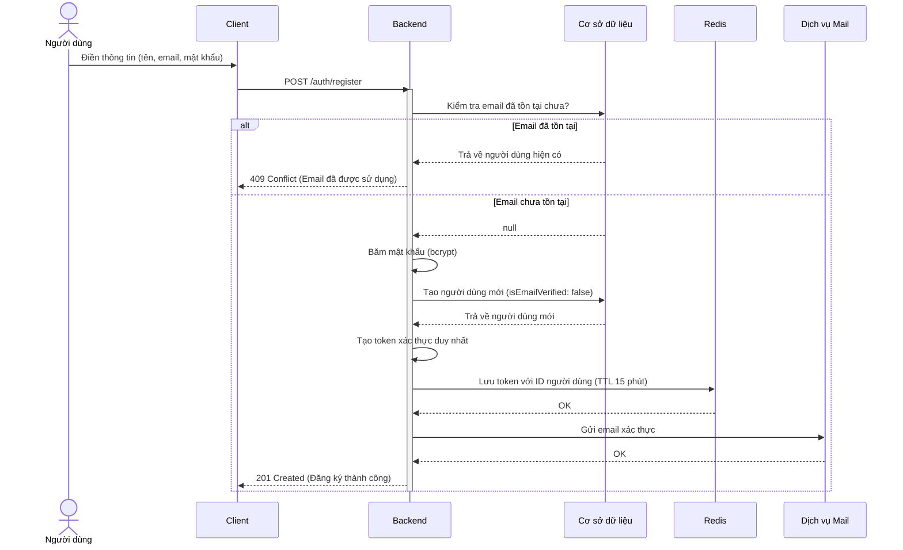
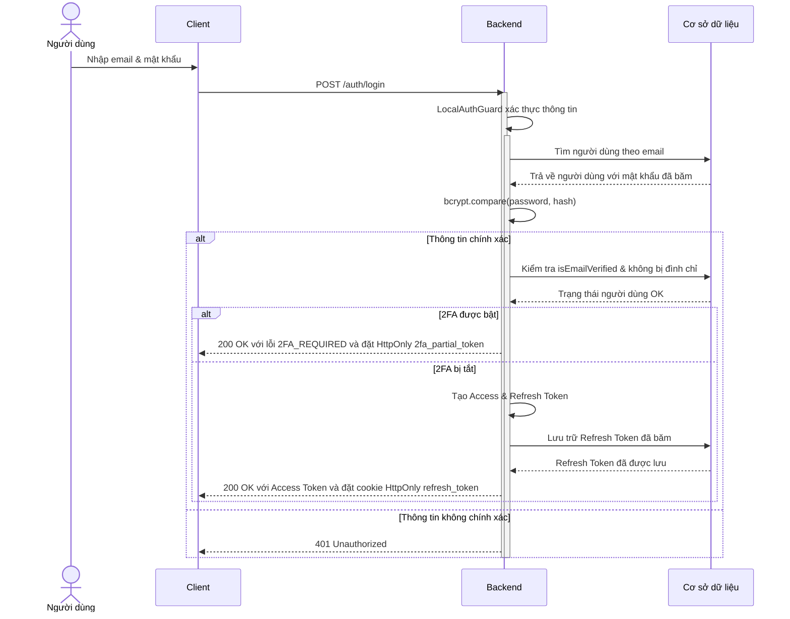
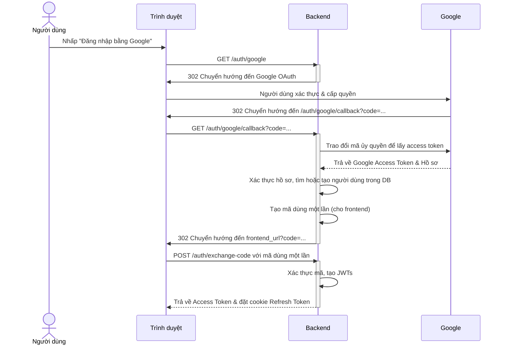
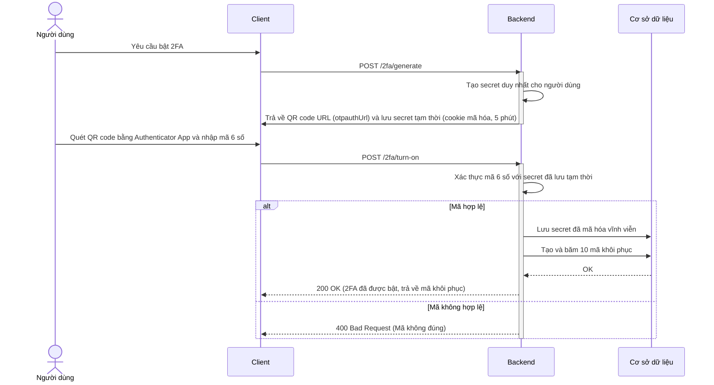
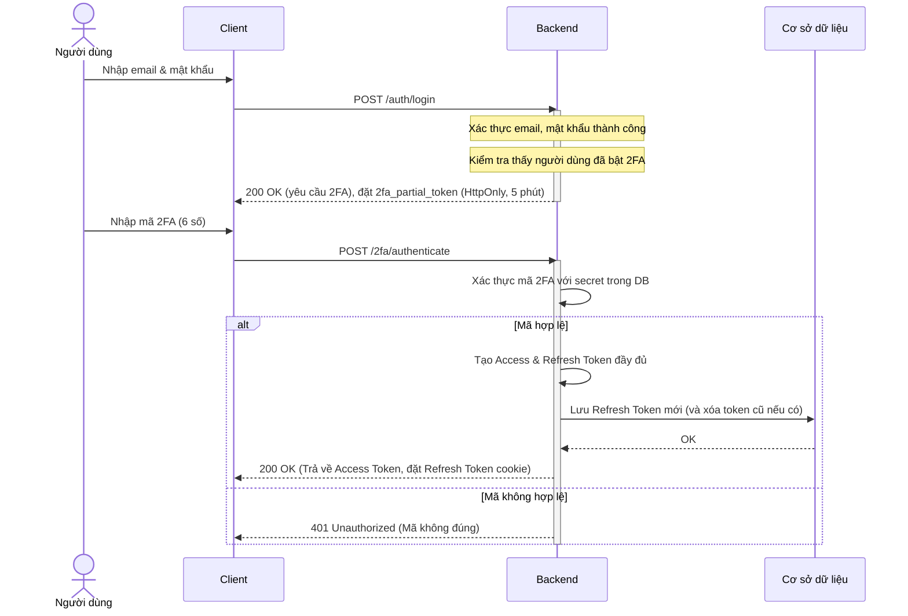
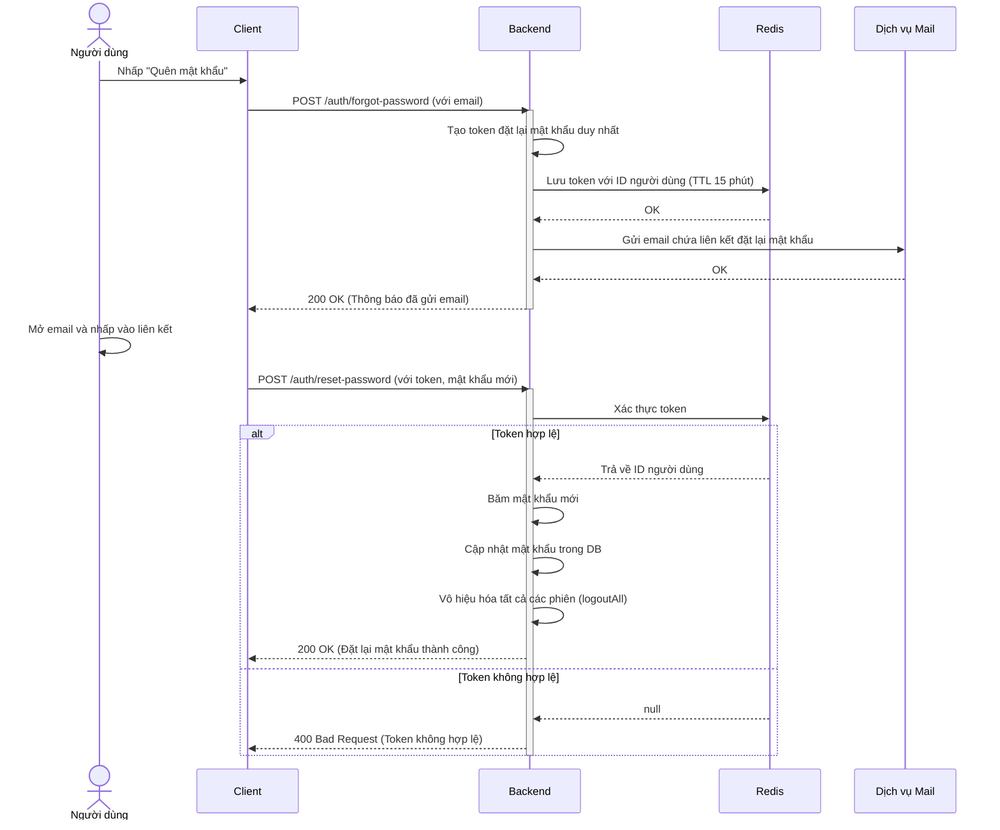
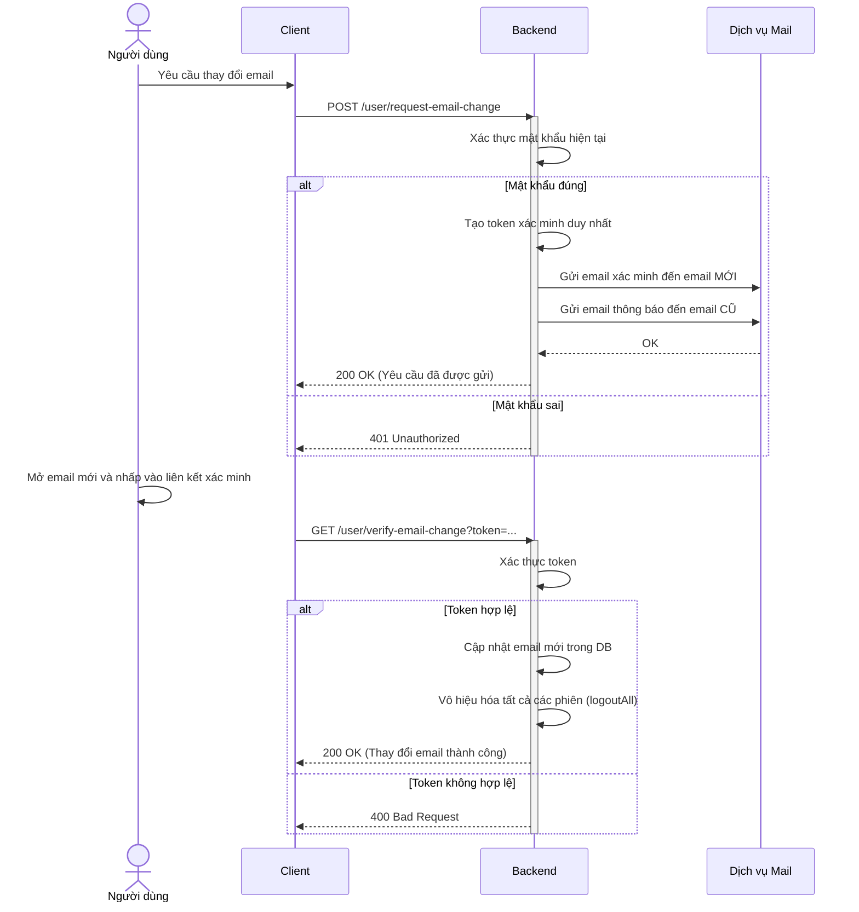
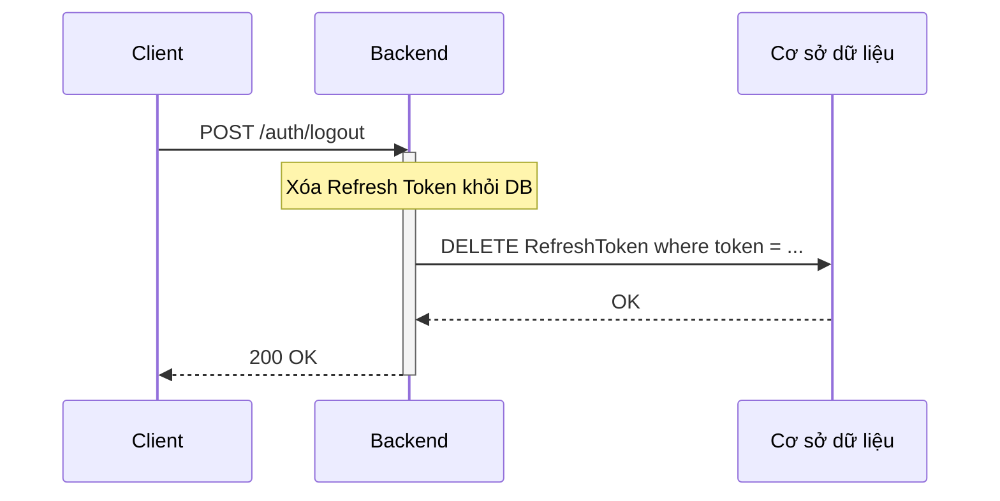
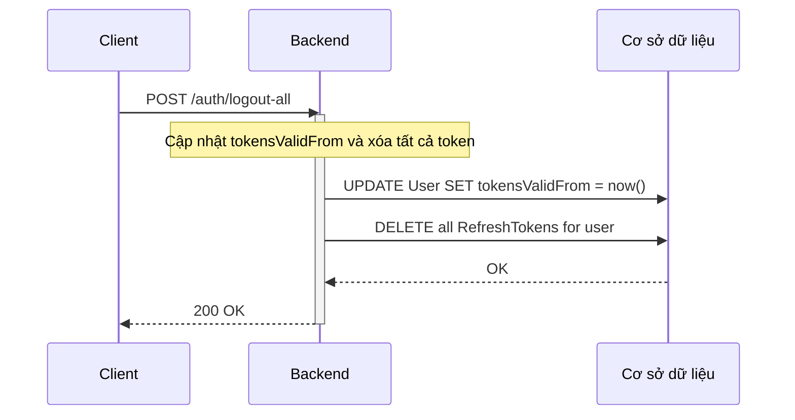
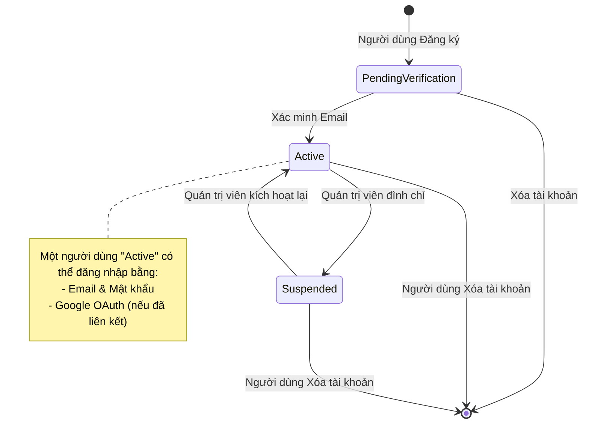

# 1: Tiêu đề

## Phân tích sâu về Xác thực Dự án

### **Người trình bày:** Đinh Việt Hoàng

**Chương trình:**

1.  Các cơ chế xác thực cốt lõi
2.  Quản lý phiên với JWT
3.  Đăng nhập xã hội: Google OAuth 2.0
4.  Bảo mật nâng cao: Xác thực hai yếu tố (2FA)
5.  Quản lý tài khoản an toàn

---

# 2: Cơ chế 1: Email & Mật khẩu

## Đăng ký và Đăng nhập an toàn

### Luồng đăng ký

- **Đầu vào:** Họ và tên, Email, Mật khẩu
- **Các bước bảo mật:**
  1.  **Kiểm tra tính duy nhất của Email:** Ngăn chặn các tài khoản trùng lặp.
  2.  **Băm mật khẩu:** Sử dụng `bcrypt` với cost factor là 12.
      ```typescript
      // Băm mật khẩu của người dùng một cách an toàn
      const passwordHash = await bcrypt.hash(registerDto.password, 12);
      ```
  3.  **Xác minh Email:**
      - Một token ngẫu nhiên, duy nhất được tạo và lưu trữ trong Redis với TTL 15 phút.
      - Một email với liên kết xác minh được gửi cho người dùng.
      - Tài khoản vẫn không hoạt động (`isEmailVerified: false`) cho đến khi được xác minh.



### Luồng đăng nhập

- **Guard:** `LocalAuthGuard`
- **Các bước bảo mật:**
  1.  **Xác thực thông tin đăng nhập:** `bcrypt.compare()` kiểm tra mật khẩu một cách an toàn mà không tiết lộ trường nào không chính xác.
  2.  **Kiểm tra trạng thái:**
      - Xác minh `isEmailVerified` là `true`.
      - Đảm bảo tài khoản không bị `SUSPENDED`.
  3.  **Kiểm tra 2FA:** Nếu 2FA được bật, một token tạm thời (`5 phút`) được cấp. Nếu không, các token đầy đủ sẽ được cấp.



---

# 3: Cơ chế 2: Quản lý phiên với JWT

## Cách chúng tôi giữ cho người dùng đăng nhập an toàn

### Cấu trúc Token

- **Access Token (15 phút):**
  - Chứa `userId` và `email`.
  - Được sử dụng để xác thực các yêu cầu API.
  - Được gửi trong header `Authorization: Bearer`.
- **Refresh Token (30 ngày):**
  - Chứa `userId`.
  - Được lưu trữ trong một cookie `HttpOnly`, an toàn để ngăn chặn XSS.
  - Được sử dụng để lấy một access token mới mà không buộc người dùng phải đăng nhập lại.

### Các tính năng bảo mật

- **Xoay vòng Refresh Token (Refresh Token Rotation):** Một refresh token mới được cấp và token cũ bị vô hiệu hóa sau mỗi lần sử dụng. Điều này ngăn chặn kẻ tấn công chiếm và sử dụng lại token cũ.

- **Thu hồi Token (Token Revocation):** Dấu thời gian `tokensValidFrom` trong bản ghi người dùng được cập nhật khi thay đổi mật khẩu hoặc "đăng xuất tất cả". Bất kỳ token nào được cấp trước thời gian này đều tự động bị vô hiệu hóa, đảm bảo các phiên cũ không thể tiếp tục.

  ```typescript
  // Trong quá trình xác thực token
  if (payload.iat < user.tokensValidFrom) {
    throw new UnauthorizedException("Token đã bị thu hồi.");
  }
  ```

- **Giới hạn phiên đăng nhập (Session Limiting):** Hệ thống giới hạn mỗi người dùng chỉ có tối đa **5 phiên đăng nhập** (tương đương 5 refresh token) hoạt động cùng một lúc. Khi người dùng đăng nhập từ một thiết bị thứ 6, phiên đăng nhập cũ nhất sẽ tự động bị hủy, giúp ngăn chặn việc lạm dụng tài khoản.

- **Dọn dẹp Token hết hạn (Expired Token Cleanup):** Một tác vụ tự động chạy hàng ngày vào lúc 3:00 AM để xóa tất cả các refresh token đã hết hạn khỏi cơ sở dữ liệu, giúp giữ cho hệ thống luôn sạch sẽ và hiệu quả.

---

# 4: Cơ chế 3: Google OAuth 2.0

## Đăng nhập xã hội liền mạch và an toàn

### Luồng xác thực

1.  **Khởi tạo:** Người dùng nhấp vào "Đăng nhập bằng Google".
2.  **Chuyển hướng:** Backend chuyển hướng người dùng đến màn hình chấp thuận OAuth 2.0 của Google.
3.  **Callback:** Sau khi người dùng chấp thuận, Google chuyển hướng trở lại ứng dụng với một mã ủy quyền.
4.  **Xác thực & Trao đổi Token:**
    - Backend xác thực hồ sơ Google của người dùng.
    - Nó kiểm tra người dùng hiện có bằng Google ID hoặc email.
    - **Người dùng mới?** Một tài khoản mới được tạo với `isEmailVerified: true`.
    - **Người dùng hiện có?** Google ID được liên kết với tài khoản hiện có của họ.
5.  **Tạo phiên:** Một mã dùng một lần được tạo và gửi đến frontend, sau đó được trao đổi để lấy access và refresh token JWT tiêu chuẩn.



### Liên kết tài khoản

- Người dùng đã xác thực có thể liên kết tài khoản Google của họ từ trang cài đặt.
- **Kiểm tra bảo mật:** Người dùng không thể liên kết một tài khoản Google nếu nó đã được liên kết với một người dùng khác trong hệ thống.
- **Yêu cầu:** Người dùng phải đặt mật khẩu trước khi họ có thể hủy liên kết tài khoản Google để tránh bị khóa tài khoản.

---

# 5: Cơ chế 4: Xác thực hai yếu tố (2FA)

## Thêm một lớp bảo mật bổ sung

### Luồng thiết lập

1.  **Tạo Secret:** Một khóa bí mật duy nhất được tạo cho người dùng và được lưu trữ tạm thời trong một cookie `HttpOnly` được mã hóa (TTL 5 phút).
2.  **Hiển thị mã QR:** Một mã QR chứa `otpauthUrl` được hiển thị cho người dùng để quét bằng một ứng dụng xác thực (ví dụ: Google Authenticator).
3.  **Xác minh & Kích hoạt:**
    - Người dùng nhập mã 6 chữ số từ ứng dụng của họ.
    - Backend xác thực mã này với secret đã lưu.
    - Khi thành công, secret được mã hóa sẽ được lưu vĩnh viễn vào cơ sở dữ liệu và 10 mã khôi phục dùng một lần được tạo và băm.



### Luồng đăng nhập với 2FA

1.  **Đăng nhập ban đầu:** Người dùng cung cấp email và mật khẩu chính xác.
2.  **Token một phần:** Hệ thống cấp một `2fa_partial_token` đặc biệt, có thời hạn ngắn (`5 phút`) được lưu trữ trong cookie `HttpOnly`. Token này không đủ để truy cập API đầy đủ.
3.  **Thử thách 2FA:** Người dùng được nhắc nhập mã TOTP 6 chữ số hoặc một mã khôi phục.
4.  **Xác thực:** Backend xác minh mã với secret được lưu trữ của người dùng.
5.  **Phiên đầy đủ:** Khi thành công, token một phần sẽ bị loại bỏ, và các access và refresh token tiêu chuẩn được cấp.



---

# 6: Quản lý tài khoản an toàn

## Đặt lại mật khẩu, thay đổi email và đăng xuất

### Quên/Đặt lại mật khẩu

- **Dựa trên Token:** Một token đặt lại ngẫu nhiên, an toàn được tạo và lưu trữ trong Redis (TTL 15 phút).
- **Sử dụng một lần:** Token sẽ bị xóa ngay sau khi sử dụng.
- **Vô hiệu hóa phiên:** Sau khi đặt lại mật khẩu thành công, tất cả các phiên hoạt động sẽ bị chấm dứt (`logoutAll`) để ngăn chặn việc chiếm đoạt tài khoản.



### Thay đổi Email an toàn

- **Yêu cầu mật khẩu:** Người dùng phải nhập mật khẩu hiện tại của họ để bắt đầu thay đổi email.
- **Xác minh kép:** Một liên kết xác minh được gửi đến **cả** địa chỉ email cũ và mới.
- **Vô hiệu hóa phiên:** Tất cả các phiên sẽ bị chấm dứt sau khi thay đổi email thành công, buộc người dùng phải đăng nhập lại bằng email mới.



### Đăng xuất

- **Đăng xuất thiết bị hiện tại:** Refresh token cụ thể sẽ bị xóa khỏi cơ sở dữ liệu.
- **Đăng xuất tất cả các thiết bị:** Dấu thời gian `tokensValidFrom` được cập nhật, làm vô hiệu hóa tất cả các token hiện có và xóa tất cả các refresh token khỏi cơ sở dữ liệu.





---

# 7: Vòng đời xác thực người dùng

## Sơ đồ trạng thái

Sơ đồ này cho thấy các trạng thái có thể có của một tài khoản người dùng trong suốt vòng đời của nó, dựa trên trạng thái được lưu trong cơ sở dữ liệu.



---

# 8: Hỏi & Đáp

## Cảm ơn!

**Có câu hỏi nào không?**
