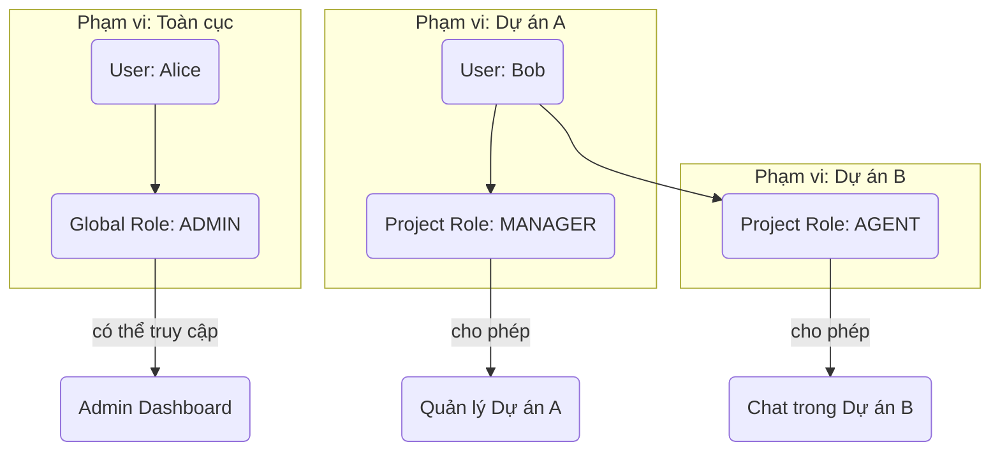
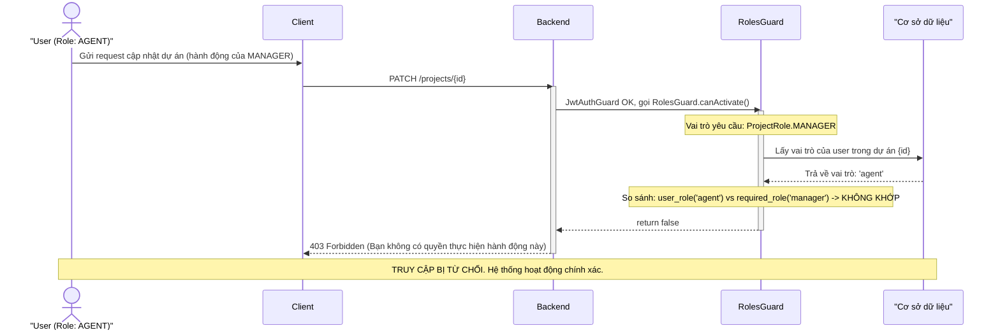

# 1: Tiêu đề

## Phân Tích Sâu Về Phân Quyền Dự Án

### **Người trình bày:** Đinh Việt Hoàng

**Chương trình:**

1.  Phân biệt Xác thực (Authentication) và Phân quyền (Authorization).
2.  Mô hình Kiểm soát Truy cập Dựa trên Vai trò (RBAC).
3.  Vai trò Toàn cục (Global Roles) vs. Vai trò Dự án (Project Roles).
4.  Triển khai với NestJS Guards.
5.  Luồng ví dụ: Kiểm tra vai trò trong một dự án.

---

# 2: Xác thực vs. Phân quyền

## Hai khái niệm Cốt lõi của Bảo mật

Để xây dựng một hệ thống an toàn, chúng ta phải phân biệt rõ ràng hai khái niệm:

- **Xác thực (Authentication): Bạn là ai?**

  - Đây là quá trình xác minh danh tính của người dùng. Hệ thống kiểm tra xem người dùng có đúng là người mà họ khai báo hay không.
  - **Ví dụ:** Đăng nhập bằng email và mật khẩu, hoặc qua Google.

- **Phân quyền (Authorization): Bạn được phép làm gì?**
  - Sau khi danh tính đã được xác thực, đây là quá trình xác định những hành động, tài nguyên, hoặc khu vực nào mà người dùng đó được phép truy cập.
  - **Ví dụ:** Chỉ có `MANAGER` mới được phép xóa một dự án.

| Phép ẩn dụ                                                                                   |
| :------------------------------------------------------------------------------------------- |
| **Xác thực** là việc bạn xuất trình CMND/CCCD để vào cửa một tòa nhà.                        |
| **Phân quyền** là chiếc thẻ thang máy của bạn chỉ cho phép bạn đi đến một số tầng nhất định. |

---

# 3: Mô hình RBAC của chúng ta

## Kiểm soát Truy cập Dựa trên Vai trò (Role-Based Access Control)

Hệ thống của chúng ta sử dụng mô hình RBAC, một phương pháp tiêu chuẩn để quản lý quyền hạn. Quyền không được gán trực tiếp cho người dùng, mà được gán cho các **vai trò**.

### Các khái niệm chính

- **User (Người dùng):** Chủ thể (actor) trong hệ thống, là người thực hiện các hành động.
- **Role (Vai trò):** Một tập hợp các quyền hạn được định nghĩa trước (ví dụ: `ADMIN`, `MANAGER`). Người dùng được gán vào các vai trò này.
- **Scope (Phạm vi):** Ngữ cảnh mà vai trò có hiệu lực. Trong hệ thống của chúng ta, có 2 phạm vi chính:
  - **Toàn cục (Global):** Áp dụng trên toàn bộ ứng dụng.
  - **Dự án (Project):** Chỉ áp dụng trong một dự án cụ thể.



---

# 4: Định nghĩa các Vai trò

## Các vai trò được định nghĩa trong hệ thống thông qua các Enum.

### Vai trò Toàn cục (Global Roles)

Áp dụng cho toàn bộ hệ thống, được lưu trực tiếp trong bảng `users`.

**`packages/shared/src/global-roles.enum.ts`**

```typescript
export enum GlobalRole {
  ADMIN = "admin", // Toàn quyền truy cập hệ thống
  USER = "user", // Người dùng thông thường
}
```

### Vai trò Dự án (Project Roles)

Chỉ có hiệu lực trong phạm vi một dự án cụ thể, được lưu trong bảng `project_members`.

**`packages/shared/src/project-roles.enum.ts`**

```typescript
export enum ProjectRole {
  MANAGER = "manager", // Quản lý dự án, thành viên, và cuộc trò chuyện
  AGENT = "agent", // Chỉ xử lý các cuộc trò chuyện
}
```

---

# 5: Triển khai với `RolesGuard`

## Logic phân quyền được tập trung tại một Guard duy nhất.

Toàn bộ logic phân quyền của hệ thống được xử lý bởi `RolesGuard`. Guard này được kích hoạt trên các endpoint được đánh dấu bởi decorator `@Roles()`.

### Luồng hoạt động của `RolesGuard`

1.  **Kiểm tra Decorator:** Guard đọc các vai trò yêu cầu từ decorator `@Roles(ProjectRole.MANAGER, ...)`.
2.  **Xác định Phạm vi:** Guard tự động phát hiện vai trò yêu cầu là `GlobalRole` hay `ProjectRole`.
3.  \*\*Kiểm tra Quyền:
    - Nếu là `GlobalRole`:\*\* So sánh vai trò trong object `user` với vai trò yêu cầu.
    - **Nếu là `ProjectRole`:**
      1.  Lấy `projectId` từ `request.params`.
      2.  Truy vấn bảng `project_members` để tìm vai trò của người dùng trong dự án đó.
      3.  So sánh vai trò thực tế với vai trò yêu cầu.
4.  **Áp dụng Kế thừa:** Logic kiểm tra có tính đến sự kế thừa vai trò (ví dụ, `MANAGER` có tất cả quyền của `AGENT`).
5.  **Trả về Quyết định:** Guard trả về `true` (cho phép truy cập) hoặc `false` (ném ra lỗi `403 Forbidden`).

Cách tiếp cận này giúp logic phân quyền được **tập trung, nhất quán, và dễ bảo trì**.

---

# 6: Luồng ví dụ: Kiểm tra Vai trò trong Dự án

## Sơ đồ minh họa cách hệ thống ngăn chặn một `AGENT` thực hiện hành động của `MANAGER`.



---

# 7: Hỏi & Đáp

## Cảm ơn!

**Có câu hỏi nào không?**
