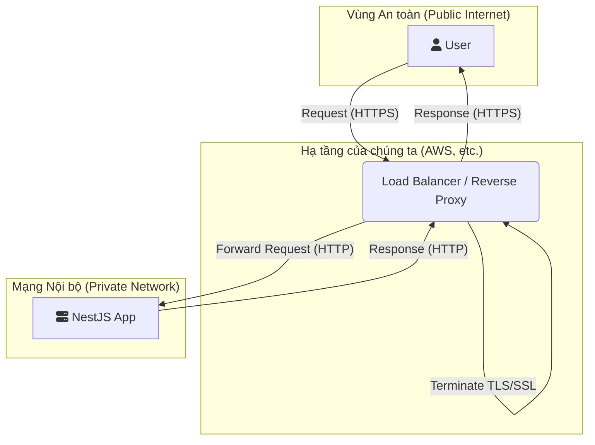

# Slide 1: Tiêu đề

## Mã Hóa Dữ Liệu (Data Encryption)

### **Người trình bày:** Đinh Việt Hoàng

**Chương trình:**

1.  Tầm quan trọng của Mã hóa Dữ liệu.
2.  Hashing vs. Encryption: Hai Kỹ thuật Chính.
3.  Cách Dữ liệu được Bảo vệ trong Database (At Rest).
4.  Phân tích chi tiết `EncryptionService`.
5.  Cách Dữ liệu được Bảo vệ trên Mạng (In Transit).

---

# Slide 2: Hashing vs. Symmetric Encryption

## Hai kỹ thuật chính để bảo vệ dữ liệu "khi nghỉ" (at rest)

Trong ứng dụng của chúng ta, chúng ta sử dụng hai phương pháp riêng biệt để bảo vệ dữ liệu trong cơ sở dữ liệu, tùy thuộc vào nhu cầu sử dụng.

### 1. Hashing (Băm) - `bcrypt`

- **Cơ chế:** Là một hàm băm mật mã, hoạt động theo **một chiều**. Bạn có thể tạo ra một chuỗi "hash" từ dữ liệu gốc, nhưng không thể đảo ngược quá trình để lấy lại dữ liệu gốc.
- **Thuật toán:** Chúng ta sử dụng `bcrypt`, một thuật toán mạnh mẽ và tiêu chuẩn công nghiệp được thiết kế đặc biệt để băm mật khẩu. Nó có chủ ý chậm để chống lại các cuộc tấn công vét cạn (brute-force).
- **Trường hợp sử dụng:** Khi bạn cần **xác minh** một bí mật mà không cần biết giá trị thực của nó.
  - _Ví dụ:_ Kiểm tra mật khẩu người dùng khi đăng nhập. Chúng ta so sánh hash của mật khẩu người dùng nhập vào với hash đã lưu trong database.

### 2. Symmetric Encryption (Mã hóa Đối xứng) - `AES-256-GCM`

- **Cơ chế:** Hoạt động theo **hai chiều**. Dữ liệu được mã hóa bằng một khóa bí mật, và sau đó có thể được giải mã lại bằng chính khóa bí mật đó.
- **Thuật toán:** Chúng ta sử dụng `AES-256-GCM`, một thuật toán mã hóa khối tiên tiến. Phần "GCM" (Galois/Counter Mode) rất quan trọng vì nó cung cấp "Authenticated Encryption", nghĩa là nó đảm bảo cả **tính bảo mật** (dữ liệu được giữ bí mật) và **tính toàn vẹn** (dữ liệu không bị thay đổi).
- **Trường hợp sử dụng:** Khi bạn cần **lưu trữ an toàn** một bí mật nhưng cũng cần **đọc lại giá trị gốc** của nó sau này.
  - _Ví dụ:_ Lưu trữ 2FA Secret của người dùng. Chúng ta cần giải mã nó để xác minh mã TOTP mà người dùng cung cấp.

---

# Slide 3: Bảo vệ Dữ liệu trong Database (Data at Rest)

## Tổng quan về các trường dữ liệu nhạy cảm và phương pháp bảo vệ

Bảng dưới đây liệt kê tất cả các dữ liệu nhạy cảm được bảo vệ trong cơ sở dữ liệu của chúng ta.

| Dữ liệu             | Vị trí (Bảng.Trường)                   | Phương pháp                    | Lý do                                                                                                                            |
| :------------------ | :------------------------------------- | :----------------------------- | :------------------------------------------------------------------------------------------------------------------------------- |
| Mật khẩu Người dùng | `users.passwordHash`                   | **Hashing (`bcrypt`)**         | Không bao giờ lưu trữ mật khẩu dạng thô. Chỉ cần so sánh hash để xác thực.                                                       |
| Refresh Token       | `refresh_tokens.hashedToken`           | **Hashing (`bcrypt`)**         | Ngăn chặn việc chiếm đoạt phiên đăng nhập nếu kẻ tấn công có quyền truy cập vào database.                                        |
| Mã khôi phục 2FA    | `two_factor_recovery_codes.hashedCode` | **Hashing (`bcrypt`)**         | Mã khôi phục chỉ dùng một lần và chỉ cần được so sánh, không cần bị đọc.                                                         |
| **2FA Secret**      | `users.twoFactorAuthenticationSecret`  | **Encryption (`AES-256-GCM`)** | Đây là dữ liệu duy nhất cần được giải mã. Hệ thống cần giá trị gốc của secret để có thể xác minh mã TOTP mà người dùng nhập vào. |

---

# Slide 4: Phân tích chi tiết `EncryptionService`

## Dịch vụ mã hóa cốt lõi của ứng dụng

Dịch vụ này chịu trách nhiệm cho việc mã hóa và giải mã đối xứng.

**`packages/backend/src/common/services/encryption.service.ts`**

```typescript
// ...
export class EncryptionService {
  private readonly key: Buffer;
  private readonly algorithm = "aes-256-gcm";
  // ...

  constructor(private readonly configService: ConfigService) {
    const secretKey = this.configService.get<string>("ENCRYPTION_KEY");
    if (!secretKey || secretKey.length !== 32) {
      throw new Error(
        "ENCRYPTION_KEY must be defined in .env and be 32 characters long."
      );
    }
    this.key = Buffer.from(secretKey, "utf-8");
  }

  encrypt(text: string): string {
    const iv = crypto.randomBytes(this.ivLength);
    const cipher = crypto.createCipheriv(this.algorithm, this.key, iv);
    const encrypted = Buffer.concat([
      cipher.update(text, "utf8"),
      cipher.final(),
    ]);
    const authTag = cipher.getAuthTag();
    return `${iv.toString("hex")}:${authTag.toString(
      "hex"
    )}:${encrypted.toString("hex")}`;
  }

  // ...
}
```

### Các điểm chính

- **Quản lý Khóa:** Khóa mã hóa 32-byte (`256-bit`) được quản lý an toàn thông qua biến môi trường `ENCRYPTION_KEY`. Ứng dụng sẽ không khởi động nếu thiếu khóa này.
- **Initialization Vector (IV):** Một IV ngẫu nhiên mới được tạo cho mỗi lần mã hóa. Điều này là bắt buộc để đảm bảo rằng việc mã hóa cùng một dữ liệu nhiều lần sẽ tạo ra các kết quả khác nhau, tăng cường bảo mật.
- **Authentication Tag:** Chế độ GCM tự động tạo ra một "thẻ xác thực". Thẻ này được sử dụng trong quá trình giải mã để đảm bảo rằng dữ liệu không bị thay đổi hoặc giả mạo.
- **Định dạng Lưu trữ:** Chuỗi `iv:authTag:encrypted` được lưu vào database. Đây là một phương pháp hiệu quả để lưu trữ tất cả các thành phần cần thiết cho việc giải mã một cách an toàn.

---

# Slide 5: Mã hóa Dữ liệu trên Mạng (Data in Transit)

## Bảo vệ dữ liệu khi nó di chuyển từ client đến server

Bảo vệ dữ liệu trong database là chưa đủ; chúng ta cũng phải bảo vệ nó khi nó được truyền qua mạng Internet.

### Giao thức HTTPS (TLS/SSL)

- **Cơ chế:** Toàn bộ giao tiếp giữa trình duyệt của người dùng và máy chủ của chúng ta phải được mã hóa bằng **HTTPS** (HTTP qua TLS/SSL).
- **Cách hoạt động:** TLS (Transport Layer Security) tạo ra một "đường hầm" mã hóa an toàn giữa client và server. Mọi dữ liệu đi qua đường hầm này đều được mã hóa, ngăn chặn các cuộc tấn công nghe lén (Man-in-the-Middle, eavesdropping) hoặc giả mạo dữ liệu.

### Mô hình triển khai

Trong các môi trường sản xuất hiện đại, việc xử lý mã hóa TLS/SSL thường không được thực hiện trực tiếp tại tầng ứng dụng (NestJS). Thay vào đó, nó được xử lý bởi các thành phần hạ tầng phía trước.



- **Trách nhiệm:**
  - **Hạ tầng (Infrastructure):** Chịu trách nhiệm cấu hình chứng chỉ SSL, chấm dứt kết nối HTTPS, và chuyển tiếp request đến ứng dụng qua mạng nội bộ an toàn.
  - **Ứng dụng (Application):** Chỉ cần chạy trên cổng HTTP và xử lý logic nghiệp vụ, tin tưởng rằng hạ tầng đã đảm bảo an toàn cho kết nối bên ngoài.

---

# Slide 6: Hỏi & Đáp

## Cảm ơn!

**Có câu hỏi nào không?**
